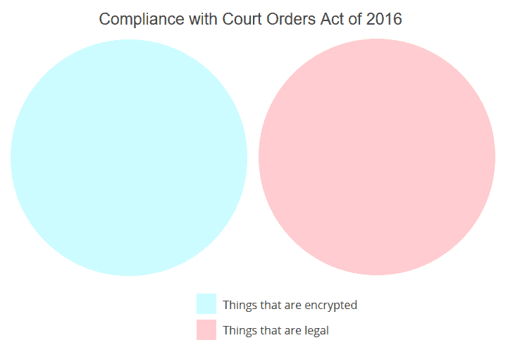

# 技术联盟就禁止加密法案给伯尔和范斯坦写公开信

> 原文：<https://web.archive.org/web/https://techcrunch.com/2016/04/19/tech-coalitions-pen-open-letter-to-burr-and-feinstein-over-bill-banning-encryption/>

# 技术联盟就禁止加密法案向伯尔和范斯坦写公开信

这张由 TechCrunch 创建的维恩图总结了 2016 年《遵守法庭命令法案》的条款。

一群技术联盟给参议员理查德·伯尔(共和党人)和黛安娜·范斯坦(民主党人)写了一封公开信，内容是关于他们的法案[要求所有的加密在命令下都是可破解的](https://web.archive.org/web/20221209025652/https://beta.techcrunch.com/2016/04/13/burr-feinstein-encryption-bill-is-officially-here-in-all-its-scary-glory/)，在本月早些时候[泄露了一份草案](https://web.archive.org/web/20221209025652/https://beta.techcrunch.com/2016/04/08/feinstein-and-burrs-draft-encryption-bill-would-essentially-make-all-encryption-illegal/)后，该法案在创纪录的时间内声名狼藉。

这封极具外交辞令的信是这样开头的:

> 我们写信来表达我们对围绕加密的善意但最终不可行的政策的深切担忧，这些政策会削弱我们保护自己免受想要造成经济和身体伤害的人的攻击所需的防御。

它接着指出了“意想不到的后果”，如受损的安全对坏行为者和好行为者都是不利的，并且任何阻碍全球产业运作的国家企图都是愚蠢的，注定要失败，并且在失败后，会损害美国的声誉和经济(我是在转述)。

这封信由四个团体签名:[改革政府监控](https://web.archive.org/web/20221209025652/https://www.reformgovernmentsurveillance.com/)、[计算机和通信行业协会](https://web.archive.org/web/20221209025652/https://www.ccianet.org/about/members/)、[互联网基础设施联盟](https://web.archive.org/web/20221209025652/https://www.i2coalition.com/i2c-members/current-members/)和[娱乐软件协会](https://web.archive.org/web/20221209025652/http://www.theesa.com/about-esa/members/)。

这四家公司代表了大多数主要的互联网和科技公司:微软、谷歌、亚马逊、易贝、脸书、网飞、威瑞信，以及其他几十家公司。(拥有 TechCrunch 的美国在线是前两家上市公司之一。)

这项法案完全不切实际，而且忽略了它想要监管的行业的基本方面，很可能不需要所有这些公司的反对。预计它不会在参议院获得任何支持，路透社报道称，奥巴马总统不会提供支持。尽管如此，像这样的一封信没有坏处，而且可能还有些好处。