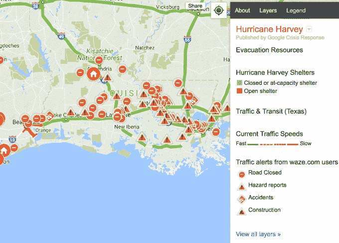
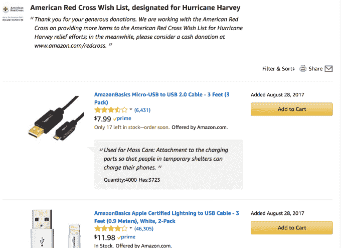
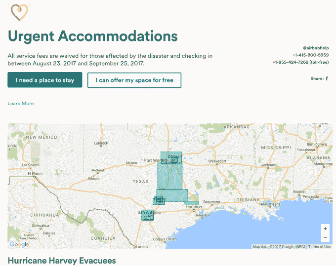

# 科技公司如何帮助受飓风哈维影响的德州人

> 原文：<https://web.archive.org/web/https://techcrunch.com/2017/08/29/tech-companies-harvey-houston-fundraising/>

对于休斯顿地区的居民来说，这场创纪录的暴雨仍然如此强烈，以至于国家气象局在其降水地图上添加了一种新的颜色，哈维是一场马拉松——一场自然灾害的巨大蔓延仍然存在，其影响还无法准确评估。作为回应，该地区的当地人团结起来，组成了一支临时救援舰队，通过 Twitter 发送求救信号，并向不幸的人敞开大门。

当所有人都在关注德克萨斯州的灾难时，科技行业也团结起来——像往常一样令人振奋——来减轻受灾者的痛苦。以下是一些科技巨头(以及一些总部位于德克萨斯州的公司)正在提供的帮助。

**苹果**

苹果公司[在 iTunes 和 iOS 应用商店中直接增加了一个捐赠按钮](https://web.archive.org/web/20230326183911/https://techcrunch.com/2017/08/27/you-can-donate-to-harvey-storm-relief-through-apples-app-store-and-itunes/)，收益将捐给美国红十字会。该按钮允许用户使用已经链接到其账户的支付信息，以 5 美元到 200 美元的增量轻松捐款。

**谷歌**

该公司向得克萨斯州的谷歌员工致意，并承诺与美国红十字会合作，为救灾工作捐赠 100 万美元。在撰写本文时，该公司已经向其目标筹集了 140，917 美元。

该公司还在其产品套件中添加了针对德克萨斯州和休斯顿的 SOS 警报，详细说明了紧急电话号码、救援筹款人、地图和其他资源。

**脸书**

脸书正在自己的平台上开展[匹配活动，承诺向灾难慈善中心捐赠高达 100 万美元，该组织优化捐赠，以惠及“灾难周期的整个过程——准备、应对和长期恢复”](https://web.archive.org/web/20230326183911/https://techcrunch.com/2017/08/29/facebook-hurricane-harvey-fundraising/)

脸书还提供了针对哈维的安全检查，因此用户可以查看可能受到灾难影响的朋友和家人。

**Lyft**

Lyft 已经将对美国红十字会的捐款整合到其 [Round up &捐赠功能](https://web.archive.org/web/20230326183911/https://www.lyft.com/round-up/causes/arc)中，该功能鼓励乘客将车费凑整，并将差额捐给慈善事业。Lyft 还将向飓风哈维救济基金捐赠 10 万美元，并暂停受哈维直接影响的城市的运营，以保护司机和乘客。

**亚马逊**

亚马逊也将向美国红十字会捐赠高达 100 万美元的款项。该公司还添加了一个受哈维影响的人可能需要的物品的愿望列表，以便用户可以向红十字会发送特定的物品，以代替现金捐款。

**奥斯丁公司**

总部位于奥斯汀的一些公司，包括 uShip、Box、Aceable、the Chive、Everfest、Invodo 和 unboundary Network，正在组织一场实物捐赠活动，以帮助救灾。捐赠的不易腐烂的食物、瓶装水、电池和其他需要的物品可以在周五之前送到或邮寄到 uShip 总部，地址是德克萨斯州奥斯汀河畔大道东 205 号，邮编 78704。收益将捐给休斯顿食物银行或美国红十字会。

**微软**

微软宣布初步向红十字会捐赠 10 万美元，暗示它打算在未来进一步捐赠。

**Airbnb**

为了应对德克萨斯州正在发展的住房危机，Airbnb 向那些因飓风和洪水破坏而流离失所的人开放其平台，免除他们的费用，并为他们提供免费住宿。

**优步**

优步正在运行一个项目，提供往返休斯顿、奥斯汀、达拉斯和得克萨斯州其他城市已建立的哈维避难所的免费乘车服务。根据优步的说法，“不需要采取任何行动就可以获得往返这些地点的免费乘车——当你请求 uberX 时，全额折扣将自动应用并反映在应用程序中。”在其博客文章[中列出了免费优步游乐设施的完整列表。](https://web.archive.org/web/20230326183911/https://www.uber.com/blog/austin/hurricane-harvey-relief-efforts/)

奥斯汀，随着更多信息的公布，我们将更新科技公司的哈维救援工作列表。