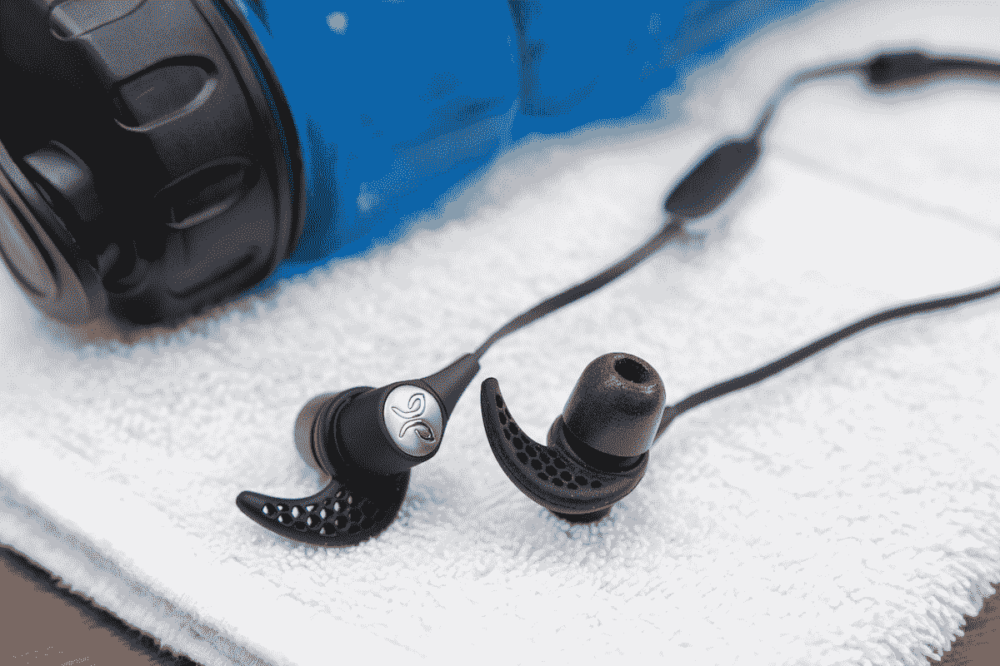
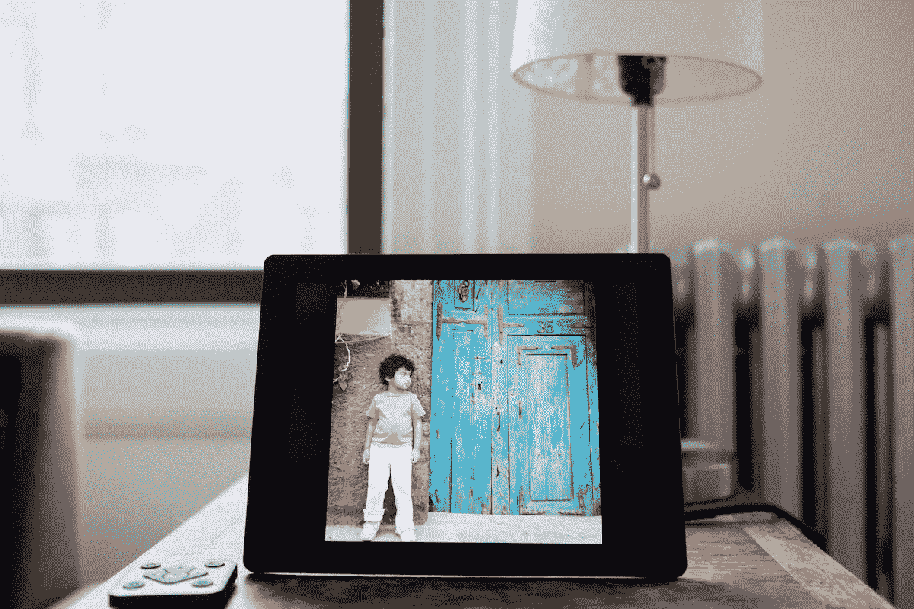
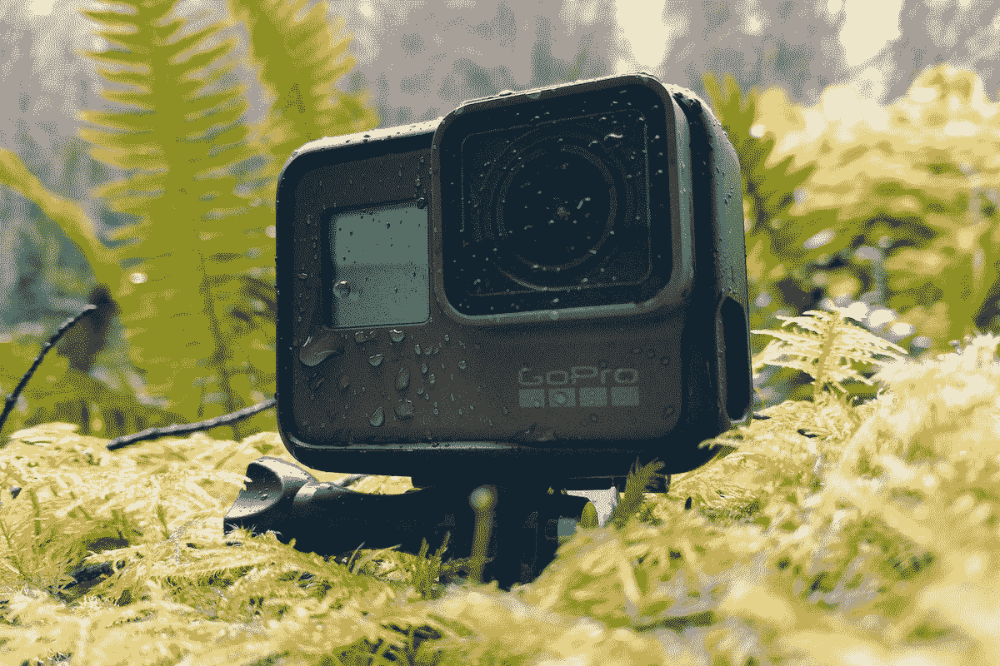

# 为任何人创造绝佳最后礼物的科技设备 

> 原文：<https://web.archive.org/web/https://techcrunch.com/2018/05/10/tech-devices-that-make-for-great-unexpected-gifts/>

马库拉·邓巴撰稿人

More posts by this contributor

***编者按:**本帖与*[*wire cutter*](https://web.archive.org/web/20221208193048/https://thewirecutter.com/?utm_source=techcrunch&utm_medium=referral&utm_campaign=syndication&utm_content=gaming-setup)*合作完成。当读者选择购买 Wirecutter 独立选择的编辑精选时，Wirecutter 和 TechCrunch 会赚取附属佣金。*

送礼物应该很容易。但是很难选择送什么礼物。技术尤其如此，产品往往更注重功能而非情感。最重要的是:找到一份与接受者有联系的礼物，创造一种享受感，并且他们真的会使用。这里有五件几乎会吸引所有人的科技礼物。

**小鸟 X3 无线运动耳塞**

[松鸟 X3 耳塞](https://web.archive.org/web/20221208193048/https://www.amazon.com/Jaybird-Wireless-Bluetooth-Sports-Headphones/dp/B01M7NCT5O?tag=wctchcrsynd-20)是为[在](https://web.archive.org/web/20221208193048/https://thewirecutter.com/reviews/best-wireless-exercise-headphones/?utm_source=techcrunch&utm_medium=referral&utm_campaign=syndication&utm_content=-unexpected-gifts)健身而设计的，但它们的设计和出色的音频让它们成为任何忙碌的人的完美之选。X3 的可互换的提示和鳍提供了一个高度定制，舒适的适合。整体声音开箱即用，但我们喜欢配套的 Jaybird 应用程序提供量身定制的聆听体验。八小时的播放时间意味着你将在多个训练或一整天的工作中做好准备。

**亚马逊 Echo(第二代)声控音箱**

虽然围绕着声控扬声器已经有足够多的嗡嗡声，但它们还不被认为是标准的家庭用品。但我们认为它们很有帮助，我们知道很多人觉得它们在点餐、听有声读物、播放音乐或控制电器和灯光方面非常有用。我们最喜欢的是[亚马逊 Echo(第二代)](https://web.archive.org/web/20221208193048/https://www.amazon.com/Echo-2nd-Generation-speaker-Charcoal/dp/B06XCM9LJ4?tag=wctchcrsynd-20)，它比目前任何其他型号做得都多(也做得更好)。它支持大量的[智能家居设备](https://web.archive.org/web/20221208193048/https://thewirecutter.com/reviews/best-alexa-compatible-smart-home-devices-for-amazon-echo/?utm_source=techcrunch&utm_medium=referral&utm_campaign=syndication&utm_content=-unexpected-gifts)——包括恒温器、灯泡和吸尘器，并且它有一套技能，包括提供定制的天气、新闻和日历提醒。(注意:如果您将这些设备中的一个作为礼物赠送，请确保支持接受者的首选音乐服务；例如，亚马逊的设备可以与自己的 Prime 音乐服务以及 Spotify 兼容，但不能与 Apple Music 兼容。)

**Jackery Bolt USB 电池**

一个方便的设备(有时也是救生员)是任何人都会认为是必需品的礼物。我们研究了超过 300 个 [USB 电源组和电池组](https://web.archive.org/web/20221208193048/https://thewirecutter.com/reviews/best-usb-battery-packs/#our-pick-for-everyday-carry-jackery-bolt?utm_source=techcrunch&utm_medium=referral&utm_campaign=syndication&utm_content=-unexpected-gifts)并测试了 40 个，将 Jackery Bolt 命名为我们的首选。jack ery Bolt[由铝制成，大小非常适合每天放在包里或口袋里。它有两条连接器电缆(一条 Lightning 和一条 MicroUSB)，它的 6000 mAh 电池足以为一部中型智能手机充电两次。](https://web.archive.org/web/20221208193048/https://www.amazon.com/dp/B01A6L85CC?tag=wctchcrsynd-20)

**Nixplay Seed 数码相框**

[nix play Seed](https://web.archive.org/web/20221208193048/https://www.amazon.com/dp/B012FRC3PA?tag=wctchcrsynd-20)数码相框是与远方的朋友和家人保持联系的绝佳方式。因为它支持 Wi-Fi，所以你可以在任何地方使用社交媒体平台、云存储或智能手机上传图片。这是一个伟大的礼物，因为新老时刻可以随时分享，让观众有更多的理由与你联系。它具有高分辨率 IPS 显示屏，可以横向或纵向显示图像。[相框](https://web.archive.org/web/20221208193048/https://thewirecutter.com/reviews/best-digital-photo-frame/?utm_source=techcrunch&utm_medium=referral&utm_campaign=syndication&utm_content=-unexpected-gifts)的遥控器和传感器——当房间里没有人时会关闭设备——让你在方便的时候选择你想看的东西。多人可以通过 Nixplay 网站创建照片播放列表，或者通过电子邮件发送添加要显示的图片。8GB 的存储容量可以容纳大约 25，000 张智能手机照片。

**GoPro Hero5 黑色动作摄像机**

[go pro hero 5 Black](https://web.archive.org/web/20221208193048/https://www.amazon.com/dp/B01M14ATO0?tag=wctchcrsynd-20)是我们对[动作相机](https://web.archive.org/web/20221208193048/https://thewirecutter.com/reviews/best-action-camera/?utm_source=techcrunch&utm_medium=referral&utm_campaign=syndication&utm_content=-unexpected-gifts)的首选，因为它可以用于日常拍摄，捕捉旅行冒险中的记忆，并且非常适合不适合更大、更昂贵相机设备的环境。它没有笨重的外壳，但仍然防水。对于那些通常将技术集成放在设备列表首位的人来说，GoPro Hero5 Black 还具有触摸屏界面和语音控制功能。在测试过程中，我们发现它的画面清晰明了，色彩准确，音质也值得专业编辑。

**Garmin Vivosport 健身追踪器**

如果你正在寻找一种方法来快速启动你的日常锻炼，而你还没有拿起一个[健身追踪器](https://web.archive.org/web/20221208193048/https://thewirecutter.com/reviews/the-best-fitness-trackers/?utm_source=techcrunch&utm_medium=referral&utm_campaign=syndication&utm_content=-unexpected-gifts)，现在是时候了。在过去三年里，我们测试了 23 款健身追踪器，认为 [Garmin Vivosport](https://web.archive.org/web/20221208193048/https://www.amazon.com/Garmin-v%C3%ADvosport-Smart-Activity-Tracker/dp/B074K9HNXZ?tag=wctchcrsynd-20) 是最佳选择。它的内置 GPS、持久的电池寿命和彩色显示屏使它与众不同。除了监控你的锻炼(包括力量训练重复)，它还有助于跟踪你的睡眠和压力水平，并支持蓝牙，支持 IOS 和 Android 集成流媒体音乐和通知。

*本指南可能已被* [*线切割*](https://web.archive.org/web/20221208193048/https://thewirecutter.com/?utm_source=techcrunch&utm_medium=referral&utm_campaign=syndication&utm_content=-unexpected-gifts) *更新。*

来自 Wirecutter 的提示:当读者选择购买我们独立选择的编辑精选时，我们可能会获得支持我们工作的代销商佣金。