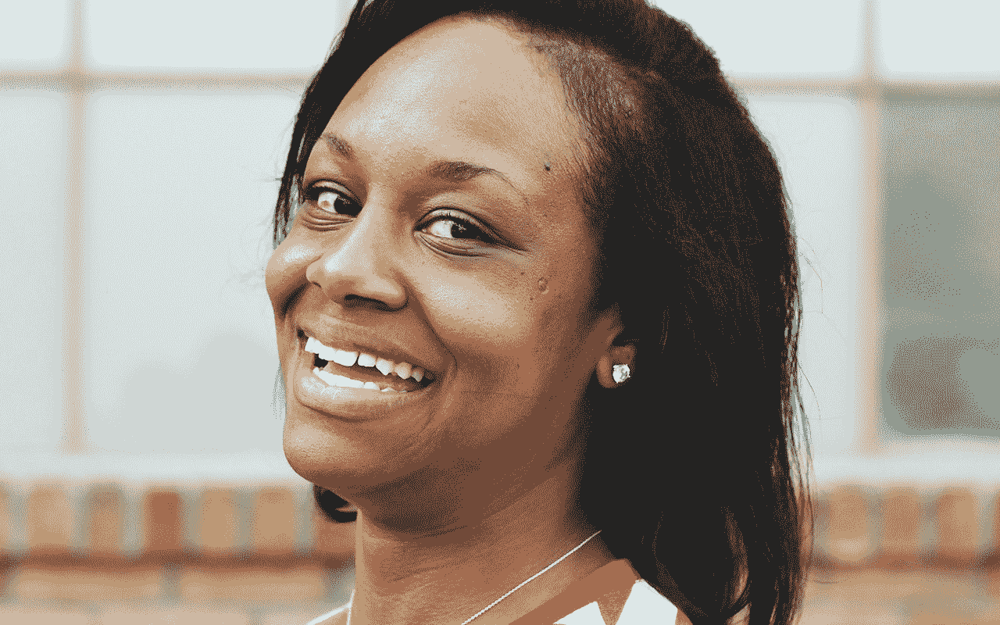
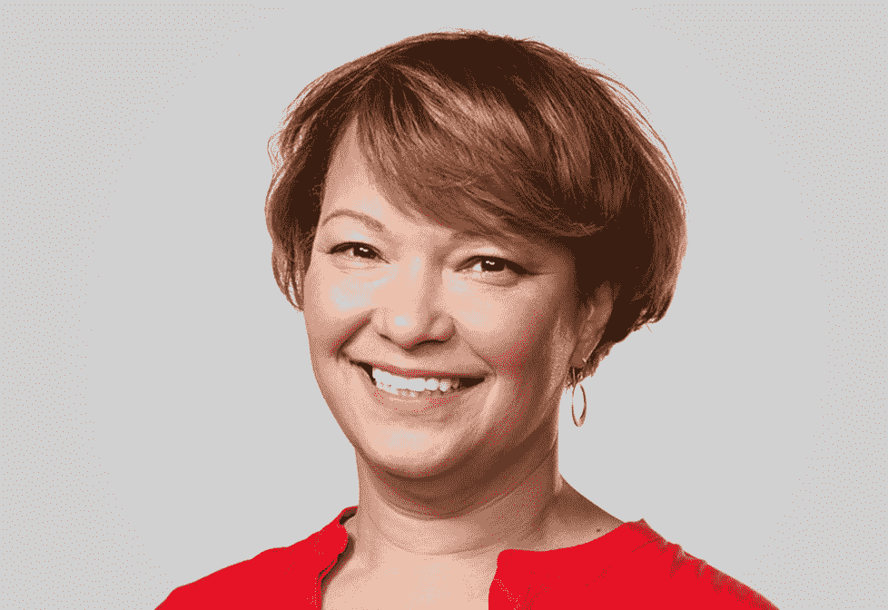

# 技术领袖将在 Disrupt SF TechCrunch 展示他们如何解决社会问题

> 原文：<https://web.archive.org/web/https://techcrunch.com/2017/08/29/tech-leaders-will-show-how-theyre-solving-societal-problems-at-disrupt-sf/>

科技行业似乎无法摆脱政治、多样性和社会倡议。这是件好事。

自唐纳德·特朗普(Donald Trump)当选总统以来，科技行业对社会和政治问题的关注度飙升。例如，今年 1 月，许多科技行业的高管强烈反对特朗普的移民禁令。然后，就在上个月，[科技领导人公开反对他禁止跨性别者在军队服役的禁令。](https://web.archive.org/web/20221208111440/https://beta.techcrunch.com/2017/07/26/tech-leaders-respond-to-trumps-ban-of-transgender-people-in-the-military/)

在 [Disrupt San Francisco 2017](https://web.archive.org/web/20221208111440/https://beta.techcrunch.com/event-info/disrupt-sf-2017/?utm_medium=organicpost37top&utm_campaign=disruptsf&utm_source=TC&unii-trigger-open=574GFD&ref=organicpost37top) 上，其中一些技术领袖不仅会谈论他们的技术，还会谈论他们如何解决我们社会面临的一些最大问题。

让我们来看看。

优步新任首席品牌官 Bozoma Saint John 是在优步围绕性骚扰、管理问题和有毒文化的丑闻中加入公司的。虽然她不原谅过去在优步发生的某些事情，但代表权对她来说很重要，她希望从多元化和包容性的角度看到变化，[她在最近的一次采访中告诉 TechCrunch。](https://web.archive.org/web/20221208111440/https://beta.techcrunch.com/2017/08/24/uber-gives-1-2-million-to-girls-who-code/)

三月，[优步发布了它的第一份多元化报告](https://web.archive.org/web/20221208111440/https://beta.techcrunch.com/2017/03/28/uber-first-diversity-report/)。像许多其他科技公司一样，优步以白人和男性为主。虽然圣约翰的角色并不正式包含多样性和包容性(那是 Bernard Coleman 的工作)，但她似乎致力于帮助优步发展成为一个代表所有类型的人的地方。

就在这个月，[圣约翰加入了编程女孩董事会](https://web.archive.org/web/20221208111440/https://beta.techcrunch.com/2017/08/24/uber-gives-1-2-million-to-girls-who-code/?ncid=mobilenavtrend)，帮助激励女孩并确保她们成功获得技术技能。

蒂芬尼·阿什丽·贝尔是人类公共事业组织的联合创始人，她把帮助人们获得干净的自来水作为自己的使命。Y Combinator 支持的非营利性创业公司帮助低收入人群支付他们的账单，当自来水公司试图切断他们获得这一基本必需品的时候。

自 2014 年 7 月以来，Human Utility 及其捐助者已经帮助了底特律和巴尔的摩的 900 多个家庭。除了她在人类公用事业公司的工作，[贝尔一直是社会正义的倡导者，公开反对警察暴行和科技行业的反黑人。](https://web.archive.org/web/20221208111440/https://beta.techcrunch.com/2016/07/06/alton-sterling-anti-blackness/)

创业加速器 Y Combinator 的总裁萨姆·奥尔特曼(Sam Altman)对永远冒险并不陌生。上个月，奥特曼启动了[United Slate](https://web.archive.org/web/20221208111440/http://unitedslate.samaltman.com/)，这是一项政治倡议，旨在解决医疗保健、加州缺乏负担得起的住房和气候变化等问题。

随着我们的国家为 2018 年中期选举做准备，奥尔特曼希望这些候选人专注于制定 10 项政策目标:降低生活成本(住房)，实施全民医疗保险制度，设定到 2050 年美国 90%的清洁能源目标，一流的教育，税收制度改革，将 10%的年度国防预算转移到未来的技术 R&D，公平贸易和公平就业，社会安全网扩张，公平的政府和更好的基础设施。

“如果我们重建我们摇摇欲坠的基础设施，经济将变得更有效率，”奥特曼在联合石板上写道。“我们可以利用技术有效地做到这一点，我们应该能够至少像中国一样高效地做到这一点。这将是一个新的新政的好时机。”

作为负责环境、政策和社会倡议的副总裁，Lisa Jackson 的任务是确保每个财政季度生产数千万台设备的苹果公司(T2)不会因为其包装和技术发明而破坏地球。

在杰克森的领导下，[苹果公司为自己设定了一个目标，承诺在产品中只使用可再生材料，以保护环境](https://web.archive.org/web/20221208111440/https://beta.techcrunch.com/2017/04/19/apple-vows-to-use-only-recycled-materials-but-greenpeace-says-iphones-should-also-last-longer/)。这样做也有助于防止侵犯人权，例如利用儿童开采钴。

回到 2015 年，[苹果决定斥资近 20 亿美元在欧洲开发两个新的可再生能源数据中心](https://web.archive.org/web/20221208111440/https://beta.techcrunch.com/2015/02/23/apple-2b-on-two-european-data-centers-running-100-renewal-power/)。所有这一切的发生部分归功于杰克逊。

TechCrunch 很高兴杰克逊、圣约翰、贝尔和奥特曼能在 9 月 18 日至 20 日的参加 [Disrupt SF 2017。鉴于他们各自对慈善事业、政府改革、环境和多样性的热情，Disrupt SF 保证不仅是你可以参加的最具创新性的展览，也是最具社会意识的展览之一(在科技领域)。](https://web.archive.org/web/20221208111440/https://beta.techcrunch.com/event-info/disrupt-sf-2017/?utm_medium=organicpost37bottom&utm_campaign=disruptsf&utm_source=TC&unii-trigger-open=574GFD&ref=organicpost37bottom)[一定要在这里买票](https://web.archive.org/web/20221208111440/https://beta.techcrunch.com/event-info/disrupt-sf-2017/?utm_medium=organicpost37bottom&utm_campaign=disruptsf&utm_source=TC&unii-trigger-open=574GFD&ref=organicpost37bottom)。