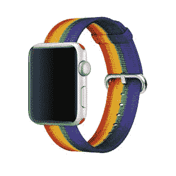
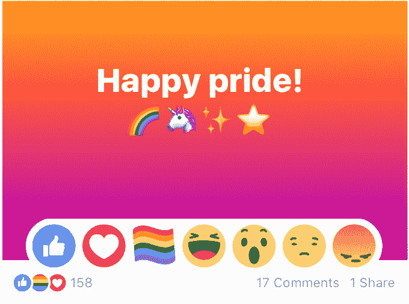
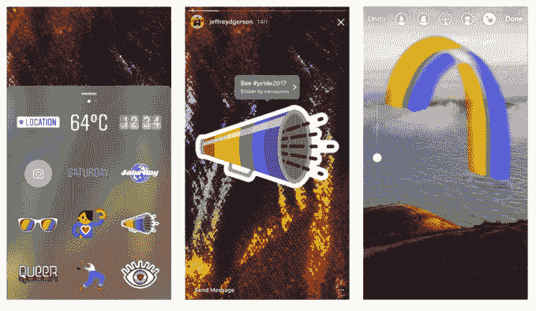
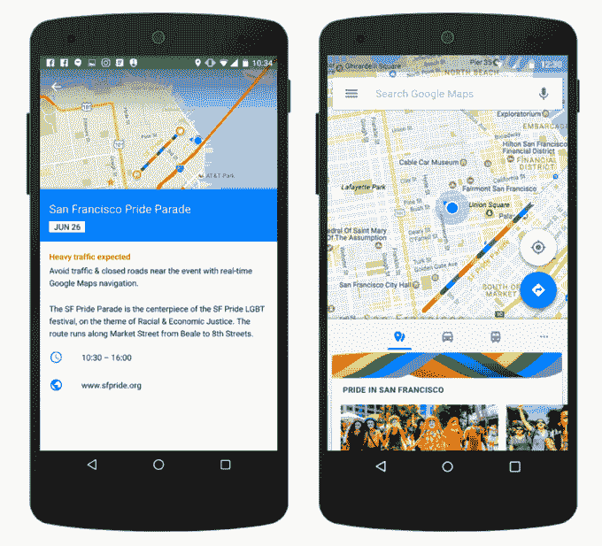
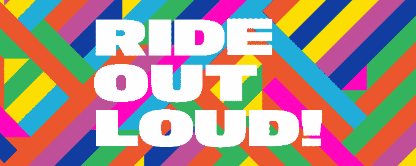
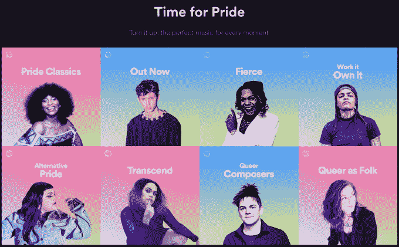
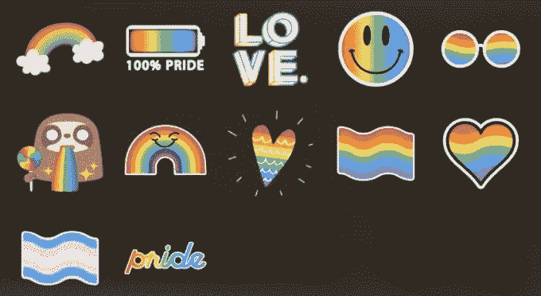

# 科技公司如何认可骄傲月

> 原文：<https://web.archive.org/web/https://techcrunch.com/2017/06/25/tech-pride-month-2017-silicon-valley-lgbtq-pride/>

6 月份，科技公司以他们所知道的最好方式来庆祝他们的骄傲:小而古怪的产品更新。

随着旧金山和纽约的年度骄傲活动将于本周末举行，这是一个很好的时间来反思在短短几年内 LGBTQ 在科技界的能见度有多高。虽然仍有大量工作要做，但我们很高兴庆祝一些有趣的方式，这些方式表明了公司对酷儿群体的声援，同时也让他们在真正重要的事情上承担任务。

**苹果**

苹果可能经常在硅谷的 LGBTQ 宣传工作中领先，但它的[骄傲版 Apple Watch](https://web.archive.org/web/20230326025528/https://www.apple.com/shop/product/MQ4G2AM/A/42mm-pride-edition-woven-nylon?fnode=e3d565ead9d5cb76b5f9578f29411cfcc69e385cae0ec566d25312cf31a3934415fa5824a79eccf3fcbdc1a7e9a84b2857ef82c1d1f50b11d605d816f3b64dbba7908810cd540735d9e282b0bb0c7f9866d42af89c398d4fb4b56e44c05bf7c1f9affb7150ec4bfb4208718790945392&fs=s%3Dnewest)(49 美元)表带证明它也可以进行表面但令人愉快的同性恋团结展示。TechCrunch 硬件编辑和官方骄傲天使 Brian Heater 给我发了一个，我可爱的新发型或彩虹手表乐队在整个骄傲月都很受欢迎，但我很确定是这个乐队。

这种特别的骄傲放纵的最好部分是，一些收益进入像 GLSEN 和特雷弗项目这样的团体。

**脸书**

脸书今年增加了广受欢迎的骄傲反应，尽管有报道称选择加入功能[在全球](https://web.archive.org/web/20230326025528/http://www.teenvogue.com/story/why-facebook-pride-like-button-isnt-available-everywhere)不可用。尽管该平台和 LGBTQ 社区之间的关系[持续紧张](https://web.archive.org/web/20230326025528/http://www.thedailybeast.com/facebooks-pride-rainbows-dont-extend-to-trans-peoples-names),脸书的酷儿用户已经非常喜欢小彩虹反应，所以希望它能继续存在。

**Instagram**

Instagram 为 Pride 2017 增加了一个特殊的 [LGBTQ 贴纸组](https://web.archive.org/web/20230326025528/https://techcrunch.com/2017/06/01/instagram-lgbtq-pride-2017/)，并推出了一个全球 Pride 启发的照片项目。这些贴纸很可爱，包括一个受 trans 国旗启发的设计。

**谷歌**

在 35 个城市，骄傲游行路线将显示在 iOS 和 Android 版谷歌地图上。根据谷歌的消息，一个特殊的骄傲图标将显示这些城市的额外活动，包括西雅图、纽约和三藩市。

**优步**

优步的本地市场似乎都在为自己的事情而自豪，但他们显然会连续第二年在西雅图举办[点播变装秀。不幸的是，我们预计送货拖拉女王的表演甚至比送货小猫更难评分。](https://web.archive.org/web/20230326025528/https://www.geekwire.com/2017/uber-delivering-demand-drag-shows-seattle-pride/)

**Lyft**

Lyft 宣布将在未来 12 个月内向 LGBTQ causes 捐赠 10 万美元。它与一个名为“[Round Up and duate](https://web.archive.org/web/20230326025528/https://blog.lyft.com/posts/2017/6/5/this-pride-support-equal-rights-for-everyone)”的人权运动合作伙伴一起启动了这一承诺，该合作伙伴邀请乘客从设置菜单中选择，以便为了一项良好的事业将车费四舍五入到最近的美元。有趣的是，我可以证实，沿着骄傲游行路线的 Lyft 汽车以彩虹色出现，这是一个很好的触摸。

**Twitter**
6 月，Twitter 推出了一个[的漂亮小标签图标](https://web.archive.org/web/20230326025528/http://mashable.com/2017/06/01/lgbtq-pride-month-twitter-emoji/#3EHyERnxbkqQ)，它成功地将彩虹骄傲旗与粉色和蓝色的变性旗结合在一起，这是一个在不太多像素中有很多颜色的图标。要召唤新偶像，试试#Pride2017、#PrideMonth 和#LoveisLove 这些标签。

**Salesforce**

向 Salesforce 喊出我们见过的最同性恋的大厅。

**Skype**

Skype [推出了](https://web.archive.org/web/20230326025528/https://blogs.skype.com/news/2017/06/14/celebrate-love-on-the-new-skype/https://blogs.skype.com/news/2017/06/14/celebrate-love-on-the-new-skype/)一些 rainbowy 贴纸和一个彩色渐变文本背景，用来表达非常同性恋的观点。

**Spotify**

Spotify 并没有满足于彩虹，而是策划了一个[音乐集](https://web.archive.org/web/20230326025528/https://open.spotify.com/view/pride-page)，如此强劲，可能会持续一整个月。或者至少是一个非常非常缺乏睡眠的骄傲周末。

**Snapchat**

对于 2017 年，Snapchat [推出了](https://web.archive.org/web/20230326025528/http://www.refinery29.com/2017/06/159161/snapchat-pride-creative-tools-2017)彩虹表情画笔、新的贴纸套装、以骄傲为主题的地理过滤器和骄傲特有的故事，以便用户可以一瞥世界各地的庆祝活动，包括即将到来的周末在巴黎、多伦多和墨西哥城举行的庆祝活动。支持 Snapchat 包含 trans 标志。

虽然很高兴在 6 月份看到这种有趣的以自豪为主题的产品调整，但利用其力量和平台进行良好的老式宣传仍然是硅谷表达其与 LGBTQ 社区团结的最佳方式。

这意味着签署影响技术社区的酷儿问题的法律简报，为多年来一直默默努力的组织做出贡献，制定包括并丰富酷儿社区成员的政策，确保 LGBTQ 员工获得更广泛的工作场所保护和医疗保险福利，这不仅可以帮助他们生活，还可以帮助他们茁壮成长。