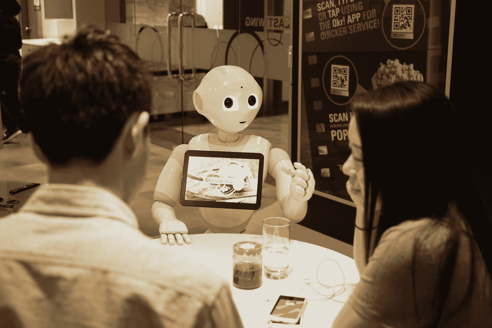

# Tech 向每个行业展示了再培训如何成为新的招聘方式

> 原文：<https://web.archive.org/web/https://techcrunch.com/2017/06/13/tech-shows-every-industry-how-retraining-is-the-new-recruiting/>

在全国范围内，各行各业的企业都在为新一轮的数字颠覆做准备。去年，亚马逊宣布正在创建没有销售人员的超市，麦当劳决定用 T2 自助服务亭取代所有收银员，卡特彼勒开始投资 T4 无人驾驶拖拉机。

虽然科技行业正在加速这些进步，对人工智能、机器学习和自动化做出了关键贡献，但这些创新也导致了前所未有的失业水平。

世界经济论坛预测，到 2020 年，制造业和客户服务等领域的 500 多万个工作岗位将会消失。然而，对需要技术技能的工作的需求继续上升，无法得到满足。需要编码技能的工作比市场总体增长速度快 50%。

随着越来越多的行业变得数字化，对技术人才的需求越来越大，这个问题只会变得更加严重。例如，当 [AT & T](https://web.archive.org/web/20221204164322/https://www.nytimes.com/2016/02/14/technology/gearing-up-for-the-cloud-att-tells-its-workers-adapt-or-else.html?_r=0) 需要其 280，000 名员工精通云计算和移动技能时，他们不再仅仅与 Sprint 和威瑞森争夺人才，还与谷歌和亚马逊竞争。

在竞争日益激烈的人才市场，科技公司正在引领一种新型的劳动力创新:再培训成为新的招聘方式。虽然从长远来看，对计算机科学教育和职业学校的投资是非常宝贵的，但再培训提供了一个更直接的解决方案。随着企业竞相走在创新的前沿，它们不仅应该采纳硅谷的技术贡献，还应该采纳再培训人才的蓝图。

再培训取代了就业委员会

迄今为止，企业依靠有竞争力的薪资和福利来吸引技术人才。公司如此重视技术角色，以至于要求编码技能的工作[现在构成了最高收入的四分之一。尽管公司试图用各种福利吸引技术人才，但他们仍然坐拥空缺职位。需要技术管理技能的职位平均需要](https://web.archive.org/web/20221204164322/http://burning-glass.com/wp-content/uploads/Beyond_Point_Click_final.pdf)[一百多天](https://web.archive.org/web/20221204164322/http://burning-glass.com/top-10-hard-to-find-tech-skills/)来填补。

各公司没有在招聘战中投入更多资金，而是在测试开发所需技术人才的新策略。在 Box，销售工程副总裁 Matt Norton 发现，解决方案工程师的最佳招聘渠道不是另一个招聘平台，而是 Box 自己的客户支持团队。

“让客户支持团队的员工接受工程师再培训，让我们能够更快地填补空缺的技术职位，同时保留我们最优秀的员工已经积累的机构和产品知识，”Norton 解释道。诺顿认为，通过创建一条填补技术职位的内部途径，其他团队可以缓解招聘瓶颈，并更快地扩展他们的团队。

科技公司也在开拓新的培训项目，以发展新兴技能。当 Flexport 决定用现代软件应对航运物流行业时，他们需要找到既了解他们的复杂技术又了解这个价值数十亿美元的行业的复杂性的员工。

Flexport 首席执行官兼联合创始人 Ryan Petersen 解释说:“我们不能只是去招聘市场招聘理想的候选人，因为在许多情况下，这些人根本不存在。”

Flexport 不仅接手了一个乏味的行业，还采用了一种过时的员工培训方式。Petersen 在 Flexport 早期花了很多时间开发一个强大的培训计划，使员工获得技术技能，成为货运行业的专家。

“我们公司内部的这种混合技能组合现在使我们能够应对规模是我们 10-15 倍的公司，”Petersen 说。随着行业巨头经历这一技术演变，他们应该寻求开发类似的足智多谋和灵活的培训实践，以发展他们现有的人才。

致力于员工的教育和技能提升也让公司在招聘过程中脱颖而出。Guild Education 是一家教育技术初创公司，它使 Chipotle 等公司能够阐明他们的培训计划，并将教育作为员工的福利。

Guild 联合创始人 Brittany Stich 解释说:“随着雇主努力留住和招聘员工，为员工提供发展新技能和职业进步的机会是公司能够提供的最具竞争力的福利之一。施蒂希认为，这种福利将像医疗保健和 401k 一样普遍，因为 30 岁以下的美国人中有 61%预计在职业生涯的某个阶段发展新技能是至关重要的。

无论是培养尚未存在的技术人才，还是为现有员工提供职业发展机会，各个阶段的公司都开始将再培训作为发展现代劳动力的有力工具。

**21 世纪的新兴劳动力**

虽然硅谷公司通过消除医疗保健领域面对面的医生就诊和拆解零售领域的实体模式，肯定会导致失业，但它们也在开拓培训实践，以培养数字经济所需的人才类型。其他行业很快就会明白，在这个新时代，繁荣不再仅仅是发明尖端技术或创造颠覆性商业模式，还包括开发内部培训和就业计划，让公司在未来几年保持竞争力。