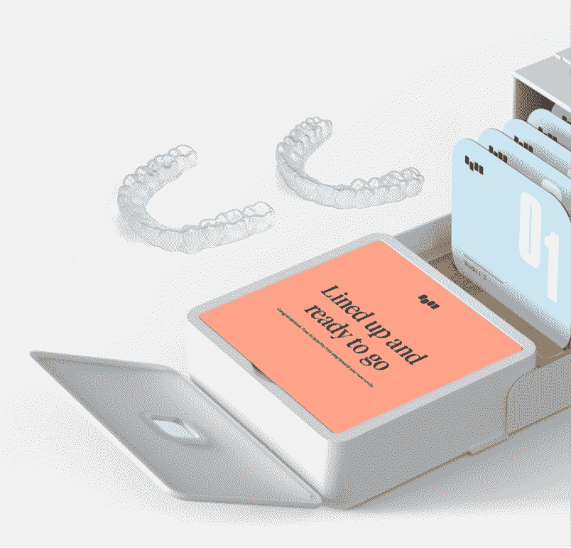
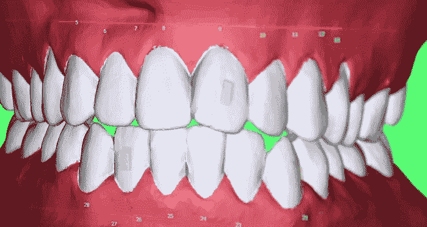
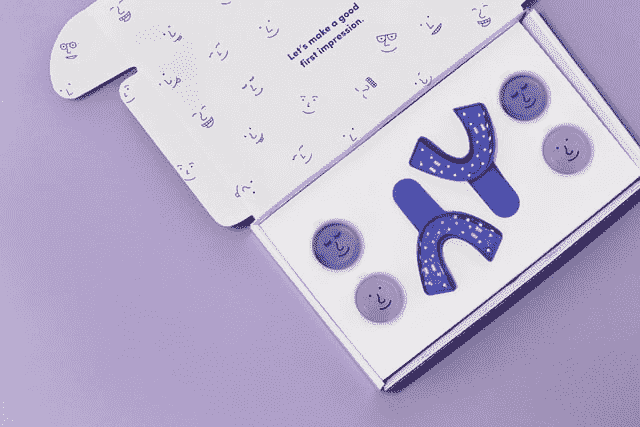
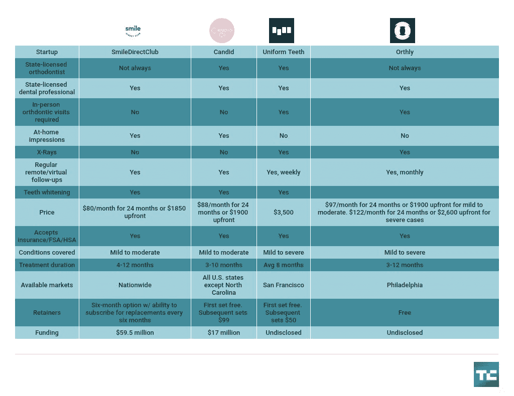

# 科技创业公司想进入你的嘴里

> 原文：<https://web.archive.org/web/https://techcrunch.com/2018/01/27/tech-startups-want-to-go-inside-your-mouth/>

牙科保健可能很贵，也很难获得，尤其是如果你生活在农村或第三世界国家。事实上，牙科保健的最大障碍是费用。这是根据美国牙科协会的数据，[它说](https://web.archive.org/web/20230225042856/http://www.ada.org/~/media/ADA/Science%20and%20Research/HPI/Files/HPIBrief_1014_2.ashx)许多农村地区缺乏牙科专业人士。

除了更直的牙齿带来的明显美学益处外，牙齿矫正还有合理的健康益处。根据美国牙齿矫正协会的说法，正确的牙齿排列有助于形成健康的咬合。正确排列的牙齿也更容易清洁，这有助于防止牙斑、细菌堆积和蛀牙。同时，排列不当的牙齿也会磨损你的牙釉质，导致牙齿脱落。

事实证明，根据国家健康和营养调查 的一项 [研究，65%的人口可以从正畸治疗中受益。但就接受治疗的人而言，这在高收入群体中更为常见。](https://web.archive.org/web/20230225042856/https://www.researchgate.net/publication/13541514_Prevalence_of_malocclusion_and_orthodontic_treatment_need_in_the_United_States_Estimates_from_the_NHANES_III_survey/amp)

根据美国牙科协会 2013 年的一项调查，牙齿矫正器和隐形矫正器——那些透明的、类似于护齿套的塑料片——的价格各不相同，但青少年的治疗费用从 4685 美元到 6500 美元不等，成年人的治疗费用高达 7135 美元。根据市场研究公司 IBISWorld 的数据，[去年，牙齿矫正市场的收入为 110 亿美元。还值得注意的是，隐适美制造商 Align Technology 围绕 clear aligners 规划阶段的多项专利已于去年到期。](https://web.archive.org/web/20230225042856/https://www.ibisworld.com/industry-trends/specialized-market-research-reports/life-sciences/health-practitioners/orthodontists.html)

那么，毫不奇怪，现在一些风险投资支持的创业公司正在争夺矫正和美白牙齿的机会。就像优步和 Lyft 对出租车行业的影响一样，这些牙齿矫正初创公司可能会颠覆一个超过百年的行业，改变我们获得牙齿护理的方式。

## 创业公司来了

对于那些买不起牙套或隐适美的人来说，像[统一牙齿](https://web.archive.org/web/20230225042856/https://www.uniformteeth.com/)、[坦诚](https://web.archive.org/web/20230225042856/https://www.candidco.com/)、[微笑直接俱乐部](https://web.archive.org/web/20230225042856/https://smiledirectclub.com/)和[或](https://web.archive.org/web/20230225042856/https://www.orthly.com/)这样的初创公司不仅旨在降低清洁矫正器的成本，还旨在减少去看正畸医生的次数——有些公司甚至完全取消了亲自去看正畸医生。多年来涌现的许多创业公司背后的基本原理归结为可及性和成本。

今年第一周推出的 Uniform Teeth 是近年来涌现出的少数几家进入你口腔的技术驱动型创业公司之一。Uniform types 售价 3500 美元，提供的治疗最类似于在传统环境下看传统正牙医生的体验。 在任何治疗开始之前，Uniform Teeth 要求您前往其办公室，会见其持证正畸医生，进行 x 光检查、扫描和牙齿健康检查。

Uniform tooth 与传统正畸体验的不同之处在于，Uniform tooth 不需要持续的亲自出诊。相反，在第一次治疗后，患者每周都会通过手机应用程序向他们的正畸医生报到。在最后一次就诊时，患者来确认治疗进展顺利，不需要任何改进。

Uniform types 由 Kjeld Aamodt 博士共同创立，他是一名认证的正畸医生，美国正畸医生协会成员，加州大学旧金山分校的教学教授。这家初创公司的目的是让牙齿矫正更实惠、更容易获得。

“有超过 2 亿各年龄段的美国人需要正畸治疗，每年只有不到 1%的人接受治疗，”统一牙齿公司首席执行官 Meghan Jewitt 告诉 TechCrunch。"这表明了对更好、更容易和更负担得起的正畸治疗的巨大需求."

另一家初创公司是[candy](https://web.archive.org/web/20230225042856/https://www.candidco.com/)，它虚拟地将患者与当地的正畸医生联系起来，然后使这些正畸医生能够直接为消费者开出矫正器。 [去年 9 月](https://web.archive.org/web/20230225042856/https://techcrunch.com/2017/09/14/candid-dental-startup-teeth-alignment/)candy 带着其 3D 打印的矫正器进入市场。Candid 首席执行官尼克·格林菲尔德(Nick Greenfield)向我描述说，它是为需要轻度至中度正畸治疗的人设计的。坦诚的费用为 1900 美元，即两年内每月 88 美元，而牙套的费用高达 7000 美元，隐适美的费用高达 8000 美元。

格林菲尔德告诉我:“对我们来说，这一切都是为了扩大接入和提高可负担性。“现在发生的是整个医疗保健，它占国内生产总值的 18%。它的增长速度是经济增长速度的六倍，在过去的 15 到 20 年里，你已经看到许多医疗保健费用上涨了 5 到 10 倍。”

单于、 [去年 11 月 A 轮融资 1500 万美元的](https://web.archive.org/web/20230225042856/https://techcrunch.com/2017/11/21/teeth-straightening-startup-candid-raises-15-million-from-greycroft-bessemer-and-others/) ，有一个三步走的过程让牙齿更直。首先，该公司向患者发送了一套建模工具，这样他们就可以在家进行牙齿印模。在患者将他们的印象发送到 Candid 后，其正畸医生会对其进行审查，以确保 Candid 能够治疗他们的病例。

如果 Candid 的正畸医生认为你的情况更严重，意味着可能需要拔牙或其他程序，他们会建议你去正畸办公室。

[或者](https://web.archive.org/web/20230225042856/https://www.orthly.com/)的方法是亲自将患者与当地的正畸医生联系起来，然后让正畸医生开出直接面向消费者的矫正器。Orthly 的联合创始人李雅达告诉 TechCrunch，这个想法是为了简化流程，“让一切更有效率，让消费者的价格更低。”

与统一牙齿相似，Orthly 需要初次亲自就诊。然而，与统一牙齿不同的是，Orthly 没有自己的正畸医生。相反，Orthly 将患者与你所在地区的正畸医生联系起来。

## 反对者

虽然 Candid、Uniform Teeth 和 Orthly 都是较新的进入者，但 SmileDirectClub 自 2014 年就已存在。然而，在过去的一年里，SmileDirect 因美国正牙医师协会反对其营销方式和其他违规行为而成为头条新闻。

SmileDirectClub 是一家直接面向消费者的牙齿矫正器初创公司，最初的想法是利用远程牙科技术将持照牙医和正畸医生与想要矫正牙齿的人虚拟联系起来。自 2014 年成立以来，SmileDirectClub 表示已帮助超过 10 万人矫正和亮泽牙齿。

该公司将隐形矫正器直接运送给客户，持牌牙科专业人士(正畸医生或普通牙医)远程监控患者的进展。在运送矫正器之前，患者要么在家里取他们的牙齿印模并将其发送到 SmileDirectClub，要么访问该公司的“SmileShops”进行亲自扫描。

SmileDirect 表示，它比其他类型的牙齿矫正治疗费用低 60%，治疗时间从 4 个月到 14 个月不等。平均疗程持续六个月。

何 AAO 声称 SmileDirectClub 违反了法律 [，因为其允许人们跳过亲自就诊和 x 光检查的方法是“非法的，并造成了医疗风险](https://web.archive.org/web/20230225042856/https://www.buzzfeed.com/nidhisubbaraman/braces-wars-dentists-are-warning-that-mail-order?utm_term=.vww8PNzJ2#.dcp4vWGJ7) ”该组织还在 36 个州对 SmileDirectClub 提起诉讼，指控其违反了管理牙科实践的法规和条例。这些投诉被提交给监管牙科诊所的监管委员会和各州的总检察长。

“AAO 也向这些州提供了额外的支持信息，”AAO 总法律顾问 Kevin Dillard 告诉 TechCrunch。“AAO 的立场是，SDC 违反了 AAO 在投诉中指出的法规和条例。这些法规和条例的存在是为了保护公众的健康和安全。”

对于任何老派的市场颠覆者，肯定会有人唱反调。迪拉德说，正畸治疗不是一种产品，而是“一种移动生物物质的复杂医疗过程，最好在有执照的专业人士的直接监督下进行”。

迪拉德说，在大多数情况下，正畸医生会对患者的口腔结构进行 3D 和 X 射线成像，这可以帮助正畸医生识别问题，如薄弱的牙根或“其他可能使正畸治疗不可取甚至危险的结构问题——包括如果进行治疗可能会失去牙齿的风险。”

在其网站上，[AAO 有一个消费者警示](https://web.archive.org/web/20230225042856/https://www.aaoinfo.org/#consumerAlert) ，提醒人们不要自己动手和“在网上订购其他物品”它警告说，“在没有彻底检查牙齿和牙龈的整体健康状况的情况下移动牙齿可能会导致牙齿的永久脱落，这可能会导致昂贵的终身牙齿问题。”

AAO 还指出，所有的正畸医生都是牙医，但只有 6%的牙医是正畸医生。然而，SmileDirectClub 坚持认为它的重点是客户，“某些组织”只是将该公司的模式视为对其底线的威胁。

“围绕我们商业模式的许多观点都是建立在对 SmileDirectClub 的流程及其为附属牙科专业人士提供的服务的误解之上，”Fenkell 说。“SmileDirectClub 与调查我们流程的机构合作，在所有情况下，都没有发现任何不当行为或不当做法。”

SmileDirectClub 与 Align Technology 合作生产 SmileDirectClub 的部分定位器。2016 年， Align Technology 向 SmileDirectClub 投资了 4670 万美元，并于 2017 年再投资 1280 万美元，共拥有该公司 19%的股份。

“作为 clear aligner 技术的先驱和领导者，以及数字创新的主要开发商，Align 需要参与并帮助塑造不断发展的医生指导模式，将市场扩展到更多人，”Align 技术发言人在一封电子邮件中告诉 TechCrunch。“这种新模式也创造了新的机会，将隐适美的提供者与潜在的患者联系起来，否则这些患者不会寻求门诊治疗。数以百万计的消费者可以从轻微的牙齿矫正中受益，许多人正在寻求方便和负担得起的治疗，他们不会与医生办公室联系在一起。”

Align 还指出，如果 SmileDirectClub 无法接收患者，这家初创公司会将患者介绍给隐适美的医疗服务提供商，让他们在办公室接受治疗。

一位 FDA 发言人告诉 TechCrunch，尽管美国美国食品药品监督管理局已经批准隐适美用于办公室治疗，但它尚未批准或批准任何非处方 clear aligners。FDA 不确认，评论或拒绝任何未决的申请。

为了确保它不会陷入类似或更糟糕的境地，Candid 表示，为了服务客户，它对客户的需求有严格的要求。首先，格林菲尔德强调说，Candid 只受理轻度到重度的病例。Candid 还要求患者在之前的六个月内看过牙医。

虽然 Candid 表示，它还没有与 AAO 主席或任何最高级别的人进行任何对话，但 Greenfield 表示，他与该组织其他人的对话是积极的。

“该组织希望看到更好的患者结果，”格林菲尔德说。“他们不想看到牙齿矫正被带向一个让人受伤的方向。他们的工作是监督牙齿的移动。在我们与 AAO 高级成员的交谈中，他们最关心的是患者的结果。

迪拉德说，与 SmileDirectClub 不同，AAO 并没有在坦诚、统一或诚实方面采取公开立场。然而，Dillard 指出，AAO“长期以来坚持的立场是，在有执照的正畸医生的直接和持续监督下进行正畸治疗符合公众的最佳和最安全的利益。

Candid 拥有来自美国各州的正畸医生，但由于监管原因，北卡罗来纳州除外。如果正畸医生认为你的情况是轻度或中度的，他们会为你制定一个治疗计划，并给你发送一个牙齿的 3D 模型。

“作为一家公司，我们的工作是在后端将客户与正畸医生联系起来，但尽可能让这种互动无缝，”格林菲尔德说。"这是正畸医生做的治疗计划和监督."

虽然 Candid 本身并未获得 FDA 的批准，但 Candid 表示，它正在与一家拥有 [510(k)许可](https://web.archive.org/web/20230225042856/https://www.fda.gov/MedicalDevices/ProductsandMedicalProcedures/DeviceApprovalsandClearances/510kClearances/)的制造商合作，这意味着它已经向 FDA 证明了一定程度的安全性和有效性。

“Candid 使用牙齿矫正医生进行治疗，”Greycroft 合伙人、Candid 的投资者约翰·埃尔顿(John Elton)告诉 TechCrunch。“所以这是所有这些的一个重要因素。他们花时间确保这是正确的治疗方法。”

这意味着一旦 Candid 收到患者的印象，该公司会将其转换为 3D 文件，然后发送给制造商。制造商然后把它变成一个计划，从一个正畸医生那里购买。

格林菲尔德说:“实际上是正畸医生从制造商那里出售矫正器。“就好像你进去了，但你是在远程操作。”

## 什么对你有效

所有这些初创公司都与有执照的牙科专业人士合作。归根结底，这是关于选择最适合你的解决方案。接受正畸治疗可能很贵，而且并不总是容易获得，这取决于你住在哪里。

“如果你不是在富裕家庭或第一世界国家长大，你的牙齿可能会有问题，参加面试——你知道，在工作中出人头地——这些都很重要。如果你有这样的问题，它会影响你的生活质量，”埃尔顿说。"它不成比例地影响了弱势群体."

这些初创公司所做的是为那些负担不起传统方法、可能在几个月内没有时间亲自去办公室拜访的人提供一种替代方式。这就是远程医疗的前景所在，它使患者能够通过移动应用程序与他们的正畸医生联系，向他们发送他们的牙齿照片和其他相关信息。

埃尔顿说:“这将极大地扩大市场，它将为整个人口提供这种(传统正畸)过于昂贵的服务，并将它从一种真正高端的化妆品带到一个大众市场，这将改善人们的生活，改善社会。”

创始人基金的 Cyan Banister 也在牙齿矫正创业公司上下了赌注。她没有坦诚，而是带着整齐划一的牙齿去了，说该公司的做法与众不同。

巴尼斯特告诉 TechCrunch:“我认为这要负责得多。“远程医疗很好，但我认为两者之间需要有一个步骤。我投资这家公司的目标是降低成本，让它更实惠。”

目前只有少数几家明确的对齐器初创公司，现在说哪种模式最好还为时过早。或许，与优步和 Lyft 类似，它不需要成为一个赢家通吃的市场。