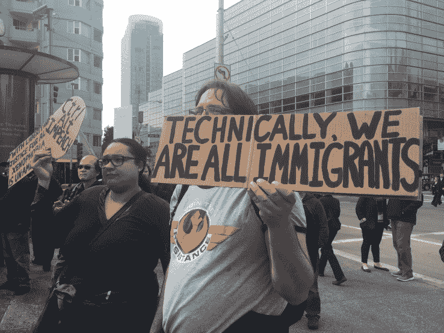

# 技术工人在旧金山市中心示威，反对特朗普的移民计划

> 原文：<https://web.archive.org/web/https://techcrunch.com/2017/02/13/tech-workers-demonstrate-in-downtown-san-francisco-against-trumps-immigration-plans/>

今天，来自 LinkedIn、思科、苹果和其他科技公司的数百名科技工作者聚集在旧金山市中心，谈论美国移民在现政府领导下的困境，这里弥漫着一股明显的能量。

特朗普总统最近试图禁止来自七个穆斯林占多数的国家的任何人进入美国。第九巡回法院迄今为止一直阻挠这些努力，尽管特朗普计划对这一决定提起上诉。与此同时，许多合法公民、绿卡持有者甚至是出生在 T2 的人在边境面临审查。

在硅谷，这项禁令和其他针对移民的措施对科技和经济产生了更大的影响。移民在建立一些世界上最大的科技公司方面发挥了重要作用，硅谷依靠来自世界各地的人才源源不断地提供智力和创新。

然而，预计川普将很快采取措施改革 H-1B 签证项目的规则，这是一种专门发给高技能工人的签证，其中近一半发给了在硅谷工作的人。对穆斯林禁令和技术工人可能面临被拒入境的担忧在硅谷凸显，粉碎了那些希望在创新之都做出贡献的人的希望。

还有那些已经在这里工作的人可能不得不离开他们的生活和家庭。尽管旧金山保持了其庇护城市的地位，但今天集会上的技术工人也提到了对特朗普可能对他们和他们在这里的家人做的事情感到害怕，他们在不同时间高呼，“没有禁令。没有墙。所有人的避难所。”

DoBetter，一个非盈利组织，上个月组织了一次反对 Palantir 的[抗议，也是今天事件的幕后黑手。除了今天的抗议，该组织还计划](https://web.archive.org/web/20230320220333/https://techcrunch.com/2017/01/18/tech-employees-protest-in-front-of-palantir-hq-over-fears-it-will-build-trumps-muslim-registry/)[收集硅谷技术工人的故事](https://web.archive.org/web/20230320220333/http://dobetter.tech/testimony)，这些人因为他们在美国的移民身份而受到某种影响。

我们的目标不仅是提高意识，因为硅谷似乎很清楚正在发生的事情，而且还可能改变特朗普的想法。“钱很重要，”今天活动的组织者之一、Indiegogo 工程师 Judy Tuan 告诉 TechCrunch。"移民禁令对劳动力极为不利。"

另一名科技工作者艾萨克·桑切斯(Isaac Sanchez)在加州库比蒂诺旧金山南部的苹果总部担任看门人，他拥有合法移民身份，但他提到他的朋友们担心，如果他们说出自己的遭遇，他们会遭到报复。

“我们都是美国人，如果你不想看到这些，你需要上地理课，”桑切斯通过翻译告诉 TechCrunch。

虽然人群很吵，大多数人都出来支持这些努力，但似乎不是每个人都理解这个信息。一位年长的绅士在人群后面不停地喊着“胡说八道”，直到聚集在集会上的人开始高喊“可耻，可耻，可耻”让他离开。

即使在旧金山市中心，那些希望改变人们对移民看法的人也有很多工作要做。