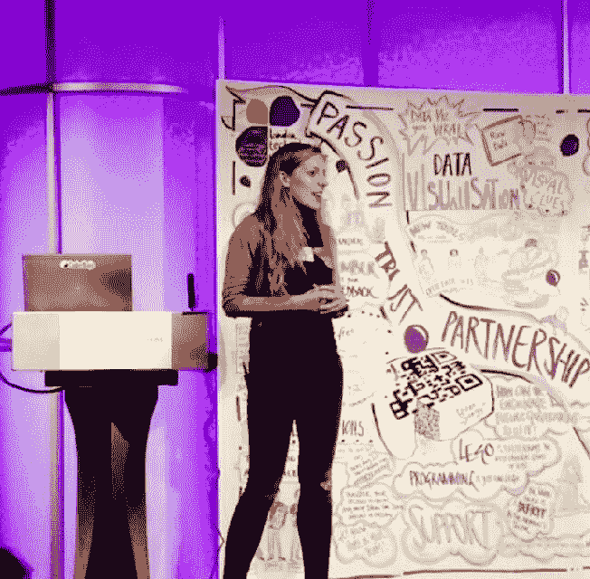

# TechCrunch Disrupt 伦敦黑客马拉松就在明天，拿上您的门票，见见我们的 MCs

> 原文：<https://web.archive.org/web/https://techcrunch.com/2016/12/02/techcrunch-disrupt-london-hackathon-is-tomorrow-get-your-tickets-and-meet-our-mcs/>

# TechCrunch Disrupt 伦敦黑客马拉松就在明天，拿好你的票，见见我们的 MCs

黑客马拉松将于明天开始，我们很高兴地宣布克莱尔·多诺霍和玛丽·卡尼将作为主持人加入我们。这里有更多关于将运行我们的黑客马拉松的动态二人组的信息。

玛丽·卡尼获得了 Dpt 的博士学位。在那里，她创建了一个模型来预测基于互联网的现象，如病毒传播。在博士期间，她在脸书的测量团队实习，目前在谷歌的语音/助理团队工作。

Marily 已经发表了 3 次 TEDx 演讲，她获得了 2015 年科学和工程领域女性(WISE)影响力奖，并因其在支持科技界女性方面的工作而获得了伦敦帝国理工学院颁发的杰出奖章。她是第一位获得谷歌 Anita Borg 奖学金的希腊女性，她现在是伦敦 Geekettes 分会的主任，并一直在努力寻找新的方法来增强英国和全球女性在科学领域的能力。她于 2013 年在伦敦脸书组织了英国第一次女性专属黑客活动，迄今为止已经参与并评判了总共 20 次黑客活动。最令人难忘的一次是被黑，由比尔和梅林达盖茨基金会赞助，她的团队获得了第二名。

Claire 对机器学习和计算机视觉有着长期的热情！她对解决现实世界的问题，应用这些领域的前沿研究感到兴奋。她被伦敦帝国学院授予博士学位。她的博士和博士后研究是在医学计算机视觉领域，获得了 10 个奖项和额外的资助。Claire 的研究产生了最先进的软件，该软件可以通过从数千张图像中学习来解释医学扫描并预测疾病的严重程度。她现在在商业环境中工作，并继续开发机器学习和计算机视觉算法，同时积极跟上最新的研究和学术趋势，以寻找新的机会。

在业余时间，她一直是科技界女性的大力支持者；参与指导计划，与玛丽·卡尼共同创立并领导伦敦极客乐队。

## 黑客马拉松门票

我们上次发布的面向黑客马拉松参与者的门票已经所剩无几，所以赶快去[注册吧。](https://web.archive.org/web/20221208110226/https://beta.techcrunch.com/event-info/disrupt-london-2016/disrupt-london-hackathon-2016/#tickets)

## 观众票

找个座位观看我们的黑客在周末付出的所有努力的高潮。今天，我们将在 12 月 4 日(星期日)发放观看 hack 项目演示的观众票。这些是给那些不是黑客但想看黑客和赢家的人看的。你可以在这里登记一张观众票[。](https://web.archive.org/web/20221208110226/https://beta.techcrunch.com/event-info/disrupt-london-2016/disrupt-london-hackathon-2016/#tickets)

明天见。