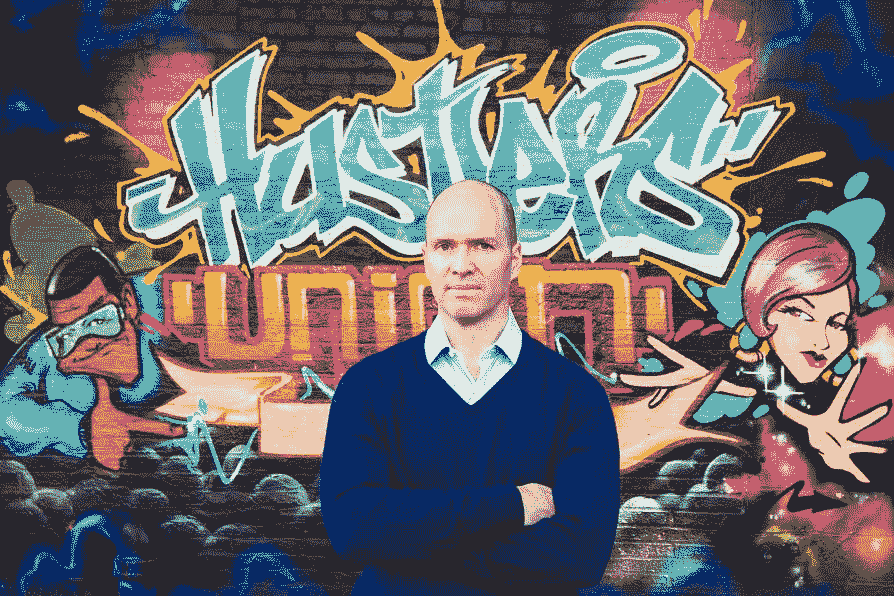

# TechCrunch 的赠品:本·霍洛维茨的“硬东西的硬东西”

> 原文：<https://web.archive.org/web/https://techcrunch.com/2014/05/01/techcrunch-giveaway-ben-horowitzs-the-hard-thing-about-hard-things/>

# TechCrunch 的赠品:本·霍洛维茨的“硬东西的硬东西”

本·霍洛维茨的故事很有力量，很吸引人，对我们社区的许多人来说也很有意义。在他的新书《困难的事情:在没有简单答案的情况下创业》中，他详细讲述了他所知道和经历的一切，并为企业家提供了一些建议。

正如马克·扎克伯格所说:“本的经验和专业知识使他不仅在硅谷，而且在全球知识经济中成为最重要的领导者之一。对于任何对建立、发展或领导一家伟大公司感兴趣的人来说，这本书是一个非常有价值的资源，也是一本有趣而有见地的读物。”

拉里·佩奇称之为“鼓舞人心的阅读”，迪克·科斯特罗说本的“结果简单、透彻、令人信服”

我的同事琳娜·拉奥[最近评论了《T3》这本书，霍洛维茨在一次采访中告诉她:“我从来没有想过要再写一本管理学的书。他们人数众多，每个人对他们的评价都一样，而且他们都是一样的——他们给出完全一样的建议。这就像一本减肥书，他们都说少吃卡路里，多运动，每本书都有相同的结论。所以我不想再写了。但在另一方面，我真的觉得有一本丢失的书，这就是当一切都出错时会发生的事情，而你已经设置好了。”](https://web.archive.org/web/20221204100517/https://beta.techcrunch.com/2014/03/03/the-hard-thing-about-hard-things-ben-horowitzs-honest-and-real-take-on-entrepreneurship/)

我们非常幸运地拥有本·霍洛维茨签名的 10 本书，我们想把它送给 10 位幸运的读者。您只需遵循以下步骤，就有机会赢得一本签名书:

1) **成为我们 TechCrunch 脸书页面的粉丝:**

2) **然后执行以下操作之一:**

*   转发这篇文章，包括#HardThings 标签
*   请在下面给我们留言，告诉我们你为什么想要一个

请只发一次信息，否则你将被取消资格。我们将确保您遵循上述步骤，并在下周四下午 7:30(太平洋时间)选出我们的 10 名获奖者。

祝你好运！

**更新:本次赠品结束。一旦我们有了获胜者，我们将更新这个帖子。**