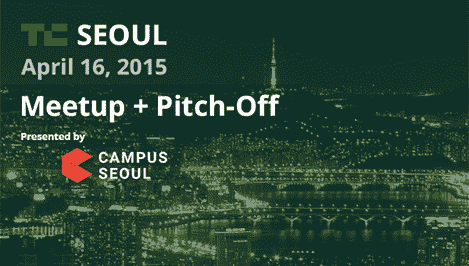

# 以下是 4 月 16 日在首尔召开的 TechCrunch 会议的议程

> 原文：<https://web.archive.org/web/https://techcrunch.com/2015/04/13/techcrunch-seoul-agenda/>

# 以下是 4 月 16 日在首尔举行的 TechCrunch 会议的议程

本周四， [TechCrunch 将与 Google Campus 合作，在韩国首尔](https://web.archive.org/web/20221006030832/https://beta.techcrunch.com/2015/02/04/techcrunch-meetup-in-the-city-of-seoul-april-16th/)举办我们的首次推介和见面会。距离会议结束只有 48 个小时了，我们希望向 1300 名与会者和其他感兴趣的人全面介绍会议日程和发言人。

决赛将于 4 月 16 日在首尔的 [aA 设计博物馆](https://web.archive.org/web/20221006030832/https://ko-kr.facebook.com/pages/aA-Design-Museum/233258180019314)举行——不幸的是，票已经卖完了，所以如果你已经买了票，请务必前来。

下午 6 点开门，然后会有一个小时的非正式社交活动。

晚上 7 点，我的同事和今晚的司仪[迈克·布彻](https://web.archive.org/web/20221006030832/http://twitter.com/mikebutcher)将开始表演，由谷歌首尔校园总经理杰弗里·林致开幕词。

我们想帮助企业家和初创公司。因此，除了举办推介比赛，Meetup 还将开始与韩国创业界的知名人士进行四次 10 分钟的炉边聊天，他们将提供他们的经验和见解的细节。

聊天结束后，我们将进入著名的 TechCrunch 推介会——首尔风格。

上周，我们[公布了我们从数百家申请](https://web.archive.org/web/20221006030832/https://beta.techcrunch.com/2015/04/06/tc-seoul-meetup-startup-contestants/)的初创公司中挑选出的 10 家。每个人将有两分钟时间向我们的评审团推销。然后将有四分钟时间进行后续问答。

评审团如下:

评审团将从竞赛中选出前三名创业公司，每个人都将获得[奖励，包括未来 TechCrunch Disrupt 活动的门票](https://web.archive.org/web/20221006030832/https://beta.techcrunch.com/2015/03/20/techcrunch-meetup-pitch-off-is-coming-to-seoul-next-month/) …当然，还有获胜带来的荣誉。

比赛获胜者应该在晚上 9:30 后宣布，这样在我们晚上 10 点后结束活动之前，有更多的时间进行交流。

我们非常兴奋能在首尔举办我们的开球活动，期待周四与您见面！

