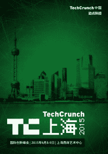

# 大家好! Join TechCrunch In Shanghai Next Week • 

> 原文：<https://web.archive.org/web/https://techcrunch.com/2015/06/04/techcrunch-shanghai-2015/>

下周对全球的 TechCrunch 来说是重要的一周。我们正在[庆祝我们的十周年纪念日](https://web.archive.org/web/20221006024014/https://beta.techcrunch.com/events/10-years-at-techcrunch/event-home/)——并与我们的中国合作伙伴 [TechNode](https://web.archive.org/web/20221006024014/http://technode.com/) 一起举办我们的 [TechCrunch 上海国际活动](https://web.archive.org/web/20221006024014/http://tc.technode.com/en/)。

这是我们第二次参加“东方巴黎”(点击查看我们 2013 年活动的[报道)。6 月 8 日和 9 日，我们将在上海的](https://web.archive.org/web/20221006024014/https://beta.techcrunch.com/events/techcrunch-shanghai/event-home/)[西岸艺术中心](https://web.archive.org/web/20221006024014/http://westbund.com/)。

中国的科技创新越来越难以忽视。很多人听说过[阿里巴巴](https://web.archive.org/web/20221006024014/http://alibabagroup.com/)、[腾讯](https://web.archive.org/web/20221006024014/http://www.tencent.com/en-us/index.shtml)、[百度](https://web.archive.org/web/20221006024014/http://www.baidu.com/)、[小米](https://web.archive.org/web/20221006024014/http://www.mi.com/)以及深圳的硬件制造中心，但仍有很多后起之秀的科技公司需要曝光。

今年的主题是物联网，我们的演讲者将深入探讨机器人、3D 打印、移动游戏、设计以及中国初创公司如何走向全球等话题。

硅谷和以色列都是全球科技市场创新的驱动力，我们很高兴美国和以色列总领事上台分享他们对中国创业公司如何取得成功的看法。

包括红杉中国、IDG、戈壁、光速、GGV、晨兴、DCM 和 GSR 在内的中国顶级风险投资家将与我们一起登台分享市场见解。宝马、奥迪和雪铁龙的高管将坐在一起讨论智能汽车的发展。

像微信、、、乐视、途牛和 PPTV 这样的中国超级明星也在演讲名单上，还有像饿了么、达意玛和西玛拉雅这样的新兴创业公司。

除了技术领导者的主题演讲和小组讨论，我们的创业之路将接待 150 多家公司。

时间不够？没问题。每天下午，10 家精选的创业公司将举行一场比赛，让观众近距离观看他们的产品和小工具。此外，Gobi Partners、谷歌(Google)和淘宝(Taobao)将举办三场平行会议，重点讨论企业家精神、中国企业的全球扩张和众筹。

对于早期创业公司，我们在两个下午都推出了与风投约会的环节，有 60 多位风投在等着与有前途的公司洽谈。

点击查看[的英文完整议程。你可以在这里买到票。](https://web.archive.org/web/20221006024014/http://tc.technode.com/en/agenda/)

下周一见！