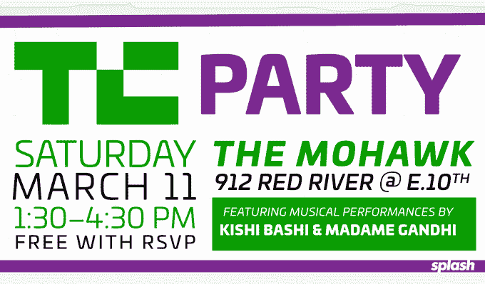

# 参加 TechCrunch 的年度派对和 SXSW 小组讨论

> 原文：<https://web.archive.org/web/https://techcrunch.com/2017/03/02/techcrunch-sxsw-party/>

# 来参加 TechCrunch 的年度聚会和 SXSW 小组讨论吧

TechCrunch 邀请你参加我们在奥斯丁的年度 **[聚会](https://web.archive.org/web/20221005192037/https://sxswtechcrunchparty.splashthat.com/)。RSVP 来见我们的作家，同时享受免费饮料和小提琴循环向导 Kishi Bashi，鼓舞人心的舞蹈鼓手 Madame Gandhi 和布鲁克林的 DJ Mick 的音乐表演。从**下午 1:30 到 4:30，3 月 11 日星期六**。我们将与 [Splash](https://web.archive.org/web/20221005192037/https://splashthat.com/) 合作，接管奥斯汀最顶级的场馆之一**莫霍克**，该场馆距离东 10 街 912 号红河会展中心仅六个街区。**

**[RSVP 此处为您免费送票](https://web.archive.org/web/20221005192037/https://sxswtechcrunchparty.splashthat.com/)** (参赛必选，先到先得)

准备好融入岸信介童话般的独立流行音乐。作为蒙特利尔乐队的前小提琴手，Kishi Bashi 在舞台上现场录制和循环他的乐器和声音，创作关于跳舞的牛排和蝴蝶最好的朋友的歌曲。M.I.A .的前鼓手[甘地夫人](https://web.archive.org/web/20221005192037/http://www.madamegandhi.com/)将用电子节奏和赋权的信息激励你，就像她的果酱“未来是女性”。米克会在甲板上确保音乐永不停止。他在米歇尔·奥巴马、碧昂斯，当然还有所有主要科技公司的活动中亮相。

[https://web.archive.org/web/20221005192037if_/https://www.youtube.com/embed/oLrTccve9uQ?start=63&feature=oembed](https://web.archive.org/web/20221005192037if_/https://www.youtube.com/embed/oLrTccve9uQ?start=63&feature=oembed)

视频

[https://web.archive.org/web/20221005192037if_/https://www.youtube.com/embed/_3jasXVUg2w?start=25&feature=oembed](https://web.archive.org/web/20221005192037if_/https://www.youtube.com/embed/_3jasXVUg2w?start=25&feature=oembed)

视频

https://www.youtube.com/watch?v=ZSO30f32NoE&

TechCrunch 的六个编辑团队将会到场听取你的工作成果。在户外露台和屋顶平台上闲逛，或者在现金酒吧享受免费饮料来躲避阳光。在过去的两年中，近 1000 人参加了 SXSW Interactive 最具标志性的一天聚会，所以不要错过！

**[这里又是那个购票链接](https://web.archive.org/web/20221005192037/https://sxswtechcrunchparty.splashthat.com/)**

TechCrunch 与 Splash 和 TravelBank 合作，为您打造这种体验。我们仍在寻找更多的赞助商，任何感兴趣的人都可以发电子邮件给 sponsors@beta.techcrunch.com

## SXSW 面板

TechCrunch 的作家也参加了一系列 SXSW 小组讨论。这是时间表: