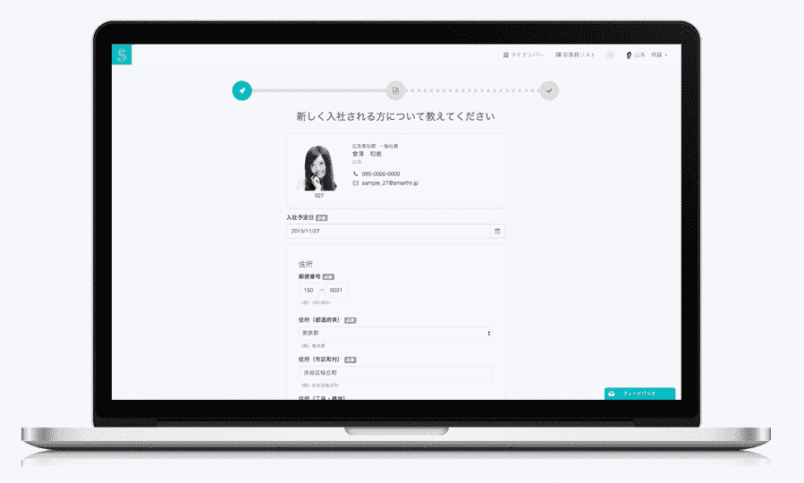
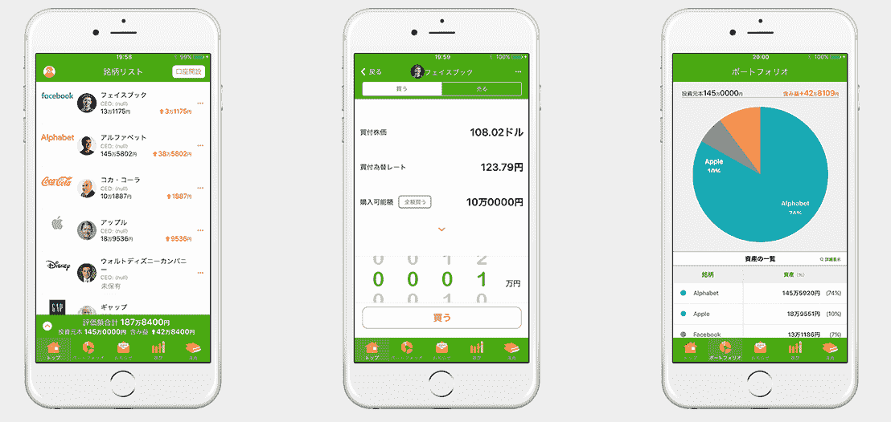
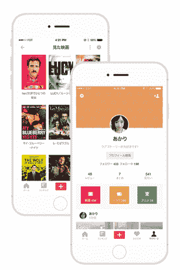

# 东京创业战场:SmartHR 摘得桂冠

> 原文：<https://web.archive.org/web/http://techcrunch.com/2015/11/19/techcrunch-tokyo-startup-battlefield-smarthr-takes-the-top-prize/>

每年，[我们的日语姐妹网站](https://web.archive.org/web/20230324190223/http://jp.beta.techcrunch.com/)都会在东京举办一场类似于[的大型扰乱活动，当然，这里是大约 10 家不同创业公司之间的战场。日本有超过 1 亿的互联网用户，拥有相当大的国内市场。虽然西方公司在日本比在 mainland China 更成功，但日本的初创企业仍有大量通过适应当地需求而发展壮大的企业。](https://web.archive.org/web/20230324190223/http://jp.beta.techcrunch.com/events/techcrunch-tokyo-2015/event-home/)

今年的赢家是 [SmartHR](https://web.archive.org/web/20230324190223/https://smarthr.jp/) ，一个管理和登记就业福利和援助项目的平台。股票交易应用程序 One Tap Buy 位居第二。

以下是所有的初创公司:

SmartHR: [该公司是 Zenefits](https://web.archive.org/web/20230324190223/https://smarthr.jp/) 的国内版本，它处理当地保险和就业援助福利计划的登记。创业公司说现在的流程太繁琐；比如一个女人要休产假，有无数种形式。SmartHR 是一种在线注册和福利管理服务，可自动为政府机构创建福利申请。

**爆米花**是一家名为 [Coubic](https://web.archive.org/web/20230324190223/https://coubic.com/) 的公司的产品，帮助消费者与当地水疗中心和服务提供商预约时间。Coubic 是该产品的母公司，该产品为当地企业处理日程安排，服务等级从免费到每月 49 美元不等。爆米花是其面向消费者的一面，提供健康和美容治疗的交易和特价。

**一键买入:** [这是手机炒股买入 app](https://web.archive.org/web/20230324190223/http://www.onetapbuy.co.jp/) 。只需点击三次鼠标，你就可以用 1 万日元(81 美元)买到股票。这个连在战场上获得了亚军。

这家初创公司是一家在线助理公司，为客户提供在线秘书、会计或人力资源方面的帮助。他们可以帮助研究和分析，工作通信和面试帮助，客户支持和日程管理。试用期是免费的，但最便宜的计划每月起价 7 万日元，或略高于 500 美元。虽然 Zirtual 可能已经失败，但该公司表示，在助理获得许可的日本，监管环境完全不同。

SHELFY 将餐馆和消费者等当地企业与建筑和室内装饰公司联系起来。他们说，从成千上万的选择中找出承包商并与之合作的正常过程有很多麻烦。该公司将所有这些承包商带到网上，为客户提供了一个简单的投标和设计流程。

这是一款知识分享应用，专家们可以在这里上传自己传授技能的视频。视频教授如何处理电话或客户支持，甚至工作招待应用程序。也有机会提供反馈，甚至与其他用户就所教的技能进行竞争。

****

这家公司根据评级和评论为电影提供个性化的推荐，他们说这是一个比网飞更好的推荐引擎。,

**WealthNavi:** 这是一个[帮助消费者进行智能投资的财富顾问平台](https://web.archive.org/web/20230324190223/http://www.wealthnavi.com/)。该公司表示，日本的散户投资者经常在缺乏大量信息的情况下获得风险更高的推荐。该公司让客户填写一份表格，解释他们的年龄、投资目的、年收入和资产。目前，他们正在提供建议，但表示随着许可和监管的变化，他们将能够成为直接的资产管理公司。

[vimeo 141263581 w=500 h=281]

[BONX |可穿戴对讲机:来自](https://web.archive.org/web/20230324190223/https://vimeo.com/141263581) [CHIKEI Inc.](https://web.archive.org/web/20230324190223/https://vimeo.com/user44348978) 的 SNOW 在 [Vimeo](https://web.archive.org/web/20230324190223/https://vimeo.com/) 上。

**Bonx:** [这是由一些东京大学的学生发明的](https://web.archive.org/web/20230324190223/http://bonx.co/en/)设备，他们想要一种简单的方式在进行冒险运动时保持联系。这是一个音频接收器，让他们在滑雪、滑冰或进行其他类型的集体活动时相互交谈。他们说，他们进军的是 GoPro 以其微型可安装相机应对的数十亿美元市场。

**商店柜台:** [这是一个弹出式商店平台](https://web.archive.org/web/20230324190223/https://shopcounter.jp/)，让商人、艺术家和服装零售商在空间里建立临时商店，比他们必须签署长期商业租约更快。他们有一个平台，可以按天或周列出各种空间。

**Mijin:** [这是一家试图用区块链的潜在力量重现传统数据库](https://web.archive.org/web/20230324190223/http://mijin.io/en/)的初创公司，旨在创建支付系统、在线游戏、航空里程计划、物流、保险和金融系统。这家初创公司目前处于 beta 测试阶段，明年年初，他们将与一家商业合作伙伴进行封闭测试。