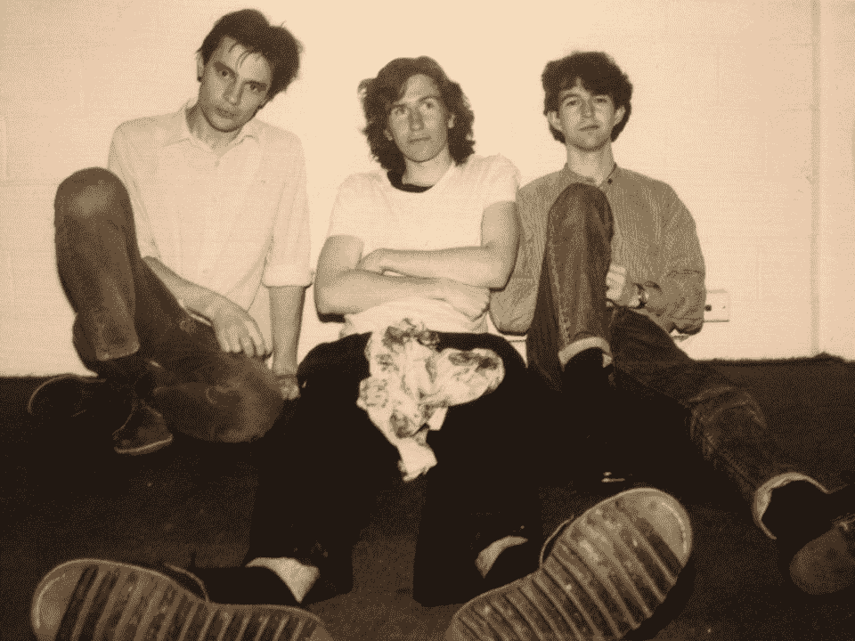

# 澳大利亚知名企业加入初创公司战地澳大利亚

> 原文：<https://web.archive.org/web/https://techcrunch.com/2017/09/24/techcrunchs-startup-battlefield-australia-joined-by-leading-aussie-names/>

你可能已经知道，TechCrunch 将与 ELEVACAO 合作，前往澳大利亚寻找最具颠覆性的早期创业公司。正如我们最近常说的，“条条大路通颠覆”，我们现在的重点是在全球范围内寻找适合我们颠覆阶段的最佳创业公司。

TechCrunch 的初创公司战地澳大利亚是我们有史以来的第一次，对我来说，能够离开伦敦来到“澳大利亚”特别甜蜜。一个鲜为人知的事实是，我拥有双重国籍，既出生在英国，又持有澳大利亚护照。但一会儿会有更多。

在过去几年中，澳大利亚越来越多地被称为科技创业中心，见证了 MYOB 的 8.33 亿美元 IPO(澳大利亚有史以来最大的科技 IPO)，Atlassian 在美国的 11 亿美元 IPO，澳大利亚 Campaign Monitor 的 2.5 亿美元股权增长轮和新西兰 Xero 的 1.5 亿美元轮。高增长的创业公司正在该地区激发一大批健康的早期创业公司。

TechCrunch 的初创公司战地澳大利亚也将有许多优秀的人加入我们的舞台，其中包括:

**[迈克·坎农-布鲁克斯](https://web.archive.org/web/20221207211923/https://www.crunchbase.com/person/mike-cannon-brookes#/entity)，Atlassian 联合首席执行官兼联合创始人**

[Catriona Wallace](https://web.archive.org/web/20221207211923/https://www.linkedin.com/in/drcatrionawallace/?ppe=)，火烈鸟的创始人

[詹姆斯·卡梅隆](https://web.archive.org/web/20221207211923/https://www.crunchbase.com/person/james-cameron-3#/entity)，Airtree Ventures 的合伙人

TechCrunch 的[创业战场](https://web.archive.org/web/20221207211923/https://beta.techcrunch.com/startup-battlefield/)自 2007 年以来一直将世界级的创始人带到聚光灯下，在过去的十年中，近 700 名参赛者已经筹集了近[70 亿美元的资金](https://web.archive.org/web/20221207211923/https://beta.techcrunch.com/startup-battlefield/leaderboard/)，并获得了近 100 次退出。

我们的战地校友社区包括 Mint、Dropbox、Yammer、TripIt、Getaround 和 Cloudflare 等公司。我们很高兴为[澳大利亚的第一个 TC 战场](https://web.archive.org/web/20221207211923/https://beta.techcrunch.com/2017/09/14/battlefield-australia-produces-a-striking-group-of-founder-applicants/)展示一个多元化的团体。

TechCrunch 战地澳大利亚的获胜者将获得 25，000 美元的无股权现金奖和一次免费旅行(两人),以在 TechCrunch 的旗舰全球竞赛中展出，扰乱战地 SF 2018 并在初创企业战地中竞争，前提是该公司仍有资格参加该竞赛。整个活动将在 TechCrunch.com、YouTube、脸书和 Twitter 上直播(稍后可以点播)。

为了将战地带到澳大利亚，TechCrunch 与 ELEVACAO 基金会合作，该基金会的使命是在全球范围内赋予女性科技企业家权力，这与 TechCrunch 的 Include 项目相一致，旨在鼓励科技领域的多元化。

至于我和澳大利亚的历史，简单的说，我的家人为了我父亲的工作搬了过来，他是一名疟疾科学家，在纽卡斯尔和堪培拉的项目中工作。在这个过程中，我甚至去了 ANU。那段时间我主要做了两件事(除了文学学位)。第一个是通过联合创办一份学生报纸来获取新闻业的知识。第二个是在成长中的鞭挞/垃圾/摇滚现场打鼓(嘿，那是 80 年代末)。这让我认识了传奇的(嗯，在我看来)ANU 学生乐队“快乐的头”随着蒂姆的歌曲创作，他灼热的电视转播，由阿德里安低音和我打鼓，我们支持了许多头条新闻行为通过堪培拉。

欢乐合唱团团长:阿德里安、蒂姆和迈克

但是摇滚乐队很少是永远的，最终，蒂姆搬回悉尼组建了另一支乐队，而我搬回伦敦成为了一名记者。蒂姆的乐队变成了[你就是我](https://web.archive.org/web/20221207211923/http://youami.com.au/)，这是澳大利亚有史以来最成功的乐队之一。从那以后，我有幸看到现在著名的[蒂姆·罗杰斯](https://web.archive.org/web/20221207211923/http://www.timrogersmusic.net/)和他的乐队在英国巡回演出，我很高兴在那里听到一些永远美妙的澳大利亚音乐。