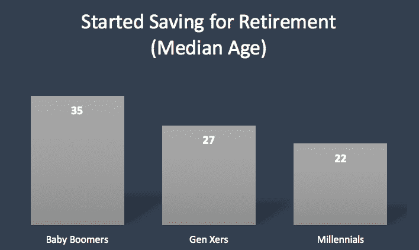
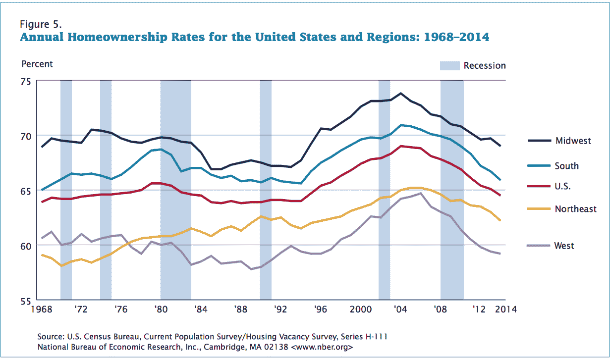

# 技术正在改变我们的退休方式 

> 原文：<https://web.archive.org/web/https://techcrunch.com/2016/03/23/technology-is-changing-how-we-retire/>

塔克·史密斯就职于

[OneRent](https://web.archive.org/web/20221209195216/https://www.onerent.co/)

.

从婴儿潮一代到 X 一代，再到千禧一代，似乎每一代人都面临着一系列新的问题，他们认为这些问题比上一代人更难解决。婴儿潮一代成长于冷战高峰时期，x 世代在经济衰退中首当其冲，千禧一代背负着比以往更多的学生债务。

退休是一个温床问题，根据个人年龄的不同会引发不同的反应，但事实证明这是一个影响所有三代人的问题。对技术的不同程度的接触、熟悉和信任，以及对成功的退休的不同定义，是每个人群对这个问题的态度的根源。

有趣的是，一些传统的投资形式，如房地产和股票交易，在每个人群中有不同的想法，而其他传统媒介，如 401k，则以相对相同的方式使用。

## 40.1 千代

统计数据来自泛美退休研究中心 2014 年的一项调查

但稍后会详细介绍。首先，我们来分解一下每一代人是如何处理退休规划的。

## [婴儿潮](https://web.archive.org/web/20221209195216/http://www.transamericacenter.org/docs/default-source/resources/center-research/tcrs2014_sr_baby_-boomers_and_employers.pdf)(社保一代)

出生于 1946 年至 1964 年之间的婴儿潮一代在一个充满冲突的工业化世界中长大，见证了朝鲜战争、越南战争和美国作为一个工业超级大国的诞生。他们是第一批出生在有退休计划的美国人:社会保障。

1935 年通过的《社会保障法》旨在为年满 65 岁的老年人提供退出劳动力市场的途径。婴儿潮时期出生的人从小就对该计划充满信心，这也解释了为什么他们中的三分之一的人计划将社会保障作为他们退休收入的主要来源。

> 千禧一代是每个人似乎都有自己看法的一代。

理论上，这个概念很简单:那些有工作能力的人将把一部分工资交给那些不再有工作能力的人，按照今天的数字，这相当于每个社保受益人有 2.8 个工人。平均受益人每月可以从社会保障中获得 1229.85 美元，这是 2431 万婴儿潮一代退休后的主要收入来源。

这一冷酷无情的事实导致几乎三分之二的婴儿潮一代计划在 65 岁后退休，超过一半的人认为减少工作时间和 T2 退休是一回事。

尽管婴儿潮一代是听着社会保障带来的好处长大的，但他们很快意识到继续在 T4 退休是不够的，他们正疯狂地努力使收支平衡。

出生于 1965 年至 1978 年的 x 世代是早期科技繁荣的产物。见证了互联网在成年后的崛起，他们对技术很熟悉，但不时会面临信任问题。他们也是第一代质疑社会保障能力的人，他们在 20 世纪 80 年代中后期开始参加工作时，看到雇主大规模采用了 401k，使他们成为“401k 一代”。

x 世代通过将 401k 整合到他们退休计划的核心，开创了结构化的个人退休计划的理念。与其他两代人相比，x 一代人更有可能选择参加 401k 计划，并且比婴儿潮一代人更有可能使用专业的财务规划师。大约 83%的 x 世代不相信在他们想要的退休年龄会有社会保障，其中 54%的人认为会在 65 岁以后。他们对社会保障缺乏信心，这使得他们中的大多数人认为，仅仅出于经济原因，他们需要兼职工作到退休。

虽然他们成长于数字世界，但 x 世代不太可能信任金融科技，这就是为什么我们 T21 看到他们的 401k 账户中的退休基金比他们的千禧一代更加密集的原因。x 世代在退休规划上显示出一个重要的进步，他们以一种更实际、更个人化的方式将婴儿潮一代的方式向前推进了一步。

统计数据来自泛美退休研究中心 2014 年的一项调查

## 千禧一代(创新一代)

出生于 1979 年至 1996 年之间的千禧一代似乎是每个人都有自己看法的一代，但似乎有一个普遍的共识，即他们在某种程度上是破坏性的。本质上，出生时就掌握着 T2 技术，对没有互联网的世界几乎没有记忆，千禧一代通常更容易接受 T4 的变化，并乐于挑战传统的思维和生活方式。因此，这种与技术的共存伴随着对即时满足和获取信息的内在需求。

与上面提到的 401k 图表可能暗示的相反，调查显示，千禧一代实际上比前两代人对退休更加自觉和积极。平均而言，他们比婴儿潮一代早 13 年，比 x 世代早 5 年开始为退休储蓄。

然而，这一趋势的结果并没有以最明显的方式反映出来。稍微算一下就会发现，千禧一代实际上每年缴纳的养老金比婴儿潮一代(2357.14 美元)和 x 一代(1372.55 美元)少，平均只有 864.86 美元。但这并不意味着他们在减少储蓄。事实上，研究显示情况恰恰相反。

千禧一代较少的 401k 缴款背后的故事实际上是，他们通过更开放地适应新的技术平台和服务，使他们能够分散投资基金，使 Xer 一代的退休方法更进了一步。金融科技和房地产领域的创新让千禧一代能够利用他们的适应能力，进入过去几代 20 多岁的年轻人无法进入的岗位。

> x 世代不太可能信任金融科技。

像 [Wealthfront](https://web.archive.org/web/20221209195216/https://www.wealthfront.com/) 和 [Betterment](https://web.archive.org/web/20221209195216/https://www.betterment.com/) 这样的机器人投资服务给了他们比以前的几代人更早开始股票交易的信心，他们必须了解这个行业的来龙去脉，才能有效地使用他们的资金。我们可以看到，随着像 [Acorns](https://web.archive.org/web/20221209195216/https://www.acorns.com/) 这样使储蓄和投资自动化的服务和 [Robinhood](https://web.archive.org/web/20221209195216/https://www.robinhood.com/) 这样使股票交易决策更自由、错误更少的服务的不断改进，信心再次增强。

上面提到的投资平台都通过不同的方式让更广泛的人可以进行股票交易，但都改变了千禧一代对这个行业的看法。

婴儿潮一代、x 一代和千禧一代对房地产的看法也不一样。婴儿潮一代在一个每个月都会出现新郊区的美国长大，他们将房产视为人们计划居住多年的储蓄金。对他们来说，拥有一个家是一种成就，在他们成年后要做的事情清单上打勾，或者换句话说，是意料之中的。

总的来说，x 一代最初认为找房子和婴儿潮一代相似，但当 2007 年房地产泡沫破裂，他们中的许多人失去了他们本该抚养新家庭的房子，他们的观点发生了变化。自泡沫破裂以来，美国已经成为一个租房者的国家，正在复苏的 x 世代和不稳定的千禧一代引领着这一趋势。反过来，由于租金的大幅上涨，房东们获得了巨大的利润，这使得购买和持有出租房产成为一个人退休投资组合中的“必备品”。

