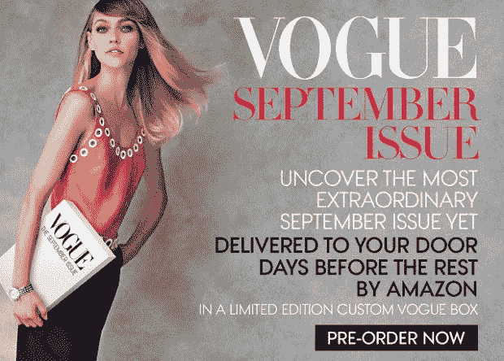

# 科技今年很流行...字面意思

> 原文：<https://web.archive.org/web/https://techcrunch.com/2015/09/08/techs-in-vogue-this-year-literally/>

我知道这可能会让你震惊，但我不是时尚专家。如果我能找到两只相配的袜子穿，我就很幸运了。大多数时候我放弃了，没有。然而，看起来科技世界的其余部分正在寻求提升其时尚游戏，即苹果和亚马逊。

在今年的《Vogue》9 月刊中，两家公司都在维拉王、卡尔文·克莱恩、路易·威登、凯特·斯派德和乔治·阿玛尼等时尚偶像中展示了自己的最佳表现。时装周即将到来，这些公司想要这些特定的眼球。

幸运的是，我的未婚妻 April 和我坐了很长时间的飞机，所以她有时间告诉我为什么这很有趣。显然，这期《时尚》杂志通常被称为“圣经”所有即将到来的大趋势都在那里。是 832 页的*广告*(当然还有一些内容)。甚至还有一部关于九月刊制作的[纪录片。](https://web.archive.org/web/20230406213006/http://www.imdb.com/title/tt1331025/)

这已经不是科技公司第一次讨论这个问题了，谷歌在 2013 年推广谷歌眼镜[。不过，感觉真的很难受。显然是这样，因为现在戴眼镜的是医生，而不是模特(或有抱负的模特)。](https://web.archive.org/web/20230406213006/http://www.theatlantic.com/technology/archive/2013/08/huh-vogue-publishes-12-page-google-glass-spread-in-september-issue/278771/)

当 April 在飞机上翻阅杂志时，她指着左边和右边的技术参考资料。Apple Watch！亚马逊时尚！(不管那是什么)苹果音乐！甚至《星球大战》也得到了认可。对于一群喜欢合适的眼线和一条 200 美元的牛仔裤的人来说，这是一个很大的怪癖。

但就是这样，这就是这些公司想要的受众。对于一期正常的杂志，《Vogue》看到大约有 1，256，659 份被抢购一空。据该杂志称，九月号是它自己的野兽，它的“总受众”是这样划分的:

当[苹果收购 Beats](https://web.archive.org/web/20230406213006/https://techcrunch.com/2014/05/28/apple-buys-beats-electronics-for-3b/) 时，它是关于几件事:科技、德瑞医生、强大的生活方式品牌、德瑞医生和德瑞医生。Beats 很酷。它带有缓存。这种缓存看起来不像流行的不合时宜的谷歌眼镜。它*适合*。

苹果手表是一种时尚宣言，而不是一种科技产品。我的意思是，这就是为什么[苹果有一个荒谬定价版本的设备](https://web.archive.org/web/20230406213006/https://techcrunch.com/2015/03/11/rose_gold/)…只是为了它可以挂在时尚人群。基本上是要求。

[gallery ids="1205966，1205964，1205965，1205963，1205962，1205961，1205959，1205960，1205957，1205955，1205958"]

就亚马逊而言，我不知道“亚马逊时尚”到底是什么。他们没有自己的服装系列，也没有任何有趣的代言人，但我猜这是他们正在努力提升的东西，尤其是因为他们在伦敦新开了一家照相馆，用服装照片给人们留下深刻印象。

我的意思是，如果你想预订大量的 Vogue 广告，你可以在亚马逊上预订。所以他们显然都参与了这场时尚游戏。

时尚界和科技正在发生碰撞，这不仅仅是因为可穿戴设备。这是一种生活方式，很酷，是一场比赛，看谁能最快地把极客变成时尚。

失陪了，我要继续寻找相配的袜子了。