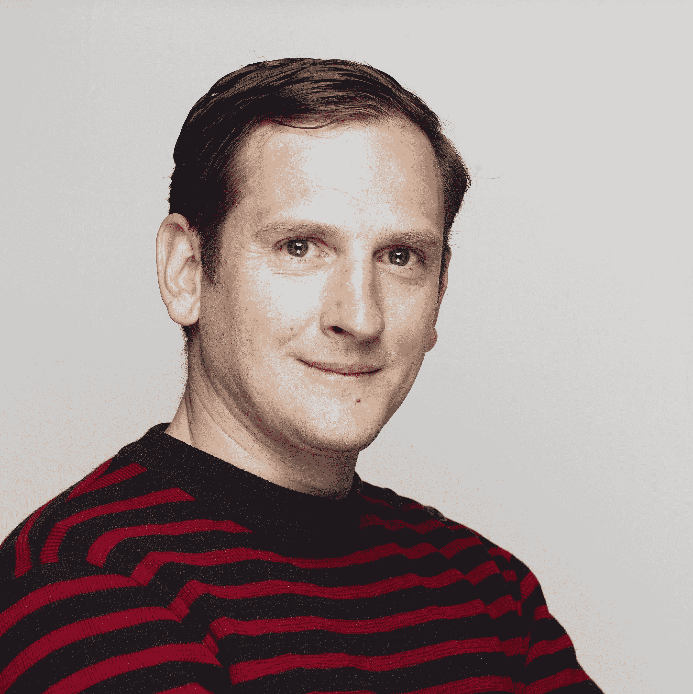

# Techstars 在巴黎的 Partech Shaker 上推出了一项新计划 

> 原文：<https://web.archive.org/web/https://techcrunch.com/2017/03/20/techstars-launches-a-new-program-in-paris-at-the-partech-shaker/>

[Techstars](https://web.archive.org/web/20230202105239/http://www.techstars.com/) 即将在巴黎推出新的创业加速器。每年都会有 10 家创业公司参加这个为期 13 周的项目。Techstars 与风险投资公司 [Partech Ventures](https://web.archive.org/web/20230202105239/https://www.crunchbase.com/organization/partech-international) 合作。特别是，Techstars Paris 将在 [Partech Shaker](https://web.archive.org/web/20230202105239/http://partechshaker.com/) 大楼举行。

“我很高兴地宣布，我们将在法国启动第一个项目，Techstars Paris，”总经理 Bertier Luyt 告诉我。“这是一个‘城市计划’，一个没有任何特定行业焦点的计划，非常广泛和开放。”

第一批将于 2017 年 9 月开始，[应用](https://web.archive.org/web/20230202105239/http://www.techstars.com/apply/)应该很快就会开始。如果你被选中，你将获得 12 万美元的资助，Techstars 将持有你公司 6%的股份。好消息是这个项目并不局限于法国的初创公司。任何想在巴黎待一段时间的企业家都可以申请。我希望外国企业家也会采取行动。

Techstars 有许多不同的程序。最著名的可能是纽约市、博尔德市、波士顿等地的城市项目。该公司还与迪士尼、巴克莱等大公司合作，为它们运营加速器——这些项目也创造了健康的收入流。

但是 Techstars 也在和法国的大公司合作。Partech 为 Techstars 做了一些介绍，原来法国液化空气、法国 Jeux、安盟、雷诺、道达尔都是 Techstars 巴黎合作伙伴。

这正是你对这种伙伴关系的期望。那五家公司都在给钱，希望能早点看到一些创新创业公司。“他们还提供指导、行业专家介绍、市场数据以及与这些合作伙伴一起进行测试的能力，”Luyt 说。

每年只会有一批。如果你的初创公司在 2017 年底没有处于正确的阶段，也许你应该考虑另一个 Techstars 项目，因为它们不会在同一时间发生。

Luyt 说:“在这一批之后，我们为巴黎的 Techstars 合作伙伴，为他们的团队和员工开发另一个程序。”“第一期节目定于 2018 年第一季度。”通过这种方式，像道达尔(Total)和雷诺(Renault)这样的老牌法国巨头将了解初创公司实际上是如何运作的。

Techstars Paris 的推出是法国科技生态系统的一个好兆头。在法国已经有很多很多不同的加速器，但 Techstars 品牌比其中的许多更强大。

至于商业模式，大型上市公司真的想把钱花在创业上。我不确定它是否会给初创公司增加很多价值，但至少它让这个项目成为可能。

我个人迫不及待地想看到今年秋天的第一批创业公司。也许 Techstars 的声誉会将这个计划变成法国年轻创业公司的一个有趣信号。

