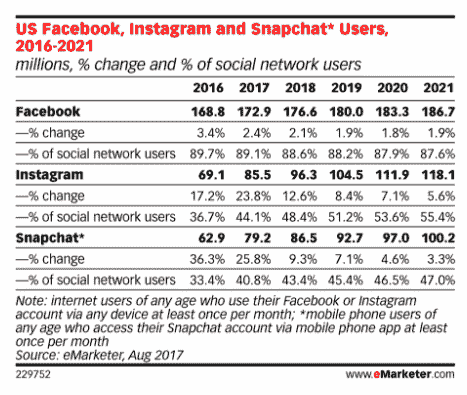
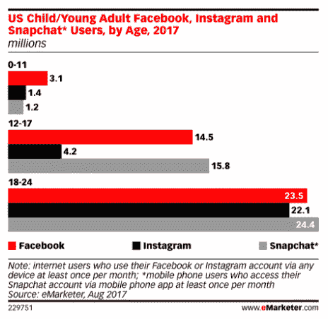
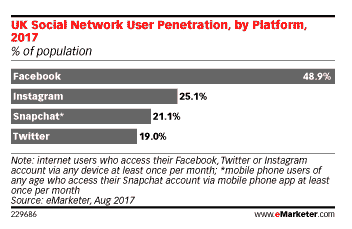

# eMarketer TechCrunch 表示，青少年更喜欢 Snapchat 和 Instagram，而不是脸书

> 原文：<https://web.archive.org/web/https://techcrunch.com/2017/08/22/teens-favoring-snapchat-and-instagram-over-facebook-says-emarketer/>

根据研究公司 eMarketer 的最新预测，脸书正在失去对青少年的吸引力，这导致该平台的增长普遍放缓。

与此同时，替代社交应用 Snapchat 和([旗下的](https://web.archive.org/web/20221005162631/https://beta.techcrunch.com/2012/04/09/facebook-to-acquire-instagram-for-1-billion/) ) Instagram 在相同的年轻人群体中出现了两位数的增长——这表明年轻用户更喜欢更新、更可视化的交流平台。

eMarketer 预测分析师奥斯卡·奥罗兹科在一份声明中指出:“这两个平台都在这一人群中取得了成功，因为它们更符合他们的沟通方式——使用视觉内容。”。

据研究人员称，这是脸书连续第二年在这个广告商梦寐以求的群体中出现预期的使用率下降。

eMarketer 表示，一些青少年甚至完全不采用脸书(它称他们为“脸书·内韦尔”)，而是直接进入竞争平台，尽管剩余的青少年似乎对脸书不太感兴趣——登录频率更低，在平台上花费的时间更少。

虽然在令人垂涎的广告人群中的相关性下降对于一个业务依赖于广告收入的社交巨头来说显然不是好消息，但脸书也拥有两个主要的年轻人友好的替代平台之一:Instagram。(又名‘如果你不能成为它，就买下它’。)

尽管如此，eMarketer 还预计，从 ZuckSnapchat 手中收购的[将在 2017 年首次在青少年(12 至 17) &年轻成人(18 至 24)年龄层超过 Instagram 和脸书，将其在美国社交网络用户中的份额提高到 40.8%，并预计到 2021 年接近大多数。(尽管 Instagram 预计也将在这段时间内保持更大的影响力。)](https://web.archive.org/web/20221005162631/https://blogs.wsj.com/digits/2013/11/13/snapchat-spurned-3-billion-acquisition-offer-from-facebook/)

早在 2013 年，当脸书拒绝收购 Snapchat 的报道浮出水面时，紧随其后的是该公司[报告使用其服务的青少年](https://web.archive.org/web/20221005162631/https://beta.techcrunch.com/2013/10/30/facebook-teens-drop/)首次出现下降。

近四年后，脸书让青少年开心的问题变得越来越大——但该公司利用 Instagram 成功克隆 Snapchat 功能的帮助缓解了这个问题。(即使这意味着脸书的企业格言现在真的应该是:‘快速行动，克隆东西’。)

 eMarketer 表示，美国 12 岁和 17 岁年龄组的脸书使用率下降最“急剧”——指出尽管该年龄组 81.9%的社交网络用户预计今年会使用脸书，但到 2021 年这一数字将下滑至 76.2%。

【eMarketer 预测的其他亮点:

*   与 2016 年相比，美国 12 至 17 岁年龄组的脸书使用率将下降 3.4%，至 1450 万，比去年 1.2%的下滑速度有所加快
*   脸书的美国月度用户总数预计今年将增长 2.4%，达到 1.729 亿人——由于老年互联网用户的增加，这比之前的预测略有上升
*   Snapchat 的美国月度用户预计将在 2017 年增长 25.8%，至每月 7920 万人，除了年龄最大的年龄组，所有年龄组的增长数据都有所上调，18 至 24 岁年龄组的增幅最大，预计今年的使用量将增长 19.2%
*   2017 年，Instagram 的美国月度用户预计将增长 23.8%，达到 8550 万人，12 岁以下用户群将增长 19%，12 岁至 17 岁用户群将增长 8.8%

*   在英国，脸书今年估计有 3250 万月活跃用户，仍是最受欢迎的社交网络，尽管它在年轻群体中的份额也被 Snapchat 和 Instagram 夺走了
*   在英国，Instagram 预计在 2017 年拥有 1670 万月度用户，比 2016 年增长 34.8%——总覆盖人数超过英国人口的四分之一(与其在美国的覆盖人数相同)
*   在英国，Snapchat 预计将拥有 1400 万月度用户，预计今年将增长 20.2%(这意味着它将覆盖约五分之一的人口)
*   尽管 Twitter 今年在英国的用户总数预计将达到 1260 万

eMarketer 的方法将每月用户统计为在整个日历年中每月至少访问其账户一次的人。该公司表示，其预测是基于对研究公司、政府机构、媒体公司和上市公司的定量和定性数据的分析，以及对出版商、广告买家和广告公司高管的采访。

在撰写本文时，脸书尚未回复置评请求。