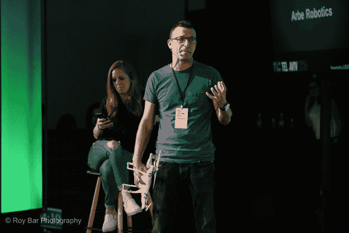
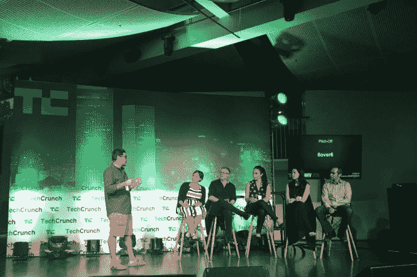
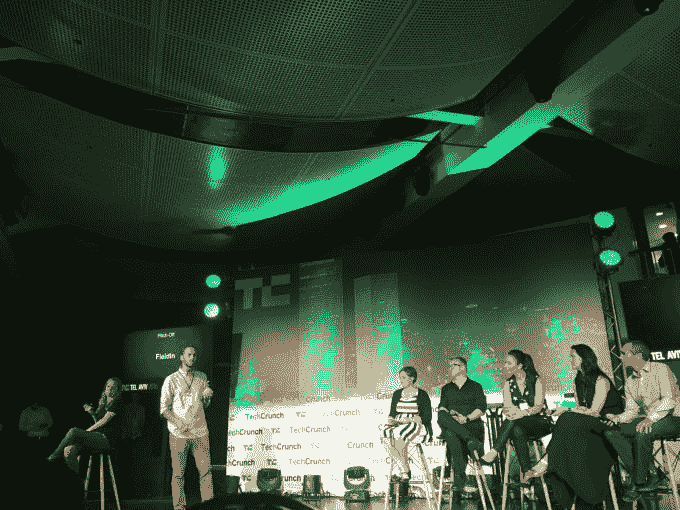

# 我们在特拉维夫的第一次聚会和比赛的获胜者是……

> 原文：<https://web.archive.org/web/https://techcrunch.com/2016/06/22/tel-aviv-meetup-winners/>

本周，我们 TC 在以色列度过了一段美好的时光，见到了创始人，听到了疯狂的新技术，可能还吃了太多的食物。昨天，我们在这里的时间以我们来这里的一件大事而告终:我们在特拉维夫的第一次聚会和开球。超过 900 人聚集在特拉斯克的海边，与前总理和前总统西蒙·佩里斯(T4)一起看[的炉边谈话](https://web.archive.org/web/20230129095750/https://techcrunch.com/2016/06/19/announcing-the-agenda-for-the-techcrunch-meetup-in-tel-aviv/?iframe=true&theme_preview=true)；在以色列出生和成长的一些(许多)突破性创业公司的领先企业家；以及一些支持他们的风投。还有！我们还举办了一场著名的聚会+比赛！

我们有十家出色的公司在当晚进行推介，但只有三家能够成为赢家。热烈祝贺第一名 [Arbe Robotics](https://web.archive.org/web/20230129095750/http://www.arberobotics.com/) ，第二名 [6over6 Vision](https://web.archive.org/web/20230129095750/http://www.6over6.com/) ，以及观众选择 [Fieldin](https://web.archive.org/web/20230129095750/http://www.fieldintech.com/) ！

作为第一名，Arbe 将于今年 12 月在伦敦的 TC Disrupt Startup Alley 获得一张桌子，以及两张 Disrupt 大会的门票。第二名 6over6 获得两张活动门票，Fieldin 将获得一张。请在下面阅读更多相关内容！

**Arbe Robotics** 希望通过一种新的传感器在无人机行业掀起一些浪潮，确切地说是无线电波，这种传感器将帮助无人机和其他自主飞行物体不仅能看到，还能避开它们路径上的东西。想想蝙蝠，但是被小工具爱好者(或者，呃，亚马逊)控制着。正如首席执行官兼创始人[(也是重复创业者](https://web.archive.org/web/20230129095750/https://www.linkedin.com/in/kobimarenko))科比·马伦科在他的演讲中解释的那样，Arbe 正在开发的传感器不仅价格是正在开发的基于图像处理的传感器的一小部分，而且它们实际上更加节能，这意味着 Arbe 的技术将使你的无人机飞行更长时间。如果你一直在关注这些新的飞行装置的新闻，你会知道安全和事故是需要解决的最大问题，所以我们认为这是一个值得关注的问题。

**6over6 Vision** ，无独有偶，是另一家创业公司*专注*(呵呵！抱歉…昨晚熬夜了)在视觉上，但从一个完全不同的*角度*(好吧，我现在就停下来)。这家公司开发了一款应用程序，希望在我们决定购买哪种眼镜或隐形眼镜时，它能扰乱我们检查眼睛的方式。6over6 使用一系列看起来有点像催眠魔咒的几何图片，以及智能手机上的加速度计和其他传感器，来测量你的近视或远视程度，甚至可以检查散光程度。该公司由视觉专家创建，员工曾将之前的初创公司出售给像博施&隆布这样的公司，目前正与在线眼镜店合作提供该产品。此外，该公司还在为今年晚些时候的上市准备监管审批。在美国等国家，视力检查可能会花费消费者数百美元，6over6 试图打破这一局面。

**Fieldin** 来自以色列创业领域的一个完全不同的部分:该公司开发了一个分析和商业智能平台，该平台结合了田间传感器、专有信息和第三方农艺数据，为农业行业提供关于其作物表现的更准确信息，更具体地说，是关于其农药计划如何发挥作用的信息。Fieldin 正在解决的问题是，尽管现在有一批人购买不含农药的有机产品，但仍然有一个庞大的以喷洒作物为基础的行业，后者中的许多人使用了过多的化学品。这些会毁坏庄稼，危害环境，伤害消费者。有了更准确的数据，field in——目前专注于果园和葡萄园——相信农民可以省钱，我们可以更放心地吃水果。

再次感谢今晚的评委——JVP 的 Gadi Tirosh、Nautilus 的 Merav Rotem Naaman 和 LeumiTech 的 Yifat Oron——他们与 Mike Butcher 和我一起上台聆听了所有精彩的推介，并做出了艰难的选择，选出了获胜者。再次感谢观众参与进来，帮助我们选出第三个！

推介创业公司的完整列表:

很快又会见到你们的！接下来是 TC 的大型欧洲夏季聚会冒险…柏林！