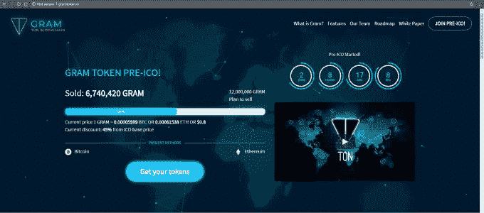

# 骗子们正在利用 Telegram 即将推出的 ICO  大捞一笔

> 原文：<https://web.archive.org/web/https://techcrunch.com/2018/01/20/telegram-ico-scammers/>

迫切希望有机会加入下一个大事件的加密货币所有者正在因盲目投资虚假电报 ICO 网站而赔钱。

聊天应用 [Telegram 即将推出的 ICO](https://web.archive.org/web/20230317110206/https://techcrunch.com/2018/01/15/inside-telegrams-ambitious-1-2b-ico-to-create-the-next-ethereum/) 承诺将打破纪录，目标募资 12 亿美元，根据新的报道，这一目标可能会扩大到 20 亿美元[。包括 TechCrunch 在内的多家媒体指出，公开销售组件预计要到 3 月份才会推出，但这并没有阻止肆无忌惮的个人抓住这个机会。](https://web.archive.org/web/20230317110206/https://www.bloomberg.com/news/articles/2018-01-18/biggest-ico-ever-is-said-to-grow-as-telegram-targets-2-billion)

Telegram ICO 项目 Telegram Open Network (TON)的新闻在 12 月的最后几周首次曝光，之后 [TechCrunch 独家报道了全部细节](https://web.archive.org/web/20230317110206/https://techcrunch.com/2018/01/08/telegram-open-network/)。

期待显而易见。“Telegram 已经是全球加密货币社区事实上的沟通渠道，成为其自己的硬币和区块链的天然家园，”TechCrunch 的 Josh Constine 和 Mike Butcher 写道。与此同时，英文和俄文版的白皮书和投资者说明书，包括有关 ICO 的精确信息，在互联网上广泛泄露。

这给了潜在骗子他们需要的两个条件——炒作和合法信息——大量网站涌现，提供明显的直接投资机会。

Gramtoken.io 是最突出的赝品。该网站现在已经离线，使用了从白皮书中提取的细节，包括项目路线图、团队成员等。它甚至贴出了一份白皮书——这份白皮书已经被泄露了——给人一种真实性的感觉。该网站的追踪者声称在上周三关闭之前已经“筹集”了 500 多万美元。

在骗局被揭露后，许多投资了该骗局的人沮丧地使用了 Twitter。TechCrunch 无法证实 Gramtoken.io 筹集了多少资金。

> Gramtoken.io 截图 via [cafebitcoin.vn](https://web.archive.org/web/20230317110206/https://cafebitcoin.vn/tin-tuc/altcoin/giam-doc-dieu-hanh-telegram-chinh-thuc-xac-nhan-gramtoken-io-ico-la-gia/)

目前还不清楚该网站下线的原因。当我们询问托管 Gramtoken.io 域名的公司 NameCheap 是否采取了行动时，该公司拒绝置评。如果 Namecheap 没有介入，可能是 Gramtoken.io 背后的人决定在引起太多关注之前关闭派对。

在其余的假货中， [ton-gram.io](https://web.archive.org/web/20230317110206/https://ton-gram.io/) 、[grampreico.com](https://web.archive.org/web/20230317110206/http://grampreico.com/)和 [tgram.cc](https://web.archive.org/web/20230317110206/http://tgram.cc/) 仍然在线，Gramtoken.tech 离线，而包括 Gramtoken.io 在内的一些脸书页面在被[指出](https://web.archive.org/web/20230317110206/https://www.facebook.com/guidetohacking/posts/1994053147301982)是骗局后，被私有或删除。

此外，[据报道，](https://web.archive.org/web/20230317110206/https://twitter.com/ArcBlock_io/status/953454511481409536)一些骗子转向电子邮件，爆出假电报 ICO 投资机会。

在一个网站 Ton-gram.io 的案例中，根据与网站相连的钱包地址，70 多人在[以太坊投资了超过 3 万美元。](https://web.archive.org/web/20230317110206/https://etherscan.io/address/0x9BA3833FB2d7A37a4DCF2f58C3F43ED7e397A45a)

> Gramtoken.io 使用付费脸书广告来接触用户

[社交媒体](https://web.archive.org/web/20230317110206/https://steemit.com/gram/@hunly/telegraph-ico-gram-ton-blockchain-token-pre-ico)[上的一些用户](https://web.archive.org/web/20230317110206/https://amp.reddit.com/r/CryptoCurrency/comments/7qtxyw/is_there_a_way_to_join_telegrams_ico_presale/)觉得有必要强调这些网站是投资机会，同时警告它们可能是骗局。也许是为了寻找流量或有利的谷歌搜索定位，一些 ICO 跟踪网站列出了 TON 项目，这进一步增加了不确定性。(注意，已经有一个项目——Tontine Trust——提供了一个“TON”令牌，它既没有连接到 Telegram，也没有连接到任何这些虚假网站。)

在发给 TechCrunch 的一封电子邮件中，Telegram 首席执行官帕维尔·杜罗夫承认 Gramtoken.io 与他的公司无关。

几周前，当 Telegram 的 TON 项目的第一份报告浮出水面时，Durov 警告用户只依赖 Telegram 广播频道的信息，但他没有进一步评论，只是在 Twitter 上回复了一个问题。

不言而喻，ICO 投资是有风险的，那些想参与的人经常被建议彻底做好功课。这包括确保该公司确实通过官方渠道宣布了象征性销售。如果它看起来好得不像真的，它可能就是真的。

一家专注于加密的投资公司的合伙人告诉 TechCrunch，由于敏感性，他要求匿名。“在某些情况下，这些网站甚至会出现在搜索结果的顶端。因此，投资者在参与代币销售之前，从多个渠道仔细核实细节是极其重要的。”

*披露:作者拥有少量加密货币。*