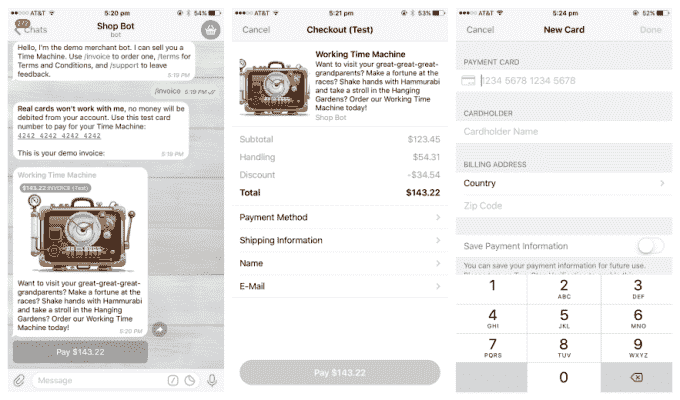
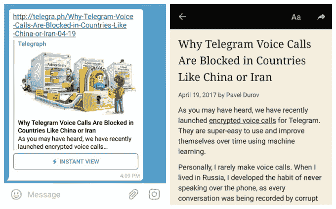

# 电报现在允许用户在它的消息应用程序 中从聊天机器人那里买东西

> 原文：<https://web.archive.org/web/https://techcrunch.com/2017/05/18/telegram-launches-chatbot-payments/>

消息应用电报今天放弃了一项重大更新，该更新显示其服务获得了对聊天机器人支付的支持。它还为其即时阅读模式添加了短视频信息和新的设计选项。

专注于安全的电报公司在近两年前推出了聊天机器人，现在它正在为聊天机器人的支付提供支持。这可能会为那些想利用聊天机器人平台与消费者联系的公司打开一系列商业机会。

最明显的是电子商务，但除了电报公司，其他公司也在考虑通过机器人进行现实商务的可能性——例如，通过与机器人互动在商店里买一瓶可乐。 [Kik 首席执行官 Ted Livingston 最近告诉 TechCrunch](https://web.archive.org/web/20230329061655/https://techcrunch.com/2017/04/07/chatbots-payments/) 支付的引入是让聊天机器人不负众望的关键。

“想象一个世界，在那里你可以点披萨，付一双鞋子的钱，租一辆出租车，或者重新装满你的地铁通行证——所有这些只需要点击电报上的几个按钮，”电报在一篇博客文章中解释道。

Telegram 正在与 Stripe 合作实现支付，但它计划增加对更本地化选项的支持，例如 RazorPay、FlutterWave、PaymentWall、Yandex。金钱和 Qiwi，这将使其在印度、非洲、俄罗斯和其他地区的影响力更大。

该公司正在展示一个演示帐户——ShopBot——的可能性，看看开发人员如何适应这个新特性会很有趣。

亚洲的消息应用已经成为线下商务和移动钱包的代名词，而电报是第一个在西方市场流行的迈出这一步的应用。[脸书早在 9 月份就在最初的 3 万个聊天机器人上添加了同样的功能](https://web.archive.org/web/20230329061655/https://techcrunch.com/2016/09/12/messenger-bot-payments/)。

> 通过电报聊天机器人进行支付的示例

支付可能是影响最大的新功能，但这绝不是 Telegram 版的唯一新增功能。

该应用传统上处理媒体很好——视频预览和链接片段出现在聊天中——现在它开放了“即时视图”网页布局进行定制。

去年 11 月推出的功能为阅读网站提供了一个快速加载和电报优化的界面，与谷歌和 Facebook 的即时文章没有什么不同。以前，它使用有限的链接布局选项，但现在 Telegram 已经推出了即时视图平台，以实现独特的设计。

网站所有者可以设计他们自己的选项，但 Telegram 也使其用户能够主动扩大提供的模板选项。用户可以为他们创建的每个模板赚取 100 美元，同时还有 10，000 美元的头奖和 5，000 美元的亚军。

最后，一个更加以用户为中心的新增功能是[视频消息](https://web.archive.org/web/20230329061655/https://telegram.org/blog/video-messages-and-telescope)。与 Telegram 应用程序发送类似对讲机的语音片段的一键通功能一样，新功能允许用户在聊天中发送短视频消息。

该功能还将扩展到 channels，Telegram 的广播功能，让个人创建单向通信的群组。截至今天，频道所有者还可以向他们的追随者发送视频消息。现在，这些信息有可能获得超越 Telegram 的可见性，因为它们现在可以通过称为“望远镜”的专用 URL 获得。因此，电报频道的视频最终可能会在脸书、Twitter 或消息应用程序之外的其他频道上分享。