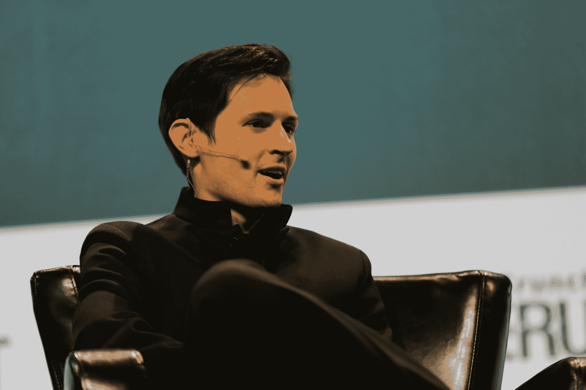

# Telegram 计划为聊天加密货币投资数十亿美元

> 原文：<https://web.archive.org/web/https://techcrunch.com/2018/01/08/telegram-open-network/>

加密信息初创公司 Telegram 计划推出自己的区块链平台和本地加密货币，为其聊天应用及其他应用的支付提供支持。据多个消息来源向 TechCrunch 透露，“电报开放网络”(TON)将是一个新的“第三代”区块链，在比特币和后来的以太坊铺平道路之后，它将拥有更优越的功能。

此次发布将通过首次发行大量硬币来筹集资金，即将到来的私人预售将达到数亿美元，这可能使其成为迄今为止最大的 ico 之一。需求是由这样一个事实驱动的，即 Telegram 不是来自一个新的创业公司，而是一个在世界各地使用的成熟的信息平台。

采用本土加密货币可以让 Telegram 的支付系统极大地独立于任何政府或银行——这是众所周知的联合创始人兼首席执行官帕维尔·杜罗夫在投资者接管他的最后一家公司俄罗斯社交网络 VK 后所觊觎的。杜罗夫没有回应 TechCrunch 就此事联系他的几次尝试。

加密货币在一个被广泛采用的通讯应用中的潜力是巨大的。

通过 Telegram 内部的加密货币支付，用户可以在跨境汇款时绕过汇款费用，通过应用程序的加密私下转移资金，进行小额支付，这将导致过高的信用卡费用，等等。Telegram 已经是全球加密货币社区事实上的沟通渠道，是自己的硬币和区块链的天然家园。

## 出售大量加密货币

据了解，Telegram 正考虑在 ICO 上市前以 30 亿至 50 亿美元的潜在总面值筹集多达 5 亿美元的资金。然而，在 ICO 发布之前，这些数字可能会发生变化，ICO 最早可能在 3 月份发布。这些数字可能会使它成为继 Tezos 之后迄今为止最大的私人加密融资，Tezos 在 7 月份筹集了超过 2.3 亿美元。

在向散户投资者进行更广泛的象征性销售之前，ICO 的预售是吸引大投资者(“鲸鱼”)的最低投资限额(有时有折扣)。一个 ICO 的公开零售阶段往往募集的资金较少，因为投资小额资金的人有一条长尾巴。但机构投资的前期投资会激发散户投资者的信心。

如果这些预售投资者不在杜罗夫的核心圈子内，他们可能需要至少买入 2000 万美元。有消息称，ICO 将需要真正的法定货币，如美元，而不是比特币或其他 ICO 迄今为止拥有的以太币。

顶级机构投资公司已经表达了兴趣，但据说杜罗夫对接受他们的现金持谨慎态度。有传言称，一家公司已经推动了预售分配是邮件。俄罗斯流亡者尤里·米尔纳创建的 Ru 集团(前身为 DST)。DST 的发言人没有回复我们关于这个故事的询问。有趣的是，邮件。Ru Group 是最终收购杜罗夫最后一家公司 VK 的基金。

## 了解电报开放网络

杜罗夫的想法是推出一个全新的区块链，利用 Telegram 的 1.8 亿用户作为火箭燃料，推动加密货币成为主流，并使 Telegram 由于其现有的规模，实际上成为其他加密货币的王者。

根据 Telegram 的白皮书，TechCrunch 已经审查了部分内容，其加密货币将被称为“gram”，并有可能通过与 Telegram 的聊天应用程序绑定而立即获得主流采用。

消息人士称，Durov 已决定将集中式和分散式基础设施结合起来，因为完全分散式网络的扩展速度不如包含一些集中式元素的网络，因此 Telegram 需要拥有自己的区块链。

对于 Telegram 来说，转移到一个分散的区块链平台可以一举两得。除了在应用程序中创建一个成熟的加密货币经济之外，它还可以使其免受伊朗等民族国家的攻击和指控。在伊朗，加密货币现在占伊朗互联网流量的 40%，但在全国范围的反政府抗议活动中被暂时屏蔽。

Telegram 发挥了微妙的政治平衡作用，试图留住该国的用户，关闭了一些呼吁政府下台的渠道，同时保持其他渠道的开放。

## 微信，但有加密

Telegram 的目标是与 TON 一起开发类似于微信的基于加密货币的工具，微信已经发展成为一个不仅仅是聊天应用程序的工具，并成为中国许多人的默认支付机制。

尽管在微信中可以非常快速地为各种服务进行支付，但该系统仍然非常集中。像 TON 这样的分散平台可以提供更高的安全性和弹性。

有消息称，Telegram 计划允许用户在即将推出的钱包中同时持有 Telegram 的货币和法定货币。

Telegram 还围绕它建立了现有的开发者生态系统，其中的机器人和服务由第三方开发者提供。同样，从理论上讲，TON 可以成为开发者为 Telegram 带来的一切的基础。

## 内部吨

在一份 132 页的白皮书中，Telegram 概述了一个四阶段计划:

“TON Services”将成为任何类型的第三方服务的平台，为分散应用程序和智能合同提供类似智能手机的友好界面。

“TON DNS”是一种为帐户、智能合约服务和网络节点分配人类可读名称的服务。有了 TON DNS，访问分散的服务就像“在万维网上浏览网站”

“TON Payments”是一个微支付平台，也是一个微支付渠道网络。它旨在用于“用户机器人和其他服务之间的即时链外价值转移”。该系统内置的安全措施旨在确保这些转移“像链上交易一样安全”。

“吨区块链”将由主链和伴随区块链的 2 的 92 次方组成。它最显著的方面是它将有一个“无限分片范例”来实现可伸缩性。因此，吨区块链旨在能够“自动分裂和合并，以适应负载的变化”。这将意味着新的区块会快速生成，“没有长队有助于保持低交易成本，即使使用该平台的一些服务变得非常受欢迎”。

它还将包括“即时超立方体路由”，旨在使区块链即使在增长时也能保持最高速度。其利害关系证明方法将通过“拜占庭容错”协议的变体达成共识，再次提高速度和效率。它还将使用二维分布式分类账。这意味着 TON 可以在任何被证明是不正确的块之上生长新的有效块，以避免任何不必要的分叉。换句话说，TON 的目标是“自愈”。

TON 的第三代区块链将基于由多方保护的动态“利益证明”,具有高度的容错能力。它还将处理 ID、支付和智能合同的存储。因此，Telegram 将依靠一种比最初的比特币方法更少耗能的新方法来挖掘加密货币，而不是依靠工作证明来创造货币。

据称，它将能够处理大量事务，大约每秒 100 万次。换句话说，类似于柏林的 Polkadot 项目的雄心——但是安装了 1 . 8 亿人的基础设施。这使得它成为一个具有所谓“动态分片”的“内部链”。

## 保持控制

白皮书还明确表示，4%的克供应量(2 亿克)将留给 Telegram 的开发团队，授予期为 4 年。Telegram 还计划保留克加密货币总供应量的“至少 52%”，以保护其免受投机交易的影响，并保持灵活性。剩余的 44%将在公开和私下出售。

该货币将在外部交易所上市，并在 Telegram 应用程序中使用。

就时间而言，今年第一季度将推出电报外部安全 ID，随后是吨的 MVP。电报钱包将于 2018 年第四季度推出，吨级经济的创建将于 2019 年在 Q1 推出。其余的 TON 服务将于 2019 年在 Q2 举行。

加密社区的一些人仍然对 TON 持怀疑态度。早期加密货币 Dogecoin 的创始人杰克逊·帕尔默说:“我认为这基本上是首席执行官将电报货币化的方式。”。

## 杜罗夫兄弟

杜罗夫和他的兄弟、数学天才尼古拉·杜罗夫(Nikolai Durov)是价值约 30 亿美元的“俄罗斯的脸书”VK 的幕后策划者，但实际上是被与普京领导的政府关系密切的寡头股东强迫出售了他们在该公司的股份。尽管 Pavel 设法通过谈判获得了高额回报，但众所周知，从那以后，他一直对外部投资者心怀怨恨。

据报道，帕维尔带着 3 亿美元和 2000 个比特币离开了俄罗斯，在圣基茨和尼维斯购买了公民身份后，他在伦敦、迪拜和俄罗斯(如果可能的话)之间分配时间。Telegram 进军加密领域可能会给他带来另一笔巨额财富，同时有可能将这款聊天应用变成一个不受政府干预的庞大支付网络。