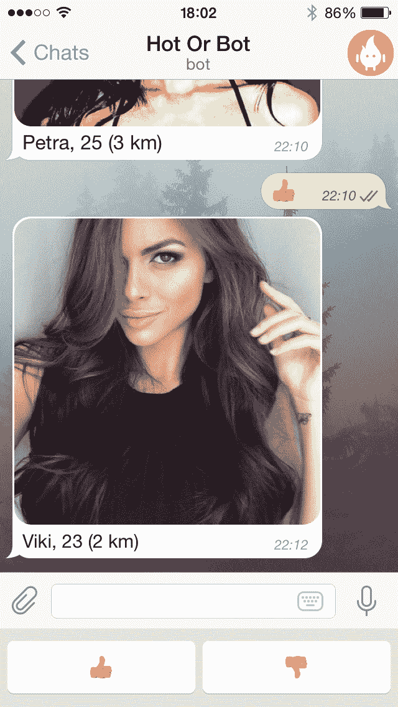
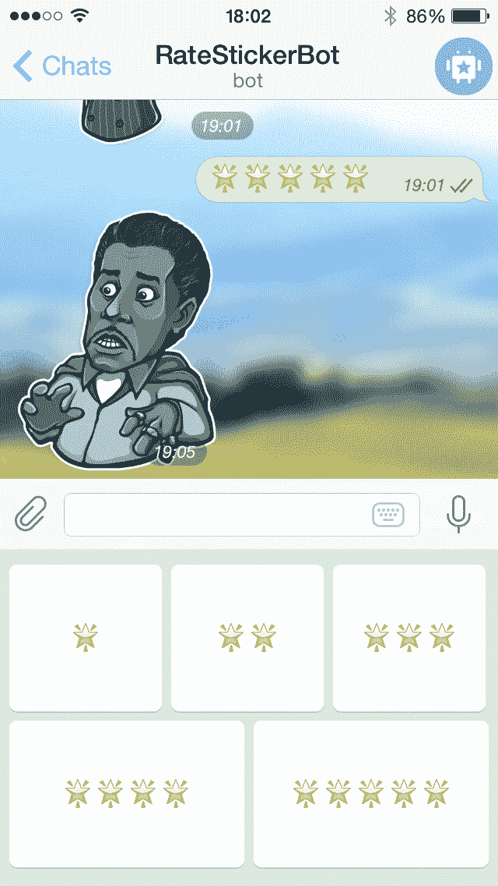

# Telegram 的新平台允许开发者创建具有多种用途的智能消息机器人

> 原文：<https://web.archive.org/web/https://techcrunch.com/2015/06/24/telegrams-new-platform-lets-developers-create-smart-message-bots-with-multiple-uses/>

几年前，一款名为 [Nimbuzz](https://web.archive.org/web/20230406160209/http://nimbuzz.com/) 的稍被遗忘(至少在西方人眼中)的移动通讯应用在其平台上推出了小型“聊天机器人”。机器人可以告诉你天气或者你的星座。尽管这个平台最终被[卖掉了](https://web.archive.org/web/20230406160209/https://techcrunch.com/2014/10/28/big-in-india-messaging-app-nimbuzz-goes-to-uks-new-call-in-250m-deal/)，但在那时我清楚地意识到这个想法的潜力有多大。

如今，一场新的信息大战正在展开，无论是 Facebook Messenger、WhatsApp、Slack、Snapchat 还是 [Telegram](https://web.archive.org/web/20230406160209/https://telegram.org/) 。但正是后者，虽然规模较小，却能不断提出许多创新的想法。

首先，Telegram 准备推出 Apple Watch 支持，正如我暗示的那样，还有一个全新的机器人平台(这将出现在 iOS 的 Telegram 3.0 中)。如果你愿意，你也可以在这里预览一下。

VK.com 名人帕维尔·杜罗夫最近向我解释了机器人 API 和平台将如何允许第三方开发者创建机器人，这些机器人只是由具有类似人工智能功能的软件操作的电报账户。

这意味着该平台也将 ping 其他服务，如“物联网”平台。在我看来，对于 Twitter 这样的公司和 Telegram 这样的初创公司来说，这似乎是一个错失的机会。

这方面的例子可能是与 Bing 图像搜索 API 集成的图像机器人，或者是与投票机器人的空对话。

在很大程度上，用户不需要输入任何东西，因为机器人会给他们提供一组自定义按钮。

Telegram 的机器人可以为用户提供定制键盘来完成专门的任务，比如“热还是机器人？”应用

或者带有自定义键盘的贴纸评级机器人。

以下是该平台的测试人员在上周末制作的一些样本机器人:

@ image bot–向这个机器人发送一个关键字，它会为您提供相关的图片。
@ trivia bot–测试你的琐事知识或加入群与朋友竞争。
@ poll bot–将此人添加到群聊中以创建投票。
@ RateStickerBot–发现并评价新贴纸。
@ alert bot——设定一个时间，这个机器人会为你喜欢的任何事情发送提醒。
@ HotOrBot——用这个类似火绒的约会机器人找朋友。
@ GithubBot–追踪 GitHub 更新。父亲。

新的机器人开发者只需要几个小时就可以构建这些机器人。他们只是用@BotFather 生成一个密钥，并使用一个简单的 https API 来控制 bot。

Telegram 中的机器人看起来与人类用户不同，因为它们的用户界面略有不同，并且当添加到组中时，它们默认情况下不能访问所有消息。

电报机器人也会像病毒一样传播。任何转发的邮件都包含指向其原始发件人的链接。这意味着从你的机器人转发给个人或团体的任何消息都相当于转发，从而使机器人天生具有病毒性质。所有的机器人都有一个添加到组和共享按钮。

Telegram 的机器人还有很多方面，但我想你已经明白了。有趣的是，其他消息平台倾向于避开这一领域，尤其是像 Facebook Messenger 这样的主流领域。

正如 Nimbuzz 在其平台中很好地利用了它们，我们认为这可能是帮助 Telegram 成为一个更有用的产品和更大玩家的有趣竞争对手的事情之一。