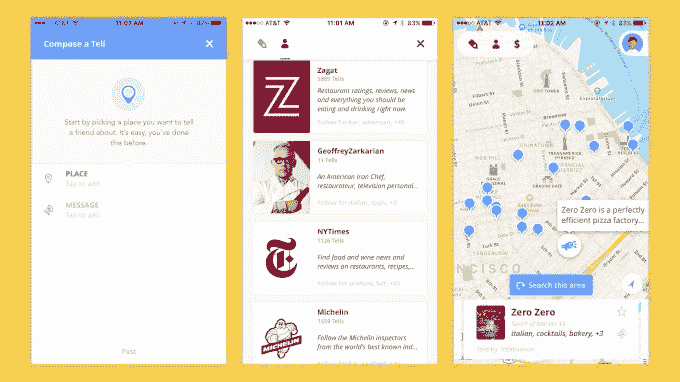

# Tell 希望你像名厨一样吃东西

> 原文：<https://web.archive.org/web/https://techcrunch.com/2017/01/26/tell-wants-you-to-eat-like-a-celebrity-chef/>

弄清楚去哪里吃饭通常是一件令人头痛的事。虽然已经有太多的餐馆发现应用程序和网站，但今天推出的一款应用程序旨在使这一过程变得更加容易。现在可以在 iOS 上使用的 Tell 是另一个寻找食物的应用程序——但是有两点使它与众不同。

首先，它用评论换取简单的推荐，因为在一天结束时，人们只想知道他们是否应该去一家餐馆。其次，Tell 避开了你在 Yelp 或 Foursquare 上找到的随机评论者的推荐，而是展示了一份来自美食影响者、博客和名厨——你关注和信任的人——的精选推荐列表。

具体来说，该应用程序允许您从与该应用程序合作的影响者列表中选择一组值得信赖的顾问。这些包括出版物如《迷恋》、《食客》、《米其林之星》、《孤独星球》、《暂停》、《美食街》和《Zagat 》,以及博客如《早午餐男孩》和《没有剩菜》。

Tell 还与名厨和餐馆老板合作，如斯科特·柯南特(Scott Conant)，以及非食品名人，如 Entourage 创始人道格·埃林(Doug Ellin)，他是该应用的投资者。

你可以根据自己的需要选择这些有影响力的人，然后查看你正在寻找餐馆的城市地图。你名单上的人推荐的所有景点都会被标出来。

除了能够从你的策划网络中发现推荐，该应用程序还有其他很酷的功能，例如可以保存你一直想去或回去的任何餐馆，以及可以通过食物类型或场合过滤结果。

该应用程序还可以利用你的社交网络，让你与朋友和联系人分享推荐信息。

到目前为止，当涉及到合作伙伴关系时，创作者将纽约市作为该应用程序的发布城市，但该平台可以在任何地方访问，并将在许多主要城市提供一些推荐。Tell 今年将在美国全境扩张，随后是国际推广。

每个人都同意的一件事是，找到一家餐馆应该是一项简单的任务，还有什么比从已经尝试过的可靠来源找到一家更好的方法呢？