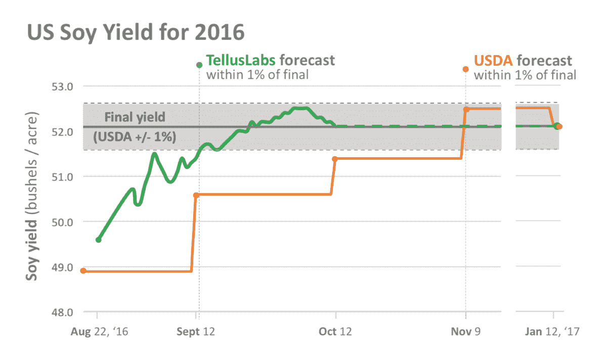
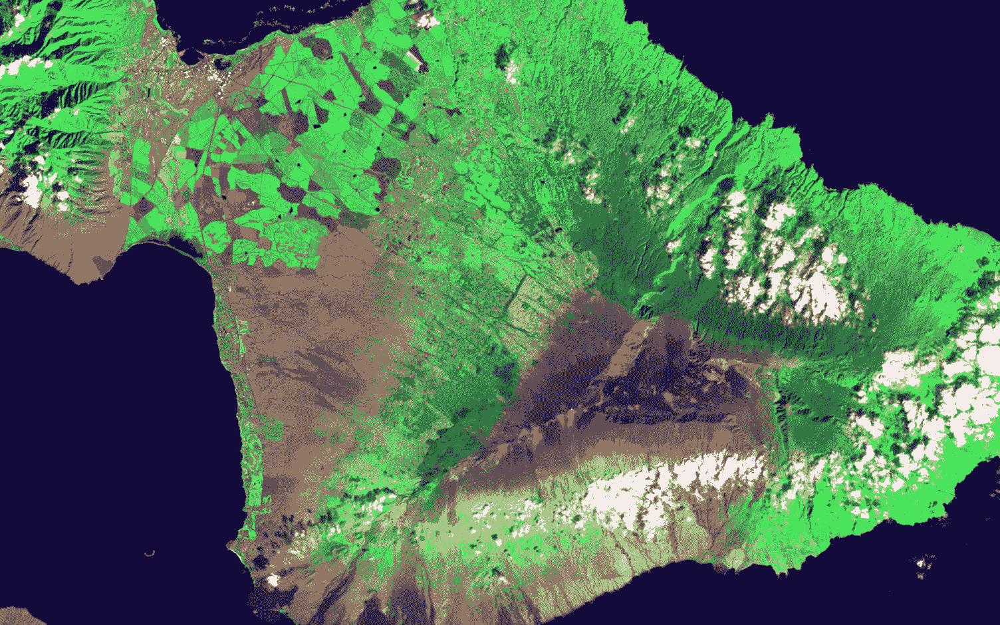

# TellusLabs 希望帮助我们更好地了解我们的星球 

> 原文：<https://web.archive.org/web/https://techcrunch.com/2017/01/17/telluslabs-wants-to-help-us-better-understand-out-planet/>

如果你花时间关注过像 Orbital Insight 和 T2 笛卡尔实验室这样的公司，你可能会认为地理空间分析竞赛已经赢了。但是[告诉卢斯实验室](https://web.archive.org/web/20221226044520/http://www.telluslabs.com/)认为，恰恰相反，桌子还没有开始变凉。有了来自 IA Ventures 的 300 万美元新种子资金和包括 Hyperplane VC、FounderCollective 和 Project 的投资团体，这家总部位于波士顿的初创公司希望它对人类直觉和机器智能之间关系的信任能够成为赢得席位的王牌。

“地理空间分析”只是这些公司通过分析卫星图像收集信息的一种花哨说法。现在人们从卫星图像中提取疯狂的东西。使用三角学和海运集装箱来估计石油供应，通过分析大超市停车场的汽车数量来预测财务回报，甚至调查风暴后被摧毁的房屋。

但是 TellusLabs 完全满足于预测玉米和大豆的产量。他们碰巧也很擅长这个。该团队最初的测试版是一个模型，每天预测这两种作物的产量，最终达到美国农业部对大豆的准确估计，与美国农业部对玉米的估计相差不到 1%——这是一个不小的成就。

这种精确度的价值不仅仅是数字。这关系到效率和粒度。如果 TellusLabs 能够比竞争对手更快地提供本地见解，它将会取得长足的进步。

尽管测试成功，但仍有足够的空间质疑这家初创公司的做法。TellusLabs 不拥有任何成像硬件的权利，该公司没有在其模型中使用任何专有数据，并避免了深度学习等流行的附加功能。

相反，该公司依赖各种中粗分辨率卫星和地面实况，包括一颗 15 岁的卫星，名为中分辨率成像光谱仪，简称 MODIS。公司首席执行官大卫·波特雷坚持认为这并不性感，但它能完成工作。

“在每个像素内，我们以不同的空间分辨率捕捉 36 个光谱带，”Potere 解释道。"我们视自己为放射科医生."

TellusLabs 正在使用的 NASA 数据集每天更新多次。代价是捕获的图像质量要低得多。其他来源的图像不提供那么多的一致性或历史深度。

现在太空中最大的趋势之一是立方体卫星的崛起。但撇开受欢迎程度不谈，Potere 认为，要有足够的数据来建立可靠的模型，要有清晰的图像数据管道，还需要 5-7 年的时间。

“我们没有令人兴奋的新深度学习算法，但我们每天都在构建干净的功能，”Potere 解释道。“干净特征数据库是必不可少的。这真的是垃圾进，垃圾出。”

美国夏威夷毛伊岛的农业、冷却的熔岩流和雨林

该公司非常清楚，它正在建立一个地理空间分析工具，而不是一个可以通过轻触开关进行面部识别的人工智能堆栈。该团队的想法是避免从“除了厨房水槽以外的一切”的方法对数据进行大量的推断。

“我们认为我们对植物生物学有所了解，知道玉米和大豆是如何生长的，所以为什么要忽略这一点”Potere 补充道。

一个恰当的比喻是威士忌蒸馏。如果一个酿酒大师在等待自己的产品成熟时，出售二手产品的精选混合物，没人会眨眼。Potere 认为，从本质上讲，对于新生的地理空间分析空间来说也是如此。

“我们不是无人机或高分辨率图像的勒德分子，”波特尔继续说道。

与此同时，Tellus 的竞争对手正在锁定与 wheelers 和卫星图像经销商的合作关系。DigitalGlobe 正在为 Orbital Insight 提供数百万亿字节的高分辨率图像，而[行星实验室正在与笛卡尔实验室合作。](https://web.archive.org/web/20221226044520/https://www.planet.com/pulse/descartes/)

在整个行业中，许多 Tellus 的竞争对手都渴望为光线触及的一切提供见解:林业、水、工业监控——不胜枚举。

玉米和大豆是每个人的天然起点。这在经济上至关重要，意味着人们会为此付费，美国农业部的历史数据是任何有进取心的机器学习开发者都能找到的最好的训练集。每个人面临的挑战将是同时找到关注点和收入。