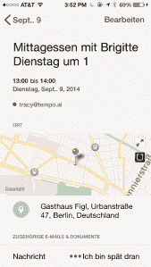

# Tempo 的智能日历以当地语言进一步推向欧洲

> 原文：<https://web.archive.org/web/https://techcrunch.com/2014/09/10/tempos-smart-calendar-launches-further-into-europe-with-local-languages/>

# Tempo 的智能日历以当地语言进一步推向欧洲

日历应用市场已经挤满了像 Cue、Sunrise、Timeful、complete、Lowdown 和其他争夺关注的应用。我一直使用的是 Tempo，主要是它的完全集成方法，如优步集成和自动呼叫拨号。

该公司名为 Tempo AI，目前正在通过西班牙语、法语、意大利语、德语和葡萄牙语的本地化语言向欧洲进军。

欧洲用户可以在这里免费下载“节奏智能日历”。

 Tempo [去年 6 月在 Relay Ventures 和 Sierra Ventures 的带领下，为](https://web.archive.org/web/20221007135447/https://beta.techcrunch.com/2013/06/20/tempo-series-a/)筹集了 1000 万美元的 A 系列资金。

首席执行官拉杰·辛格(Raj Singh)有一个愿景，就是将智能日历变成一个强大的个人助理应用平台。这就是为什么值得注意的是，Tempo 来自于 SRI，它也是语音个人助理 Siri 的发源地。

Tempo 可以在日历约会、航班状态或关于会议的最后一封电子邮件中找到电话号码，并以简单的方式显示出来。

除了所有欧洲国家的 App Store 之外，Tempo 还在美国、澳大利亚、加拿大、香港、爱尔兰、新西兰、新加坡、南非和英国上市。