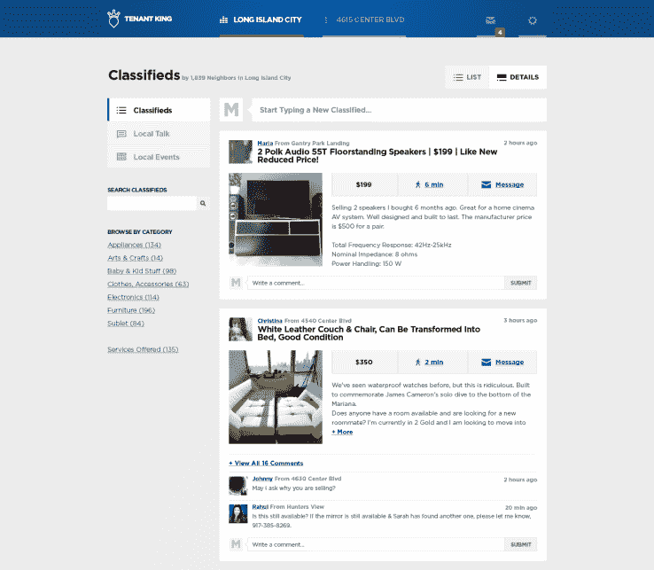

# 租户之王在高层建筑内创建本地市场 

> 原文：<https://web.archive.org/web/https://techcrunch.com/2015/08/17/tenant-king-creates-local-marketplaces-within-high-rise-buildings/>

# 租户国王在高层建筑内创建当地市场

住在城市高层建筑中最令人沮丧的事情之一是你不得不与邻居合住。然而，一家初创公司正试图将这种烦恼转化为好处，让你利用你的邻居网络来获得服务和商品。

成立于纽约的 [Tenant King](https://web.archive.org/web/20221007094533/https://tenantking.com/) 认为，通过将用户与高层建筑中的邻居联系起来，他们可以创建一个可信的网络，取代 Airbnb 或 Craigslist 等独立服务。

Tenant King 目前在纽约的 400 栋建筑中运营，采用了严格的地址验证流程，该公司表示，这有助于保持用户对该服务的信任。

虽然 Nextdoor 等类似服务只是让另一个邻居为你担保，但 Tenant King 要求用户通过接收邮件中的物理验证码、扫描公用事业账单或让公司授权与你的账单地址关联的信用卡来验证他们的地址。

一旦被你所在的大楼的网络接受，你就可以进入分类广告，在那里邻居提供任何东西，从转租到出售大型家具。

正如该公司向 TechCrunch 解释的那样，Tenant King 的好处来自于这样一个事实，即一些交易最好在你自己的大楼内进行。

例如，家具或其他大件商品更有可能在 Tenant King 上出售，因为买家不必担心运输或运输。该公司的联合创始人帕特里克·米斯科(Patrik Misko)表示，在一些建筑中，近 50%的房源以成功交易告终。

虽然目前仅在纽约提供，但 Tenant King 很快将在美国其他主要城市的高层建筑中提供。