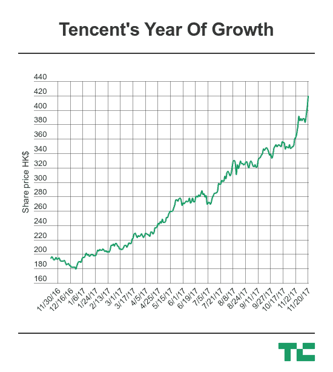

# 腾讯成为首家市值超过 5000 亿美元的中国科技公司

> 原文：<https://web.archive.org/web/https://techcrunch.com/2017/11/20/tencent-500-billion/>

# 腾讯成为首家市值超过 5000 亿美元的中国科技公司

腾讯成为第一家估值超过 5000 亿美元的中国公司。

这家已有 19 年历史的公司在香港证券交易所上市，股价上涨至 418.80 港元，市值达到 3.99 万亿港元，超过 5000 亿美元大关。紧随其后的竞争对手阿里巴巴是亚洲市值第二高的公司，价值 4740 亿美元。

在腾讯公布 2017 年第三季度收入 652 亿元人民币(98 亿美元)，利润 180 亿元人民币(27 亿美元)后一周，该公司加入了价值 5 万亿美元的俱乐部，其中包括苹果、Alphabet、脸书、微软和亚马逊。得益于腾讯的游戏业务，整体利润同比增长 69%，收入增长 61%

[正如 SCMP 指出的](https://web.archive.org/web/20230404204339/http://www.scmp.com/business/companies/article/2120712/tencent-breaches-us500b-valuation-shares-rally-above-hk41460)，在该公司 2004 年首次公开募股时投资 9000 美元，现在价值 100 万美元。

仅看过去 12 个月，由于第三季度等令人印象深刻的收益报告，腾讯的股价已经翻了一番。

自 2014 年 3 月[以来，腾讯的市值增加了两倍多，达到 1500 亿美元](https://web.archive.org/web/20230404204339/https://blogs.wsj.com/chinarealtime/2014/03/11/chinas-tencent-is-now-bigger-than-intel/?mg=prod/accounts-wsj)，超过了英特尔。当时写道，华尔街日报认为该公司“在美国还不是一个家喻户晓的名字，但它应该是”，这仍然适用于今天。

微信是中国最大的社交服务，其即时通讯应用微信的用户总数接近 10 亿，但它未能在海外复制这一成功。相反，腾讯专注于投资全球市场。

其利润丰厚的游戏业务专注于个人电脑和移动设备，是收入的核心，[仅上个季度就实现了 50 亿美元的收入](https://web.archive.org/web/20230404204339/https://techcrunch.com/2017/11/15/tencent-games-business/)，这要归功于《王者荣耀》、 [2017 年票房冠军游戏](https://web.archive.org/web/20230404204339/http://technode.com/2017/07/07/worlds-top-grossing-game-honour-of-kings-is-coming-to-europe-and-the-us/)，以及对热门游戏[部落冲突(Supercell)](https://web.archive.org/web/20230404204339/https://techcrunch.com/2016/06/21/tencent-confirms-deal-to-buy-majority-stake-in-supercell-from-softbank-for-8-6b) 和[英雄联盟(Riot Games)](https://web.archive.org/web/20230404204339/https://techcrunch.com/2015/12/17/tencent-takes-full-control-of-league-of-legends-creator-riot-games/) 背后公司的收购。

过去一年，腾讯的投资重点似乎已经超速。它收购了上市公司[特斯拉](https://web.archive.org/web/20230404204339/https://techcrunch.com/2017/03/28/tesla-tencent-investment/)、 [Snap](https://web.archive.org/web/20230404204339/https://techcrunch.com/2017/11/08/wechat-owner-tencent-snapped-up-another-12-of-snap-this-month/) 的股份，投资了印度的独角兽 [Flipkart](https://web.archive.org/web/20230404204339/https://techcrunch.com/2017/04/10/flipkart-1-4-billion/) 、[即时通讯应用 Hike](https://web.archive.org/web/20230404204339/https://techcrunch.com/2016/08/16/indias-whatsapp-rival-hike-raises-175m-led-by-tencent-at-a-1-4b-valuation/) 、[健康门户网站 Practo](https://web.archive.org/web/20230404204339/https://techcrunch.com/2017/01/16/practo-raises-55-million-series-d-led-by-tencent/) 和[优步的竞争对手 Ola](https://web.archive.org/web/20230404204339/https://techcrunch.com/2017/10/10/ola-raises-1-1b-from-tencent-and-softbank/) 。其他早期阶段的交易包括[飞行汽车](https://web.archive.org/web/20230404204339/https://www.cnbc.com/2017/09/05/tencent-leads-90m-investment-in-lilium-german-flying-car-company.html)，月球无人机和小行星采矿，而像[搜狗](https://web.archive.org/web/20230404204339/https://techcrunch.com/2017/11/09/chinese-search-engine-sogou-up-4-following-ipo/)和[中国文学(电子出版)](https://web.archive.org/web/20230404204339/https://techcrunch.com/2017/11/08/china-literature-makes-stellar-public-debut/)这样的长期投资已经在过去一个月上市。

如果最近 Snap 和特斯拉的交易可以借鉴的话，腾讯可能会投入大量资源，在美国科技公司中建立一个基地。它不仅相信可以从他们的经验中学习，以促进其在中国的业务，而且还可以增加新的视角，特别是在消息/微信方面。