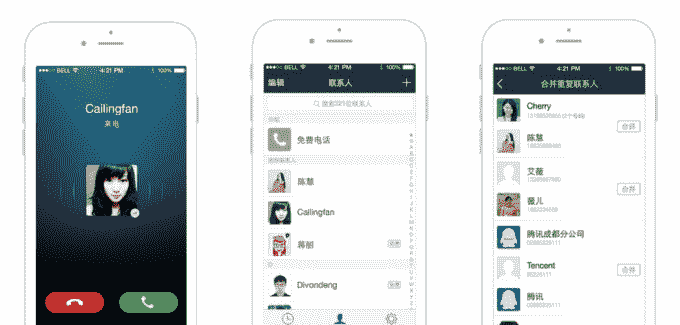

# 腾讯通过新的独立微信网络电话应用专注于免费通话

> 原文：<https://web.archive.org/web/http://techcrunch.com/2014/11/11/tencent-launches-a-standalone-wechat-voip-app-to-heap-more-misery-on-chinas-telcos/>

中国电信运营商长期以来一直对该国最大的即时通讯应用微信感到不满，因为其数亿用户给他们的数据网络带来了压力，并导致他们的收入损失。甚至有[威胁要对其收费](https://web.archive.org/web/20230326045440/http://usa.chinadaily.com.cn/business/2013-03/21/content_16327476.htm)。但现在事情变得更加严重了，因为这一热门服务的幕后公司腾讯为中国用户推出了一款专门的互联网通话应用()，以及一款面向世界其他地区用户的国际版()。

微信在中国被称为 Weixin，它已经允许用户使用 WiFi 或蜂窝数据进行免费(VoIP)通话，但这些应用程序采用了这一功能——这在某种程度上被埋没在聊天选项中——并将其内置于自己的全功能应用程序中。

除了免费给朋友打电话——减去任何数据消耗的费用——它们还包括语音邮件功能、通讯录，并声称支持高清质量的语音通话。华电需要一个微信账户——每月活跃用户超过 4 亿——并从腾讯服务中导入联系人的个人资料照片。它也支持群发短信微信。

有趣的是，Lighttalk 不需要微信账号。它提供从你的电话簿或 QQ 导入联系人的功能，但奇怪的是并不是从微信本身导入。后一个遗漏使得它对我来说基本上没用，因为我需要从头开始用这个应用建立我的人脉网络。

除了取代常规通话，该应用还可以进一步巩固微信/腾讯与零售商和品牌的合作。许多中国公司在微信上设立了官方账户来与消费者互动，似乎有可能的是，这款网络电话应用程序最终将允许用户直接给他们(尤其是零售品牌)打电话。

目前，它专注于连接微信用户，但它也可能推出类似 Skype 的通话功能，让用户可以拨打普通手机和座机号码。日本竞争对手 [Line 早在一年前](https://web.archive.org/web/20230326045440/https://techcrunch.com/2014/03/17/messaging-app-line-turns-on-its-cheap-voice-service-line-call-in-us-and-7-other-markets-on-android/)就做出了这样的举动。

中国的运营商没有坐视微信飙升而不采取自己的行动。去年，中国电信与科技公司网易合作推出了其[易信](https://web.archive.org/web/20230326045440/http://www.yixin.im/)服务，而中国移动有一个类似 Skype 的服务叫做 [Jego](https://web.archive.org/web/20230326045440/http://www.jego.me/index.jsp) 。然而，在中国，这些举措都没有获得像微信一样的吸引力。

中国互联网观察的人员测试了 VoIP 应用程序，发现通话质量至少与中国三大运营商提供的相当。显然，这将取决于用户及其所在地，但正如他们指出的那样，这款应用应该会让中国的电信行业特别紧张。

当然，这也可能是一个警钟，促使运营商与微信合作，向客户提供捆绑服务。这种情况已经开始在中国运营商的一些地区分支机构发生，在亚洲其他地区也很常见。

**注**:这篇文章的原始版本被更新为包括轻言的细节，[发现它的帽尖技术码](https://web.archive.org/web/20230326045440/http://technode.com/2014/11/12/chinese-mobile-messaging-apps-free-voice-calling/)。