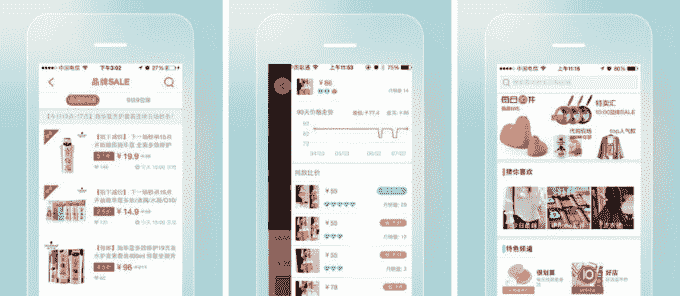

# 腾讯领投 3.5 亿美元投资中国的口袋吴钩，这是阿里巴巴 TechCrunch 的竞争对手，专注于移动领域

> 原文：<https://web.archive.org/web/https://techcrunch.com/2014/10/23/tencent-leads-350m-investment-in-chinas-koudai-gouwu-a-mobile-focused-rival-to-alibaba/>

# 腾讯牵头对中国的口碑吴钩进行了 3.5 亿美元的投资，口碑是阿里巴巴专注于移动业务的竞争对手

阿里巴巴在美国创纪录的首次公开募股(IPO)可能给人一种印象，即该公司在中国的电子商务市场已经稳操胜券，但有许多快速增长的竞争对手着眼于颠覆老大。 [Koudai 吴钩](https://web.archive.org/web/20221014192744/http://koudai.com/index)(英文称为 Pocket Shopping)就是这样一家公司，它[刚刚宣布](https://web.archive.org/web/20221014192744/http://www.weibo.com/2192319247/BsSOdrUhd?mod=weibotime)一轮重要的 3.5 亿美元 C 轮融资，正如 [Technode 首先发现的](https://web.archive.org/web/20221014192744/http://technode.com/2014/10/23/koudai-gouwu-raises-series-c-funding-led-tencent/)。

值得注意的是，这轮融资由阿里巴巴最大的竞争对手腾讯牵头，投资 1.45 亿美元。其他投资者包括老虎基金、H 资本、Vy 资本、Falcon Edge 和尤里·米尔纳的 DST 集团。库代·吴钩没有透露这轮融资的估值，也没有透露交换了多少股权。

Koudai 吴钩是一个专注于移动的购物市场，让商家直接向买家销售，它从销售线索费和销售佣金中赚取收入。它还与微信整合，微信是腾讯的移动通讯服务，在中国占据主导地位，[声称全球每月有 4.38 亿用户](https://web.archive.org/web/20221014192744/http://thenextweb.com/apps/2014/08/13/wechat-climbs-to-438-million-monthly-active-users-closing-in-on-whatsapps-500-million/)，使零售商能够建立账户并使用该服务来营销他们的产品。

微信的接入提供了一个潜在的巨大销售平台，这无疑是腾讯强烈支持该公司的原因。虽然腾讯凭借其桌面版 QQ 消息服务和移动版微信(在中国称为 Weixin)在中国互联网领域占据主导地位，但它在电子商务领域一直步履维艰，这也解释了为什么今年早些时候腾讯对 JD.com15%的投资，以及现在对口碑吴钩的兴趣。

今年夏天，腾讯将 JD.com 整合到微信中，极大地提升了其潜在的影响力和销售额。[JD.com 于 5 月在纳斯达克上市](https://web.archive.org/web/20221014192744/https://beta.techcrunch.com/2014/05/21/jd-com-prices-at-19-higher-than-its-initially-proposed-range/)，是与阿里巴巴实力最接近的挑战者，因此收购口碑吴钩的股权进一步巩固了腾讯的电子商务地位，专注于移动业务，并且已经与微信打得很好。

有趣的是，[正如《亚洲科技》指出的](https://web.archive.org/web/20221014192744/https://www.techinasia.com/chinese-mobile-shopping-app-secures-350m-led-tencent-pose-biggest-threat-alibaba/)，在中国有[种猜测](https://web.archive.org/web/20221014192744/http://www.donews.com/net/201410/2861948.shtm)认为口袋吴钩在移动端产生的流量实际上比阿里巴巴的旗舰淘宝服务还多。虽然这可能不准确，但这项服务专注于移动领域的事实，抓住了阿里巴巴最大的弱点。

通过个人电脑互联网用户，阿里巴巴获得了中国电子商务领域的霸主地位，但与谷歌、脸书、Twitter 和其他公司一样，它诞生于移动时代之前，不得不推出新的举措和计划来适应不断变化的时代。虽然在移动通讯竞赛中姗姗来迟，[阿里巴巴去年推出了](https://web.archive.org/web/20221014192744/http://technode.com/2013/09/23/alibaba-released-laiwang-4-0-a-social-networking-service-to-tap-im-sector/)其微信竞争对手来往，而[对美国聊天应用 Tango 进行了 2.5 亿美元的投资](https://web.archive.org/web/20221014192744/https://beta.techcrunch.com/2014/03/19/mobile-messaging-app-gaming-platform-tango-raises-massive-280-million-series-d/)，并投入资源给[建立自己的移动操作系统](https://web.archive.org/web/20221014192744/https://beta.techcrunch.com/2012/09/21/chinese-ecommerce-giant-alibaba-spins-off-aliyun-mobile-os-team-puts-200m-in-their-pockets/)、[智能电视平台](https://web.archive.org/web/20221014192744/https://beta.techcrunch.com/2013/07/23/alibaba-pursues-new-smart-tv-os-to-grow-its-e-commerce-play/)、[移动游戏平台](https://web.archive.org/web/20221014192744/https://beta.techcrunch.com/2014/01/08/alibaba-will-launch-a-mobile-gaming-platform-to-compete-with-tencent/)以及最近为开发者提供的[类似亚马逊的服务](https://web.archive.org/web/20221014192744/https://beta.techcrunch.com/2014/10/15/alibaba-debuts-baichuan-for-developers-to-build-apps-on-tmall-alipay-wallet-mobile-taobao/)。

所有这些投资都在进行中——迄今为止取得了不同程度的成功——但总的想法是将阿里巴巴的电子商务帝国与人们日常使用的娱乐和交流平台连接起来。至少在理论上，引导这些服务可以帮助传递流量、用户和销售。

在建立了微信(它已经成为中国事实上的社交网络)和其他与中国互联网用户的日常接触点后，腾讯正从相反的角度出发:它需要电子商务服务来插入其平台。因此，对扣带吴钩的投资是其零售野心的一个重要标志。

*标题图片经由[Svetlana Lukienko/Shutterstock](https://web.archive.org/web/20221014192744/http://www.shutterstock.com/pic-126039806/stock-photo-one-hundred-dollars-pile-as-background.html)*