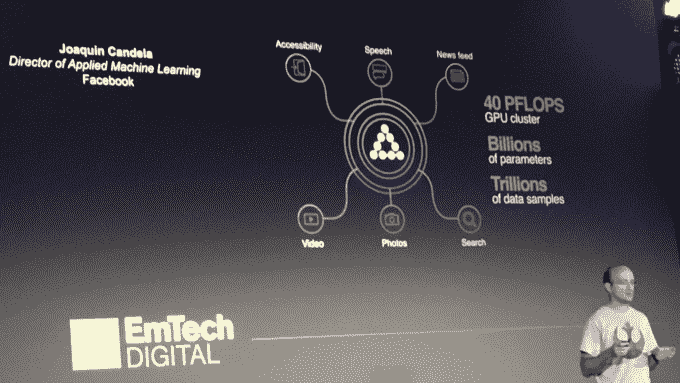
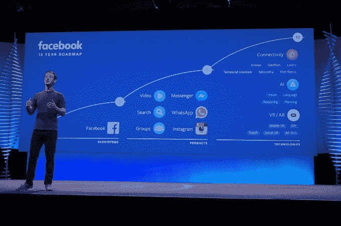

# 脸书通过与 AI TechCrunch 的攻击性照片战斗来拯救人类

> 原文：<https://web.archive.org/web/https://techcrunch.com/2016/05/31/terminating-abuse/>

该公司告诉我，脸书的人工智能系统现在比人类报告更多的攻击性照片，这标志着社交网络反虐待斗争的一个重要里程碑。人工智能可以在淫秽内容伤害真人的精神之前隔离它们。

脸书在广告方面的成功推动了对人工智能和机器视觉科学的投资，这可能使其在阻止攻击性内容方面具有优势。创建一个没有欺凌恐惧的文明分享场所，对于让用户发布个人内容以吸引朋友的注意至关重要。

Twitter 因未能充分防止或回应其平台上的骚扰指控而受到[的广泛批评，去年前首席执行官](https://web.archive.org/web/20230216174907/http://techmeme.com/search/d3results.jsp?q=twitter+harassment&wm=false&start=10)[迪克·科斯特罗承认](https://web.archive.org/web/20230216174907/http://www.theverge.com/2015/2/4/7982099/twitter-ceo-sent-memo-taking-personal-responsibility-for-the)“我们在处理虐待方面很糟糕。”Twitter 尚未盈利，也没有资源来匹配脸书在人工智能方面的投资，但仍在做出勇敢的努力。

为了推动这场斗争，Twitter 收购了一家名为 [Madbits](https://web.archive.org/web/20230216174907/https://techcrunch.com/2014/07/29/twitter-acquires-image-search-startup-madbits/) 的视觉智能初创公司，以及一家人工智能神经网络初创公司 [Whetlab](https://web.archive.org/web/20230216174907/https://techcrunch.com/2015/06/17/twitter-acquires-machine-learning-startup-whetlab/) 。据 Wired 报道，截至一年前，他们的人工智能可以识别攻击性图像，并且只有 7%的时间错误标记无害图像。这减少了完成这项艰巨工作所需的人力，尽管 Twitter 仍然需要一个人在暂停一个攻击性图片的账户之前给予许可。

*脸书展示人工智能视觉技术*

## 残酷的工作

当恶意用户上传一些攻击性的东西来折磨或打扰人们时，传统上必须由至少一个人看到并标记，要么是用户，要么是受薪工人。这些违反脸书或推特[服务条款](https://web.archive.org/web/20230216174907/https://www.facebook.com/legal/terms)的攻击性帖子可能包含仇恨言论、威胁或色情内容；煽动暴力；或包含裸体或图形或无端的暴力。

例如，一个恶霸、被抛弃的前情人、跟踪者、恐怖分子或巨魔可以在某人的墙上、某个群组、某个事件或 feed 上张贴攻击性的照片。他们可能会上传复仇色情、令人恶心的血腥图像或性别歧视或种族歧视的迷因。当有人将内容标记为攻击性内容，因此脸书会对其进行审查并可能将其删除时，损害已经部分造成了。

此前，Twitter 和脸书广泛依赖于像 CrowdFlower 这样的初创公司或菲律宾公司的外部人力承包商。《T2 连线》报道称，截至 2014 年，据估计，人类内容版主的数量约为 10 万人，其中许多人的月薪只有 500 美元左右。

这种职业是出了名的可怕，对工人造成心理伤害，他们不得不梳理堕落的深度，从儿童色情到斩首。倦怠发生得很快，工人们列举了类似于创伤后应激障碍的症状，像[工作场所健康](https://web.archive.org/web/20230216174907/http://workplace-wellbeing.com/)这样的整体健康咨询公司已经涌现出来，以帮助伤痕累累的管理者。

脸书的华金·坎德拉在《麻省理工技术评论》的 EmTech 数字会议上介绍人工智能

但人工智能正在帮助脸书避免让人类从事如此可怕的工作。人工智能可以让计算机在任何人看到之前扫描每张上传的图像，从而大规模解锁主动适度，而不是让承包商成为第一道防线，或者求助于被动适度，即不知情的用户必须首先标记一张攻击性图像。

> 今天，人工智能算法报告的攻击性照片比人报告的多。脸书的华金·坎德拉

在他最近在三藩市的麻省理工科技评论的 EmTech 数字会议上的演讲之后，我和脸书的应用机器学习工程总监 Joaquin Candela 坐在了一起。

他谈到了人工智能在脸书的实际应用，那里 25%的工程师现在经常使用其内部人工智能平台来构建功能和开展业务。凭借 40 petaflops 的计算能力，脸书分析了数万亿个数据样本和数十亿个参数。这种人工智能有助于对新闻报道进行排序，[向视力受损者大声朗读照片内容](https://web.archive.org/web/20230216174907/https://techcrunch.com/2016/04/04/facebooks-tool-to-help-the-blind-see-images-just-launched-for-ios/)，[自动为视频广告编写隐藏字幕](https://web.archive.org/web/20230216174907/http://adage.com/article/digital/facebook-start-automatically-captioning-video-ads/302616/)，使观看时间增加了 12%。

脸书的华金·坎德拉展示了一个在视频中给朋友添加人工智能标签的研究原型

坎德拉透露，脸书正处于使用人工智能在视频中建立人脸自动标记的研究阶段，并可以选择在视频中出现标记的人时立即快进。脸书还建立了一个按主题对视频进行分类的系统。坎德拉在舞台上演示了一个工具，可以按类别显示视频集合，如猫、食物或烟花。

但人工智能的一个有前途的应用是将人类从可怕的内容审核工作中拯救出来。坎德拉告诉我，“有趣的一点是，今天我们有更多由人工智能算法报告的冒犯性照片，而不是人。我们把这一比例提高到 100%，人们实际上看到的令人不快的照片就越少。”

脸书、Twitter 和其他公司必须同时确保他们的自动化系统不会沦为严厉的思想警察。建造错误，或者用过于保守的规则教导，人工智能可以审查艺术和自由表达，即使它是有争议的，也可能是多产的或美丽的。与大多数人工智能形式一样，它可以从有需要的人那里抢走工作。

## 共享护盾

保卫脸书是一项艰巨的任务。在最近于三藩市举行的[应用人工智能会议](https://web.archive.org/web/20230216174907/http://hackers.ai/applied-artificial-intelligence-conference/agenda-program/)上他自己的演讲演出之后，我与脸书核心机器学习主管 Hussein Mehanna 谈论了脸书的人工智能平台脸书学习者。

梅汉纳告诉我，脸书上每分钟有 40 万条新帖子发布，有 1.8 亿条名人和品牌的评论留在公共帖子上。这就是为什么除了图像，梅汉纳告诉我，脸书正试图理解平台上分享的文字的意义。

人工智能最终可以帮助脸书打击仇恨言论。今天，脸书、推特、YouTube 和微软同意了新的仇恨言论规则。他们将努力在 24 小时内删除仇恨言论，如果它违反了所有欧盟国家的[统一定义](https://web.archive.org/web/20230216174907/http://europa.eu/rapid/press-release_IP-16-1937_en.htm)。这个时间限制似乎更可行，由计算机来承担这项工作。

脸书的 Hussein Mehanna 在应用人工智能会议上发言

同一个人工智能平台可以保护的不仅仅是脸书，也不仅仅是有问题的图像。

“Instagram 完全处于平台之上。我听说他们非常喜欢，”梅汉纳告诉我。“WhatsApp 使用了平台的部分内容……Oculus 使用了平台的某些方面。”

Instagram 上的内容审核应用是显而易见的，尽管 WhatsApp 也看到了大量的图片共享。有一天，我们在 Oculus 虚拟现实中的体验可以得到保障，免受不仅被展示令人不快的内容，而且被迫在所描绘的场景中生活的噩梦。

> 我们不把人工智能视为我们的秘密武器。脸书的侯赛因·梅汉纳

但是，为了向社交网络上令人不快的内容造成的人类痛苦以及出卖自己理智来阻止这些内容的版主发起战争，脸书正在建立超越其公司家族的桥梁。

“我们公开分享我们的研究，”梅汉纳解释说，关于脸书如何分享其发现和开源其人工智能技术。“我们不认为人工智能是我们与其他公司竞争的秘密武器。”

事实上，一年前，脸书开始邀请来自网飞、谷歌、优步、推特和其他重要科技公司的团队讨论人工智能的应用。Mehanna 表示，脸书现在正在进行第四或第五轮定期会议，在会上，“我们实际上与他们分享”其人工智能系统的“设计细节”，教授其邻近科技公司的团队，并接收反馈。

马克·扎克伯格将人工智能视觉和语言作为脸书在 2016 年 F8 的十年路线图的一部分

“推进人工智能是你想为社区和世界其他人做的事情，因为它将触及更多人的生活，”梅汉纳强调说。乍一看，帮助脸书与之竞争时间和广告费用的公司似乎是一个战略失误。

但是当谈到开源时，Mehanna 回应了坎德拉和脸书其他人的观点。“我个人认为这不是一个双赢的局面，而是一个双赢的局面。如果我们改善 AI 在世界上的状态，我们最终肯定会受益。但我没有看到人们镍和明帝。”

当然，如果脸书不分享，它可以节省一些其他人不得不花在人类内容适度或其他人工智能避免的辛苦上的钱。但是，通过建立和提供底层技术，脸书可以确保是计算机，而不是人，在做脏活。