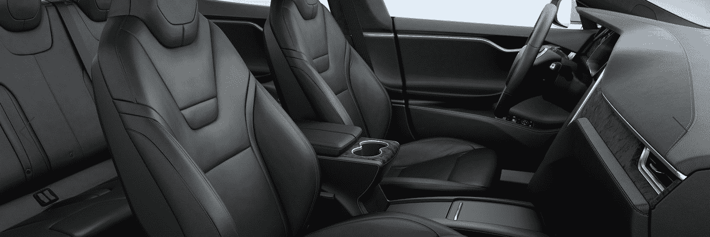

# 特斯拉推出采用最新设计的新款 Model S 

> 原文：<https://web.archive.org/web/https://techcrunch.com/2016/04/12/tesla-launches-new-model-s-with-updated-design/>

# 特斯拉推出设计更新的新款 S 型车

这是新的特斯拉 Model S，它看起来像 Model S，但略有不同——假格栅不见了。新款 Model S 采用了类似 Model X 的机头，与最近公布的 [Model 3](https://web.archive.org/web/20221025230117/https://beta.techcrunch.com/2016/03/31/this-is-teslas-model-3/) 保持一致。相反，特斯拉选择了像 Model X 一样的小胡子式黑色 T。

但是公司并没有就此止步。尾灯也略有更新。这一变化并不大胆，但尾灯有更暗的区域。

在引擎盖下，特斯拉增加了几个新功能。型号 S 将从型号 x 获得 HEPA 空气过滤系统。充电器也将在 48 安培而不是 40 安培时更快。

[gallery ids="1306249，1306250，1306251"]

最后，特斯拉还发布了两种新的木质内饰设计，“花纹白蜡木装饰”和“深色白蜡木装饰”听起来不错。

如果你想玩配置工具，新款特斯拉 Model S 已经在[特斯拉官网](https://web.archive.org/web/20221025230117/https://www.teslamotors.com/models)上有售。起价 67，400 美元，但你可以支付高达 128，900 美元，以防你*真的*需要尽可能多的钱买车。

