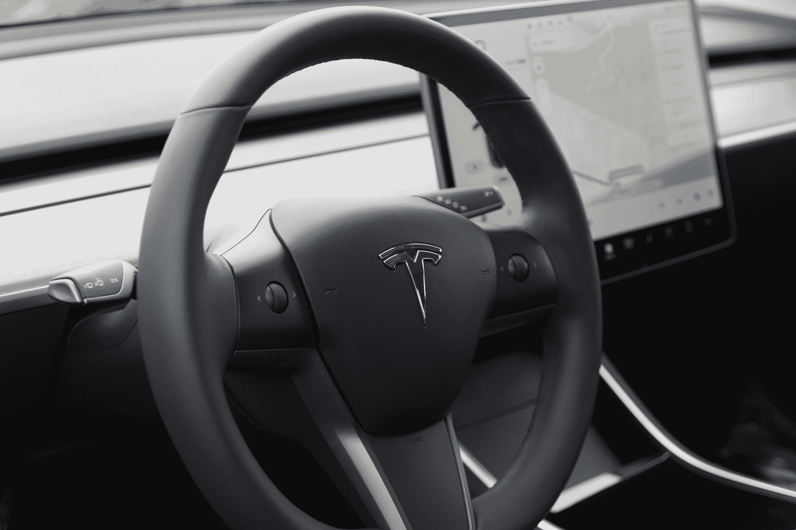

# 特斯拉让 Autopilot 在 Model 3 中更容易使用 

> 原文：<https://web.archive.org/web/https://techcrunch.com/2018/04/02/tesla-makes-autopilot-easier-to-use-in-the-model-3/>

# 特斯拉在 Model 3 中让 Autopilot 更容易使用

Model 3 [现在有了控制自动驾驶仪的新方法](https://web.archive.org/web/20221025222724/https://forums.tesla.com/forum/forums/201812-update-info)。该公司最近发布了一项更新，将控制从中央信息娱乐系统转移到方向盘上。以前，司机必须使用大屏幕来改变 Autopilot 的速度和巡航距离，并且在这样做的时候，需要司机将他们的眼睛从道路上移开来改变这些选项。

Model 3 是极简主义的一次实践，为此，该公司似乎仍在设计最好的界面。为此，Model 3 方向盘上的控制装置特意没有标记或专用于特定功能，而是根据汽车的角色而变化。

由于 2018.12 更新，右侧滚轮控制车辆的速度，而滚轮两侧的按钮改变跟随距离。新的控制措施不会取代现有的控制措施，而是对其进行补充。

在我们审查 Model 3 的过程中，我们注意到了稀疏的驾驶舱设计，并发现它有好有坏。一方面，一览无余的道路视野非常棒——这就像你年轻时开着肥皂盒赛车在赛道上滑行一样纯粹，让你感觉与道路本身息息相关。但这款车感觉太依赖中央触摸屏了，这往往要求司机为了简单的命令而将目光从路上移开。

在一起涉及自动驾驶的致命事故后，特斯拉的运营受到越来越多的审查。像这样的更新表明，该公司至少听取了车主的意见，并以实物形式更新了车辆。