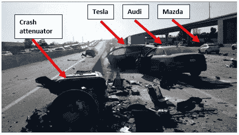

# 据 NTSB TechCrunch 称，特斯拉 X 型在致命撞车前几秒钟在自动驾驶模式下加速

> 原文：<https://web.archive.org/web/https://techcrunch.com/2018/06/07/tesla-model-x-sped-up-in-autopilot-mode-seconds-before-fatal-crash-according-to-ntsb/>

# 据 NTSB 称，在致命坠机前几秒钟，特斯拉 X 型在自动驾驶模式下加速

国家运输安全委员会发布了一份[初步报告](https://web.archive.org/web/20221025225639/https://www.ntsb.gov/investigations/AccidentReports/Pages/HWY18FH011-preliminary.aspx)详细描述了三月份特斯拉 X 型车的致命事故。车祸还导致了火灾，并关闭了加利福尼亚州山景城附近 101 号高速公路的两条车道。此时，NTSB 方面尚未确定车祸的可能原因，并正在继续调查这起事故。

报告称，X 型飞机在自动驾驶模式下，在坠机前几秒钟内加速至 71 英里/小时。

“在碰撞前的 3 秒钟，直到碰撞衰减器的撞击时间，特斯拉的速度从 62 英里/小时增加到 70.8 英里/小时，没有检测到刹车前制动或规避转向运动，”报告指出。

资料来源:NTSB/S .恩格曼

特斯拉的自动驾驶模式旨在匹配前方行驶较慢车辆的速度。根据 NTSB 的说法，当时自动驾驶设置为 75 英里/小时。

特斯拉发言人拒绝置评，但[将我指向了其 3 月份的博客帖子](https://web.archive.org/web/20221025225639/https://www.tesla.com/blog/update-last-week%E2%80%99s-accident)，该公司在博客中描述了在碰撞前的六秒钟内驾驶员的手是如何没有被检测到的。NTSB 在今天的初步报告中证实了这一点。

[特斯拉在今年 3 月的博客文章](https://web.archive.org/web/20221025225639/https://www.tesla.com/blog/update-last-week%E2%80%99s-accident)中写道:“特斯拉自动驾驶仪并不能防止所有事故的发生——这样的标准是不可能的——但它使事故发生的可能性大大降低。”。"它明确地让世界对车辆乘客、行人和骑自行车的人更安全."

车祸中丧生的车主沃尔特黄(Walter Huang)此前曾将他的车带到特斯拉经销商处，称他的车有办法转向他的车撞上的障碍物， [ABC7 报道](https://web.archive.org/web/20221025225639/http://abc7news.com/automotive/i-team-exclusive-victim-who-died-in-tesla-crash-had-complained-about-auto-pilot/3275600/)。然而，特斯拉此前表示，没有黄抱怨自动驾驶仪的记录。