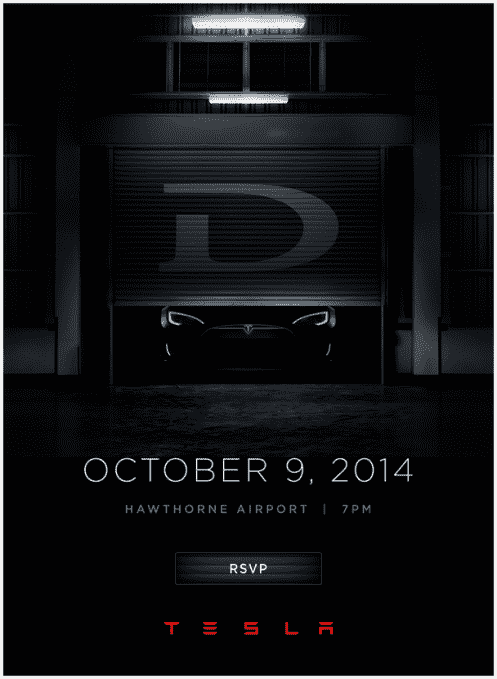
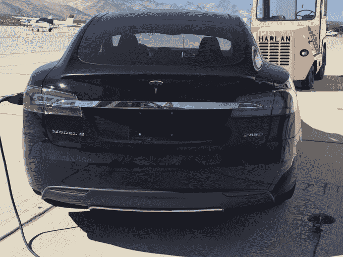

# 特斯拉汽车公司刚刚邀请媒体前来参观其新的 

> 原文：<https://web.archive.org/web/https://techcrunch.com/2014/10/02/tesla-motors-just-invited-press-to-come-look-at-its-new-d/>

# 特斯拉汽车公司刚刚邀请媒体来参观它的新 D

特斯拉汽车公司刚刚发出了参加 10 月 9 日在洛杉矶举行的新闻发布会的邀请，可能是为了发布创始人 Elon Musk [昨晚在推特上发布的新款“D”车。现在，我们正式有一个活动，在霍桑机场举行。](https://web.archive.org/web/20230207134252/https://techcrunch.com/2014/10/01/tesla-will-announce-something-called-the-d-on-october-9th/)

据传，D 将是特斯拉产品线中的一款新车， [Jalopnik 的人猜测](https://web.archive.org/web/20230207134252/http://jalopnik.com/elon-musk-just-teased-something-called-the-d-1641480411/+seanhollister)将推出 S 型轿车的全轮驱动版本。马斯克还表示，他们将在活动中展示“其他东西”，有人说这可能是 Model S 的增强版。

还有一种可能性是 D 代表驾驶员辅助，Electrek 的[塞斯·温特劳布指出](https://web.archive.org/web/20230207134252/http://electrek.co/2014/09/16/teslas-new-speed-assist-and-lane-departure-features-use-rearview-mirror-camera-to-keep-drivers-safe/)人们已经在较新的特斯拉软件中看到了这一点。

特斯拉已经制造了其 85W Model S 的 P85(性能)版本，但[现在 Jalopnik 发现](https://web.archive.org/web/20230207134252/http://jalopnik.com/tesla-model-s-p85d-is-this-elon-musks-d-1641866673)一张由特斯拉汽车俱乐部成员 Adelman 拍摄的[图像，这可能是新的 P85D。这可能是新版本的 Model S，搭载了两个较小的发动机。](https://web.archive.org/web/20230207134252/http://www.teslamotorsclub.com/showthread.php/36465-About-time-to-unveil-the-D-and-something-else/page29?p=774253&viewfull=1#post774253)

双电机 AWD 最初是为 Model-X SUV 宣布的，但一位知情人士告诉 TechCrunch，它可能会在下周出现在 Model S 上。“另一件事”，消息人士说，是一辆额定功率为 600 马力，最高时速为 155 英里的 Model S——同样使用新的双马达 AWD。我们无法证实那些消息，所以不要全信。预计这样一辆车的价格将远远超过 10-15 万美元。

我们自己的马特·伯恩斯[分享了一些关于这是否会在今天早些时候发生的想法](https://web.archive.org/web/20230207134252/https://techcrunch.com/2014/10/02/will-tesla-finally-unveil-an-insane-model-s-supercar/):

> 超高性能的 Model S 可能会满足买家和粉丝等细分市场的需求。特斯拉跑车早已过时，Model S 也变得有点过时。正如之前无数的汽车制造商一样，特斯拉可以通过提供更多的独家版本来延长 Model S 的保质期。
> 
> 特斯拉可以在 Model S 的前行李箱中增加一个电机。我怀疑特斯拉会采用两个较小的 Model S 发动机，以减轻重量。尽管如此，即使有两个特斯拉最小的电机，输出将超过 600 马力。可能会添加额外的电池来补偿增加的功率消耗。

不管怎样，我们都会去看看新的东西。