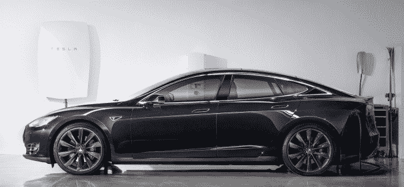

# 特斯拉 3000 美元的 Powerwall 将让家庭完全依靠太阳能运行

> 原文：<https://web.archive.org/web/https://techcrunch.com/2015/04/30/tesla-powerwall-home-battery/>

你几乎肯定会将特斯拉与汽车联系在一起——非常酷的汽车——但该公司有着更宏伟的愿景。今天，首席执行官兼创始人[埃隆·马斯克公布了“特斯拉能源”](https://web.archive.org/web/20230407023428/http://www.teslamotors.com/presskit/teslaenergy)——一个新的业务部门，专注于结束我们对电网的依赖，转而使用太阳能。

特斯拉的第一个能源产品是“Powerwall 家用电池”，这是一种不需要电网就可以为家庭供电的固定电池。电池是可充电的锂离子电池——它使用特斯拉现有的电池技术——可以固定在墙上，消除了使用本地电源的复杂性。

“现有电池的问题是它们很糟糕，”马斯克在宣布特斯拉能源的新闻发布会上说。"它们很贵，不可靠，各方面都不好。"

他说，特斯拉的解决方案与众不同。

首先，该公司的电池 10kWh 的价格为 3500 美元，7kWh 的价格为 3000 美元——[*在这里添加你刻薄的 Apple Watch 价格对比*](https://web.archive.org/web/20230407023428/https://techcrunch.com/2015/03/11/rose_gold/) *。*它们现在在美国开放预购；首批订单将在“夏末”发出

像普通电池一样，它们可以一起使用——最多九个电池可以堆叠在一起，形成强大而可靠的电源。马斯克说，他相信他们可以帮助新兴市场或偏远地区的人们“跳过”对现有电力系统的需求，就像手机在世界偏远地区变得比座机更重要一样。

(很遗憾)特斯拉汽车不包括在你的购买之内

特斯拉 Powerwall 使用太阳能充电，但它也与电网集成，“以利用多余的电力，并让客户能够灵活地从自己的储备中提取能量。”电池以一种“智能”的方式充电，通过选择电费最便宜的低费率时段来省钱。它们将太阳能储存起来以备后用，例如过夜，并在停电时作为备用。

去除污染能源是一个雄心勃勃的计划，很像太空旅行，但是马斯克相信这是可以实现的。他解释说，1.6 亿个电池组可以将美国的电力使用“过渡”到可再生能源，而 9 亿个电池组可以改变整个世界的能源需求。此外，还有可能让世界上的汽车使用清洁能源。

“这是人类力所能及的事情，”马斯克说。“这不是不可能的，这是我们可以做的事情。但还会有(需要)其他公司参与进来。”

马斯克补充说，特斯拉将继续其开源专利的政策，以帮助实现这一目标。

与目前大多数公司相反，特斯拉的新闻发布会——完全依靠太阳能——直接而中肯，几乎没有夸张。

马斯克已经让电动汽车成为(时尚的)现实，并正在与 SpaceX 一起开创太空探索。特斯拉能源是另一个概念，尽管超出了大多数人的理解范围，但如果特斯拉能够像马斯克认为的那样执行，它可能会产生巨大的影响。