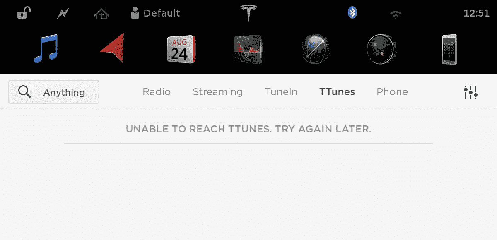

# 特斯拉流媒体音乐服务在最近的软件更新中暗示 

> 原文：<https://web.archive.org/web/https://techcrunch.com/2017/08/25/tesla-streaming-music-service-hinted-at-in-recent-software-update/>

# 特斯拉流媒体音乐服务在最近的软件更新中暗示

特斯拉首席执行官埃隆·马斯克本人暗示，这家汽车和能源公司也希望为车内播放列表提供自己的音乐解决方案，现在我们有更多证据表明这一点。据 Electrek 报道，特斯拉汽车最新更新的软件线索中包括一项名为“TTunes”的音乐服务

就用户可以实际尝试的东西而言，目前还没有任何东西，但这是特斯拉正在围绕音乐或车载流媒体开展工作的另一个迹象。6 月下旬的报道表明，特斯拉也在与唱片公司就流媒体权利进行谈判，这可能是一个信号，表明这个软件更新线索哪里有烟，哪里就有火。

【T2

早在六月初，[在公司的年度股东大会上，埃隆·马斯克本人就围绕特斯拉对音乐的看法发表了他标志性的调侃性评论。马斯克表示，使用当前可用的软件和流媒体服务驾驶“很难找到好的播放列表或好的匹配算法”，并指出我们可以期待特斯拉在今年晚些时候宣布解决这个问题。](https://web.archive.org/web/20221208100121/https://beta.techcrunch.com/2017/06/06/musk-teases-september-semi-truck-event-surprises-music-playlist-tech/)

特斯拉将在 9 月份举办一场活动，展示其电动半卡车，因此我们可能会听到更多关于“TTunes”或其他任何最终被称为“t tunes”的东西。也请叫它“TTunes ”,因为它非常可爱的哑。