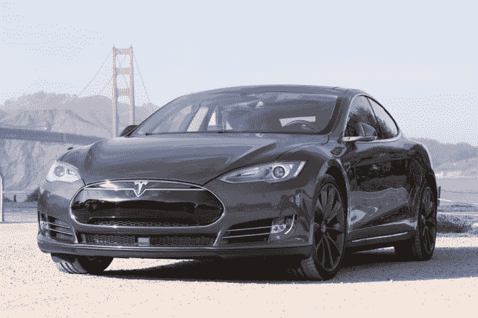

# 特斯拉主动召回 123，000 辆 Model S 汽车 

> 原文：<https://web.archive.org/web/https://techcrunch.com/2018/03/29/tesla-voluntarily-recalls-123000-model-s-vehicles/>

# 特斯拉主动召回 12.3 万辆 Model S 汽车

如果你拥有一辆 2016 年 4 月前生产的 Model S，你可能会想去经销商那里检查一下…

特斯拉刚刚宣布自愿召回 123，000 辆 S 型汽车，发现一些汽车的动力转向螺栓出现“过度腐蚀”Model X 和 Model 3 车辆在这里不受影响，Model S 也不是 2016 年 4 月之后制造的。

该公司表示，腐蚀主要发生在特别寒冷气候下驾驶的汽车上，但并不局限于召回这些汽车(因为，谁知道几年后你会把它开到哪里)。

在一封向受影响的车主概述召回的电子邮件中，特斯拉指出，更换螺栓将“需要大约一个小时”，据信该问题没有造成事故或伤害。

这不是特斯拉第一次发布召回，但这是他们迄今为止最大的一次召回。去年四月召回了大约 53，000 辆 Model S 和 Model X 汽车[，原因是驻车制动器可能卡在“开启”位置；一辆](https://web.archive.org/web/20221129133312/https://techcrunch.com/2017/04/20/tesla-voluntarily-recalls-around-53k-2016-model-s-and-model-x-vehicles/)[几个月后的](https://web.archive.org/web/20221129133312/https://techcrunch.com/2017/10/12/new-tesla-voluntary-recall-applies-to-11000-model-x-vehicles/)，它召回了 11000 辆 Model X，原因是第二排座位的电缆有问题。