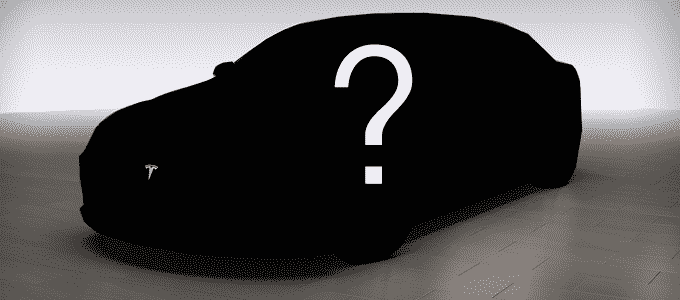
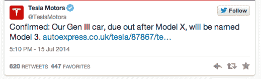

# 特斯拉价值 3.5 万美元的汽车将被称为 Model 3 

> 原文：<https://web.archive.org/web/https://techcrunch.com/2014/07/15/teslas-35000-car-will-be-called-the-model-iii/>

# 特斯拉价值 3.5 万美元的汽车将被称为 Model 3

特斯拉的第三款“T2”车一度被称为 Model E，他们打算以大约 3.5 万美元的价格将其推向市场。

随后，福特公司(Ford)变得怒不可遏，威胁要对 T4 采取法律行动，因为他们的汽车有着类似于美国历史的商标(以及一两个类似名称的商标)。

所以特斯拉正在改变现状。他们的第三代汽车将被恰当地称为 Model 3。(如果你问我，T7 和 Model T 在语音上是否更像呢？哦，这也是不要混淆与宝马 3 系。)

特斯拉[今天下午在推特上确认了](https://web.archive.org/web/20221209131913/https://twitter.com/TeslaMotors/status/489200343062814720)这个名字，此前细节在 [AutoExpress](https://web.archive.org/web/20221209131913/http://www.autoexpress.co.uk/tesla/87867/tesla-model-iii-to-challenge-bmw-3-series-world-exclusive) 中泄露。根据同一篇文章，Model 3 每次充电的续航里程应该在 200 英里以上。

特斯拉表示，Model 3 将在他们的 SUV Model X 之后的某个时候推出，该车将于 2015 年某个时候上市。唉，仍然没有具体的证据表明 Model 3 会是什么样子，尽管据说它看起来像他们有点宽体的 [Model S.](https://web.archive.org/web/20221209131913/http://www.crunchbase.com/product/model-s) 的缩小版