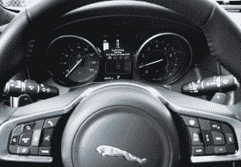
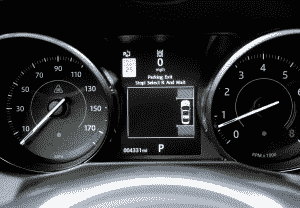

# 试驾:2016 款捷豹 XF S TechCrunch 自动泊车

> 原文：<https://web.archive.org/web/https://techcrunch.com/2016/04/07/test-drive-self-parking-in-the-2016-jaguar-xf-s/>

我最近有机会试驾了 2016 款捷豹 XF S，这是一款庄严的四门豪华轿车，配有舒适的真皮座椅和增压 V6 发动机，可能会给人带来很多麻烦。但没有太多麻烦——新款 XF 拥有最新的高级驾驶辅助系统(ADAS)，包括自适应巡航控制、交通标志识别和带队列辅助的自动紧急制动(AEB)。我想尝试所有这些事情。

测试许多 ADAS 功能的棘手之处在于它们是为安全而设计的。传感器和计算机协同工作，在你的汽车周围创造一种力场，而不是专注于自动驾驶的便利性。这个想法是汽车可以在司机之前发现潜在的事故并做出反应。你不会惊讶地得知，制造商不太热衷于让记者在他们的汽车里四处乱窜，试图几乎撞到东西，以测试这些系统。

但我测试的捷豹 XF S 具有 ADAS 功能，不仅可以安全试用，还很有趣。最好的？驻车辅助。

寻找空间

假设你在城市街道上爬行(XF 时速低于 18 英里)寻找停车位。按下控制台上的按钮，车辆的传感器会和你一起寻找空间。当你经过一个看起来可能有点紧的点时，仪表板上会弹出一条消息，告诉你 XF 已经找到了一个适合它的点。它会让你把车倒过来，轻轻踩下油门。司机仍然控制着油门和刹车踏板，但汽车将所有的转向都放入空间。

你可以把你的手放在膝盖上，紧握双手祈祷不要碰你的保险杠，不要抑制你的轮圈，不要兴奋地挥舞它们，因为你生活在未来。但是你不需要驾驶。这个系统会告诉你什么时候停下来，让汽车行驶，以完成工作。当你准备离开的时候，它会带你离开这个地方。

准备离开空间

这不是自动驾驶；我还得踩着踏板。这不像从你的特斯拉车里出来，让它自己停在车库里。但是方便驾驶，XF S 做的不错。我从来没有在慢得足以让排队助手发挥作用的交通中卡住过，也不需要 AEB 来救我于一场小车祸。(不客气，捷豹。)但车道保持和前向碰撞警报肯定发挥了作用。这些设置似乎有点敏感，这可能会导致一些用户禁用它们。没有人希望汽车成为一个唠叨的保姆，但关闭这些功能会破坏提醒你潜在问题的目的。

所有这些很酷的技术也不便宜。2016 款捷豹 XF S(S 代表机械增压发动机)的建议零售价为 62，700 美元。仅驾驶辅助包就增加了 3000 多美元的价格。在已经很豪华的运动型轿车上加上一些其他的豪华元素，比如非常有用的平视显示器，这辆车的测试价格是 73，035 美元。如果 XF 的价格已经在你的预算之内，ADAS 增加的安全性和便利性可能是物有所值的。