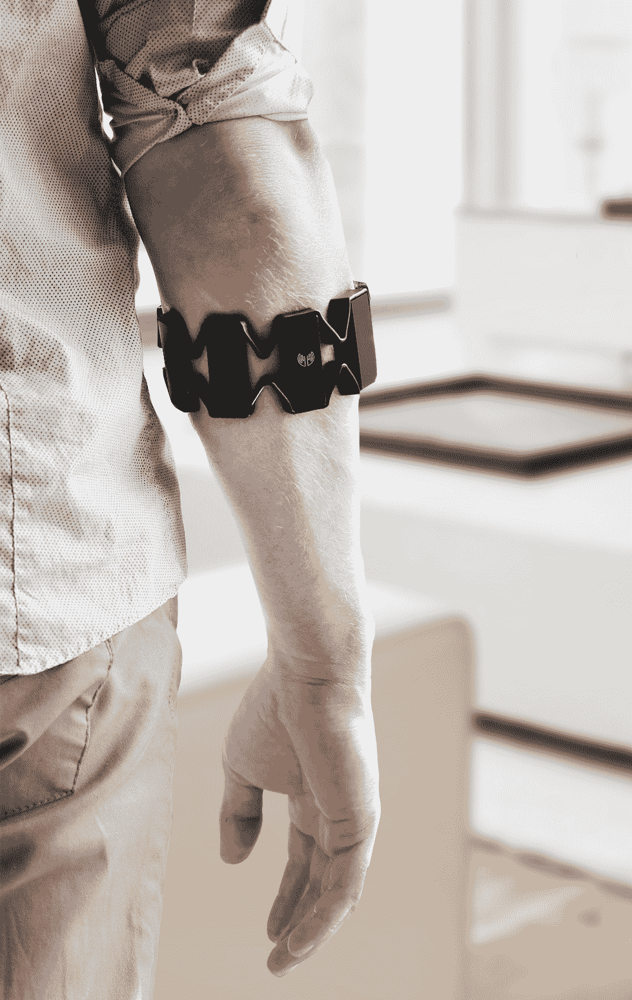

# Thalmic 展示了 Myo 手势控制臂带的最终设计

> 原文：<https://web.archive.org/web/http://techcrunch.com/2014/06/10/thalmic-shows-off-the-final-design-for-the-myo-gesture-control-armband/>

# Thalmic 展示了 Myo 手势控制臂带的最终设计

总部位于滑铁卢的初创公司 [Thalmic](https://web.archive.org/web/20230326053629/http://thalmic.com/) 即将推出其最终消费者版本的 Myo 手势控制臂带，它可以套在前臂上，可以检测通过手臂肌肉组织发送的电脉冲，并通过蓝牙将这些信号转化为各种类型的计算机化输入。

最终的运输设计比开发商 [alpha Myo 设备](https://web.archive.org/web/20230326053629/https://techcrunch.com/2014/03/10/myos-developer-alpha-teaser-compilation-video-showcases-gesture-control-potential/)更时尚，Thalmic 在过去半年中一直将该设备运输给一组选定的开发合作伙伴。它几乎是重量的一半，不到 95 克，与非常轻的男式腕表相比。该公司告诉我，它被设计成可以穿在衣服下面作为全天设备。

Myo 袖带本质上是一系列黑色矩形模块，顶部和底部带有柔性电缆外壳，采用单一尺寸设计，可以根据前臂尺寸扩展或收缩。它看起来仍然不像是你可以完全忘记你穿着的东西，但我们必须等待，看看它有什么样的重量，以及它穿着时的感觉。

这些最终设计将作为 Myo 开发人员套件预购包的一部分于下月推出，然后非开发最终版本将于 9 月开始向预购客户发货。Thalmic 预计 Myo 将在秋季大范围发售，这意味着它们应该会在假日季节为新客户提供库存。

这种设计和 Myo 中的技术是 2012 年开始的设计过程的产物，所以很高兴看到它接近完成。最终的设计反映了该公司的愿望，即 Myo 应该成为一种持久的背景可穿戴设备，我们可以一直佩戴，并可以与我们日常生活中遇到的任何数量的设备自由交互。这是否会发生将取决于开发者的支持，以及开发者想出的与小工具一起使用的应用程序的实用性。