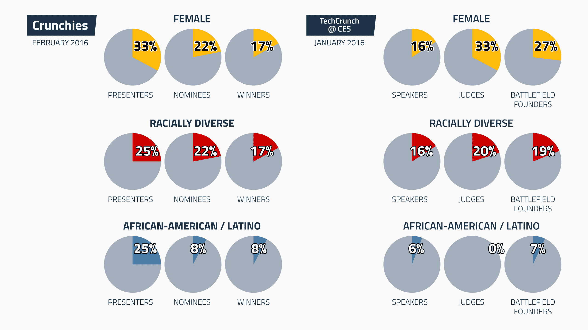
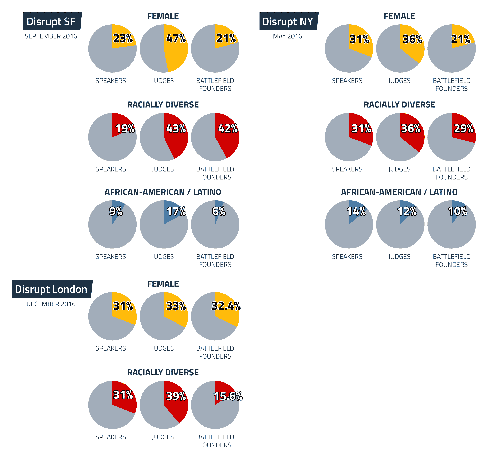
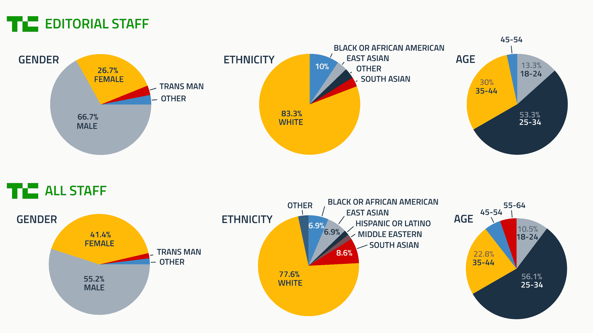

# 2016 年 TechCrunch 包括进度报告

> 原文：<https://web.archive.org/web/https://techcrunch.com/2016/10/14/the-2016-techcrunch-include-progress-report/>

多样化是 TechCrunch 的核心使命。我们相信每个人，无论背景如何，都应该有机会接触科技世界的无限可能。我们还认为，多元化的员工队伍只会让科技企业和整个社会受益。本着这种精神，TechCrunch 的[Include program](https://web.archive.org/web/20221007023712/https://beta.techcrunch.com/include/mission-statement/)旨在利用 TechCrunch 的编辑、产品、数据和活动平台，鼓励技术领域的更多多样性。

为了履行我们在 [核心原则和使命中的承诺，我们针对我们的计划、员工和工作场所文化编写了以下进度报告。](https://web.archive.org/web/20221007023712/https://beta.techcrunch.com/include/mission-statement/)

* * *

## TechCrunch 社论和活动

登上 TechCrunch 活动舞台或出现在 TechCrunch 帖子中的人塑造了人们对科技世界的看法和可能性。考虑到这一点，我们为我们的编辑报道设定了一些目标，无论是在文章中还是在舞台上。TechCrunch 的目标和业绩概述如下。

**目标:** *确保选择投资者、评委和创始人出现在 TechCrunch 舞台上的过程不会干扰活动，并且确保那些来自代表性不足的背景的人不会被忽略。*

在我们 2016 年的主要活动中——1 月的 CES awards、2 月的 Crunchies、5 月的 TechCrunch Disrupt NY、9 月的 TechCrunch Disrupt SF 和 12 月的 TechCrunch Disrupt SF——我们跟踪了演讲者、初创企业战场参赛者和评委的多样性。

在制作节目的过程中，TechCrunch 编辑团队专注于以令人信服的方式将多样性带到舞台上。对于 TechCrunch 的创业竞赛 Startup Battlefield，我们接触了湾区的 20 多个社区团体和非营利组织，以接触代表性不足的创始人，并鼓励他们参与战地。

我们收集活动参与者数据的方法各不相同。迄今为止，我们已经通过观察到的特征跟踪了我们的演讲者、评委和战场参赛者的性别和种族分类。2016 年夏天，TechCrunch 试行了一项匿名、自我报告的人口统计调查，以获得关于战地申请人和参与者的更细粒度的数据。这些数据没有用于初创公司的选择，但它为我们的战地创始人提供了更准确的报告。展望未来，我们将为我们活动的所有舞台参与者推出匿名自我报告调查。

以下是我们迄今为止整理的数据，来自自我报告(战地 SF 2016)和观察到的特质。在这种情况下，种族多样性包括任何非白人的种族。非裔美国人和拉丁美洲人尤其突出，因为他们是技术领域代表性最不足的群体。

 
 
我们在纽约的 Disrupt 上创下了女性演讲者的历史新高，占 31%,但在旧金山下滑至 23 %,在伦敦又回升至 31%。纽约的种族差异也很大，为 31%,但在旧金山回落到 19 %,在伦敦再次上升到 31%。非裔美国人/拉丁裔美国人的比例也是如此，在纽约有 14%，在旧金山只有 9%。我们需要在所有方面建立一个更强大和更持续的上升趋势。

我们看到战场法官的性别比例有了实质性的提高，女法官从 33% (CES)上升到 36%(纽约)，最终达到 47%(旧金山)。评委也是我们种族最多元化的群体，从 CES 上 20%的种族多元化和无非洲裔/拉丁裔评委增长到 Disrupt SF 2016 上 43%的种族多元化和 17%的非洲裔/拉丁裔评委。扰乱伦敦法官中 31%是女性，39%来自不同种族。我们对这一正确的方向感到高兴。

对于战地创始人来说，女性创始人始终占每批的 20%左右。在旧金山，不同种族的创始人比例达到了 42%，这是有史以来的最高水平，但从纽约到旧金山，非裔美国人/拉美裔创始人的比例从 10%下降到了 6%。对于这两个社区，我们需要做更多的推广工作，以增加战场应用。

紧缩一年只发生一次，所以我们比较的基础有限。演讲者中 33%是女性，25%来自不同种族，25%是非裔美国人/拉丁美洲人。我们将提高这些数字。

**目标:** *鼓励作者关注科技领域的多样性和包容性问题。*

TechCrunch 和 Crunch Network 的作家和撰稿人，包括 Megan Rose Dickey、Sarah Buhr、Lora Kolodny、Kim-Mai Cutler 和 Jon Shieber，继续并加强了对这些主题的研究。这里是相关故事的[提要。](https://web.archive.org/web/20221007023712/https://beta.techcrunch.com/include/)

**目标:** *创建一个框架，用于评估对不同公司、创始人和主题的报道。*

这是我们尚未实现的目标。我们继续进行提出这些问题的编辑讨论，但还没有构建一种基于硬数据分析和评估我们报道的方法。在未来的一年里，我们将专注于完成这项工作。

**目标:** *为致力于促进计算机科学和科技职业发展的学校或组织提供免费或大幅折扣的 TechCrunch 重大活动入场券，以满足那些机会有限的人的需求。*

TechCrunch 已经采取了一些初步措施，让我们的活动更容易被更广泛的社区所了解。在 Disrupt NY，我们交付了以下内容:

*   黑客马拉松门票被推广到 20 多个独立团体，这些团体与技术领域中代表性不足的团体合作。
*   学生扰乱票八折优惠。
*   代表性不足的创始人在创业路上展示他们的公司时，可享受 25%的折扣。
*   通过 TC 网站上公布的 [公开申请流程](https://web.archive.org/web/20221007023712/https://beta.techcrunch.com/2016/08/08/non-profits-and-ngos-apply-to-showcase-at-startup-alley-at-techcrunch-disrupt-sf/) 从 30 多名申请人中挑选出五张免费的创业之路表格提供给非营利组织。
*   我们还与 Brooklyn 的[Red Hook Initiative](https://web.archive.org/web/20221007023712/http://rhicenter.org/)(RHI)合作，为其 IT 培训计划的参与者提供角色，并宣传他们的工作，其中包括创始人 Jill Eisenhard 的演讲角色。TechCrunch 在舞台上为 RHI 发起了一项 [筹款活动，为该非营利组织筹集了 3000 多美元。](https://web.archive.org/web/20221007023712/https://beta.techcrunch.com/2016/05/10/shaving-for-the-red-hook-initaitve/)

在 Disrupt SF，我们提供了与纽约相同的项目，并加大了努力:

*   接待了 60 名初中和高中学生，他们来自六个不同的群体，服务于低收入社区和/或代表不足的背景。学生团体是通过 TC 网站上公布的 [公开申请流程](https://web.archive.org/web/20221007023712/https://beta.techcrunch.com/2016/07/12/teachers-and-mentors-apply-to-have-your-students-attend-disrupt-sf/) 从超过 35 个学生团体的申请人中选出的。
*   TechCrunch 试行了[战地奖学金基金](https://web.archive.org/web/20221007023712/https://beta.techcrunch.com/2016/09/30/introducing-the-startup-battlefield-scholarship-fund/)，以抵消参与该计划的成本。扰乱的门票已经并将永远对战场参与者免费。五个小组申请并获得了 1，500 至 5，000 美元不等的资金，用于支付机票、住房和其他相关费用。

在 Disrupt London，TechCrunch 主办了“女孩网络”( Girls Network ),这是一个由 20 名女性青年组成的团体，她们有机会探索初创企业胡同，聆听我们在主舞台上的演讲，并与超模和 Elbi 创始人纳塔利·沃佳诺娃进行亲密对话。我们还用我们的奖学金基金支持了一些战地公司。

**目标:** *开发 an Include“gala”的概念，为 2016 年一段时间内致力于科技多元化的团体筹集资金并提供曝光率。*

经过深思熟虑，并听取了 TC 在主要科技公司的联系人的意见后，我们决定不举办募捐活动。我们的结论是，这种努力不可能给目标群体带来有意义的回报。

**目标:** *为松脆饼干设立一个多样性奖项。*

在第九届年度 Crunchies 上，TechCrunch 将我们的第一个 Include Diversity 奖颁发给了 [金伯利·布莱恩特](https://web.archive.org/web/20221007023712/https://beta.techcrunch.com/video/kimberly-bryant-wins-the-include-diversity-award-at-the-9th-annual-crunchies/519483338/) ,《黑人女孩守则》的创始人。同时获得提名的还有: [艾丽卡·贝克](https://web.archive.org/web/20221007023712/https://www.linkedin.com/in/ericajoy)； [乔艾尔·爱默生，范式](https://web.archive.org/web/20221007023712/http://www.paradigmiq.com/)； [劳拉·魏德曼(亚军)，code 2040](https://web.archive.org/web/20221007023712/http://www.code2040.org/laura-weidman-powers/)；还有 [科特尼瑞恩齐格勒，Trans*H4CK](https://web.archive.org/web/20221007023712/http://drkrz.flavors.me/) 。

**目标:** *主持人包括与合伙人风投+一名 TechCrunch 撰稿人的办公时间。目标是每年工作大约 12 个小时。*

从 2015 年 10 月开始，TechCrunch 与顶级风投合作，为代表性不足的创始人提供反馈和指导。TechCrunch 在网站上宣布了每个办公时间的会议——本质上是创始人与经验丰富的投资者面对面的机会——并邀请来自代表性不足的群体的创始人申请。TechCrunch 的团队挑选了 10 名申请人参加会议，与风投们见面。这项工作最初专注于湾区的初创公司，并于 2016 年 5 月扩展到纽约市。我们感谢纽约和湾区许多风投的慷慨参与。

到目前为止，以下公司为办公时间工作提供了合作伙伴:

*   A16Z
*   加速
*   BBG 风险投资
*   克朗彻基金
*   涌现资本
*   FFVC
*   首轮资本
*   格雷洛克伙伴
*   家酿
*   勒勒风险投资
*   通用催化剂
*   (美)全国教育协会(National Education Association)
*   诺韦斯特风险投资公司
*   佩曼马尔风险投资
*   红杉
*   USV
*   文罗克

即将到来的参与者包括 Brooklyn Bridge Ventures、ge Ventures、Bain Capital Ventures、AngelPad、Samsung Ventures、Khosla、Flybridge、Trinity Ventures 和 Accel。

以下是 2016 年到目前为止办公时间项目的总结。我们提前实现了在 2016 年举办 12 场办公时间会议的目标:

*   平均 60 个应用/会话
*   10 次平均会议/会议
*   17 次办公时间会议(纽约和旧金山)

**共有 172 位创始人参与**(2016 年 9 月的一次)

**目标:** *在每个 Disrupt 举办一次女性科技(Crunch)活动。*

科技女性(Crunch)活动已经成为 Disrupt 大会不可或缺的一部分。在 Disrupt NY，我们与 BBG 风险投资公司合作，接待了 80 名女性创始人、投资者和 TechCrunch 员工。在 Disrupt SF，我们与 Greylock Partners 合作接待了超过 125 名女性技术人员。在伦敦，我们与 Accel Partners 和 Second Home 合作，在我们的 Women in (Tech)Crunch 招待会上接待了 100 多名女性。

**补充:**
TechCrunch 与 Crunchbase 合作开展了一个数据项目，旨在进一步揭示女性风投在创业生态系统中的参与情况:

[第一份关于风险投资领域女性的综合研究](https://web.archive.org/web/20221007023712/https://beta.techcrunch.com/2016/04/19/the-first-comprehensive-study-on-women-in-venture-capital/)，“2016 年 4 月 19 日

* * *

## 产品

TechCrunch 设定了许多与 Include 在线业务相关的目标。

**目标:** *在 TechCrunch 上推出 Include“频道”。*

页面[beta.techcrunch.com/include](https://web.archive.org/web/20221007023712/https://beta.techcrunch.com/include/)于 2016 年初上线。

**目标:** *标记来自 TechCrunch 多样性节拍的相关帖子，以及感兴趣的外部文章和数据的链接。*

网站的“TechCrunch 报道”和“我们正在阅读的内容”部分提供了这些内容。

**目标:** *更新 Include 计划和与 Include 合作的组织。*

TechCrunch 决定让这份半年一次的报告作为更新，而不是持续在线更新程序。

**目标:** *致力于提高科技多样性的组织众包目录。*

“目录”功能提供了一个组织列表、有关其活动的基本信息以及联系方式。我们渴望扩大这些清单。请向 include@beta.techcrunch.com 提出建议。

**目标:** *与 Include 任务相关的事件的众包列表。*

事件列表尚未集成到平台中，但 TechCrunch 致力于在 2017 年初将此功能添加到网站中。

* * *

## 员工和文化

***目标:*** *TechCrunch 将每年报告其员工的人口构成。*

为了记录 TechCrunch 的内部多样性，我们在今年 7 月进行了一次匿名调查。参与 Include 的工作人员设计了调查，并在分发之前征求了意见。该调查为期一周，约 73%的员工做出了回应。

来自所有部门的员工和实习生都参加了此次活动，包括行政、编辑、活动、产品、销售和社交媒体。该调查可在 [此处](https://web.archive.org/web/20221007023712/https://docs.google.com/a/beta.techcrunch.com/forms/d/e/1FAIpQLSfdIjBYdmkfZ2iA_9acESz55r-CcO0wfSeOsnuI2ojvbvK62Q/viewform) 查看，下面是重要结果的明细。

 调查发现 1 名残疾人，无退伍军人。

在性别比例方面，TechCrunch 领先于典型的科技公司。然而，与基于互联网的媒体公司相比，TechCrunch 的编辑人员在大多数其他出版物的范围内，女性占据了大约 27%的编辑部工作。这与我们的目标相去甚远。

然而，TechCrunch 在种族多样性方面还有很多工作要做，我们的编辑人员中有 80%是白人，公司所有部门中有 78%是白人。

TechCrunch 将把改善我们的招聘和雇佣作为来年的首要任务，以使我们的工作场所更加多样化。

**目标:** *TechCrunch 将定期举办与 Include 使命相关的主题培训，如管理和招聘主题。*

TechCrunch 还没有关于招聘实践的内部最佳实践文档，但计划在 2017 年初完成。

**目标:** *TechCrunch 将与其顾问委员会一起主持季度会议和晚宴。*

到目前为止，2016 年我们只召开了一次 Include 顾问委员会会议。我们最初的目标被证明过于雄心勃勃，我们现在的目标是每年与我们的顾问委员会会面两次。顾问委员会由 Tracy Chou、Charles Hudson 和 Aarthi Ramamurthy 组成。

* * *

**结论**

公平地说，2016 年是 Include 计划真正在整个 TechCrunch 平台站稳脚跟的一年。正如我们在 Include 使命声明中提到的，我们的目标是尝试很多事情，加倍努力做好的事情，放弃不好的事情，始终保持透明，并在过程中寻求大量反馈。我们将始终考虑包括正在进行的工作，我们欢迎想法和反馈。如有任何意见、建议或想法，请随时联系[include@beta.techcrunch.com](https://web.archive.org/web/20221007023712/mailto:include@beta.techcrunch.com)！