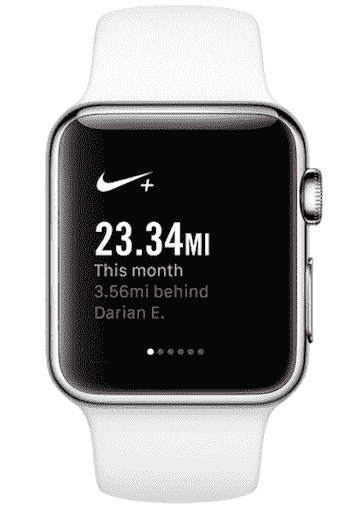
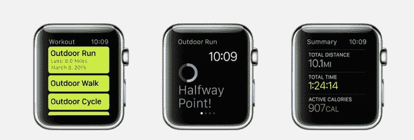
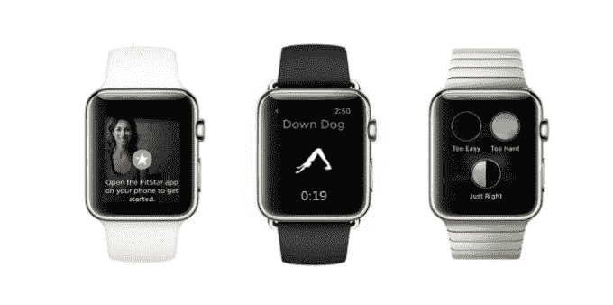
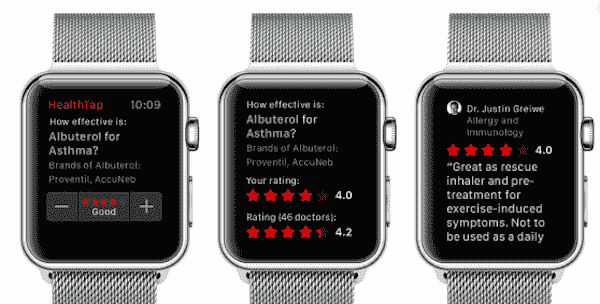
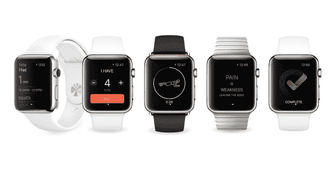
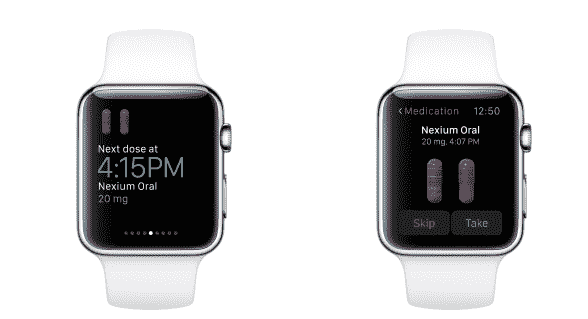
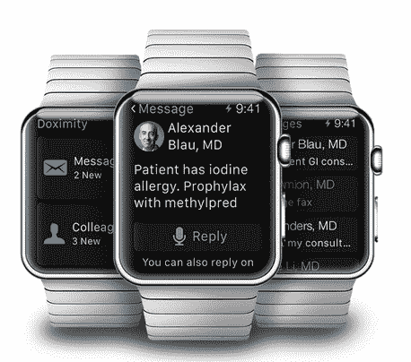

# 22 款最佳 Apple Watch 健康和健身应用 

> 原文：<https://web.archive.org/web/https://techcrunch.com/2015/04/24/the-22-best-apple-watch-health-and-fitness-apps/>

[Apple Watch](https://web.archive.org/web/20221226061425/http://www.apple.com/watch/?cid=wwa-us-kwg-watch-com)，苹果进入可穿戴设备世界的第一步，今天开始向消费者发货。

这款手表尤其标志着可穿戴健身领域的一个有趣时代。像 Jawbone Up 和 Fitbit 这样的健康和健身追踪器在过去几年中占据了这个领域的大部分。据 [NDP](https://web.archive.org/web/20221226061425/https://www.npd.com/wps/portal/npd/us/news/press-releases/wearable-tech-device-awareness-surpasses-50-percent-among-us-consumers-according-to-npd/) 称，这些可穿戴健身设备去年销量接近 330 万台。

Apple Watch 更像是一个综合平台，但它肯定考虑到了这些健身追踪器的受欢迎程度，为手表配备了内置心率监视器，GPS 追踪器来测量锻炼期间的距离和速度，加速度计来跟踪身体运动，以及显示消耗的卡路里和整体健身水平的专有应用程序。

许多健康科技公司不想在这个新平台的行动中被排除在外，也开始为 Apple Watch 重新设计他们的智能手机应用程序。虽然不是所有的应用程序都比你的手机增加了更多的手表体验，但有几个应用程序实现了微妙的飞跃。以下是我们期待手表上的 22 款顶级健康和健身应用:

## **特色 Apple Watch 健康健身应用:**

首先，让我们来看看苹果公司在其网站的 Apple Watch 部分选择了哪些应用程序。

**Nike+Running**——苹果公司因为期待这款手表，将 Jawbone Up 和 Nike+ Fuel Band 踢出了苹果商店。但看起来苹果通过 Nike some love 将 Nike+ Watch 应用程序添加到苹果网站上的特色健身应用程序集中。Nike+ Running 应用程序将允许手表的所有者与其全球跑步社区联系，并在手腕上记录距离和跑步持续时间。

**绿色厨房**——这款应用程序添加了几十种健康食谱和一步一步的说明，只需在屏幕上轻轻一点就能制作出来。该应用程序在手表中包含一个计时器，通知您何时从烤箱中取出某些物品。

**Strava**–实时了解你爬了多高、你的平均速度、距离和心率，并逐段更新，让你在锻炼中不断前进。

**梅奥诊所综合**–这款应用更多的是针对管理的医学博士方面。它可以帮助医生管理他们的日常日程，并在患者在大厅或检查室等待他们时提醒他们。它还提供基本的患者信息，如年龄、性别和体重。

把这本书想象成你手腕上的美食日记。这个应用程序提供了一种方法来跟踪你一天中吃的和喝的东西，然后在以后查找它来计算你消耗了多少卡路里。它还提供了正确的份量和应该避免的食物。

**Runtastic**——Apple Watch 将有三个来自流行跑步跟踪平台的应用程序:使用 GPS 跟踪跑步的原始 Runtastic、Runtastic Six Pack 和 Runtastic Butt Trainer。这些应用程序包括一个 Glances 功能，可以显示一个化身，演示每个练习的正确方法。这有助于锻炼的人跟随，而不是在做动作时必须抬头或拿着手机。

## **我们喜欢的健康健身应用:**

有许多许多健康和健身应用程序要么已经在手表上，要么将在不久的将来在手表上。以下是我们认为在你的手腕上有最佳使用案例的顶级应用的集合。

**Hello Heart**——这是一款血压监测仪和心脏健康伴侣应用。这对手表来说是一个很好的选择，因为它可以直接从你的手腕上记录和上传生命体征。超过 1 亿美国人患有某种类型的心脏病。这个应用程序可以让他们轻松地实时监控这些情况，而不是去医生办公室或药房获取这些信息。

**Fitstar 瑜伽**——这款应用程序可以帮助用户看到正确的姿势戴在手腕上是什么样子，而不是抬头看着屏幕或教练来确保你的姿势正确。它还允许他们检查所选瑜伽课程的剩余时间，或者通过使用播放、暂停或前后控制来管理课程。

这是一个非常简单的应用程序，通过提醒人们喝水来帮助人们保持水分。你也可以想象你每天的水位来判断你是否喝得足够多。

**绘制我的跑步地图**——此时你可能会奇怪，除了 Apple Watch 中的原生应用和 Nike+ Running 应用之外，为什么还有其他跑步应用值得一试。Map My Run 不仅有一个重要且专注的社区来鼓励跑步生活。新的手表应用程序还可以让爱好者记录 600 多种不同类型的锻炼，记录 GPS 活动，在 Apple Health 和 MyFitnessPal 上同步和分享活动，并在社交上与朋友分享锻炼。

**health Tap**–在旅途中点击应用程序提问，并获得 68，000 名美国医生的医疗问题答案。该应用程序还将提供与医生虚拟会议的提醒、个人通知和服用处方药的提醒。

**药物报警**–使用无限数量的提醒、药物和服用次数，提醒您全天服用任何类型的药物。还可以让您跟踪还有多少药片，以便在您需要订购更多时提醒您。

**人类**——这个可以追踪你一整天的活动，每天推动你起床活动 30 分钟。这很重要，因为虽然你可能不会一直在手机旁边，但你可以在手表上看到提醒，每天至少起床运动 30 分钟。该应用程序会自动采集你散步、骑自行车、跑步和其他持续一分钟或更长时间的活动，然后将其记录在应用程序上。

**Misfit Minute**–Misfit 已经有了一款流行的可穿戴产品，可以戴在手腕上，但去年 7 月开始涉足其他平台，在 Pebble watch 上安装了一款健身应用。Misfit 延续了硬件不可知论的趋势，为这款手表开发了一款应用程序，通过体重训练和循环间隔，为消费者提供全身锻炼。

**胡萝卜健身—**胡萝卜，滑稽的人工智能应用家族，都将出现在苹果手表上，包括一个让你羞于健身的应用。胡萝卜健身既恐怖又鼓舞人心，七分钟的锻炼将让你逃离一群卑鄙的鸵鸟和拳打贾斯汀比伯。这样你就可以在你的手腕上而不是手机上接收判断和弹出参考。

**线索**——这是一款月经跟踪应用程序，让女性了解她们在月经周期的哪个阶段。苹果公司因没有在健康工具包中包括月经跟踪器而受到批评，但这是女性健康非常重要的一部分。这款应用可以预测女性下一次月经、经前综合症以及最有可能怀孕的时间。

**WebMD**–WebMD 应用程序将提醒患者服药，并提供如何服用某些药物的说明以及每日服药时间表。

市场上有几款智能手机酒精测试仪测试应用，但这款可以让你检查血液酒精含量，而不用在醉酒状态下四处寻找手机。当然，你还必须随身携带 BACtrack 的智能呼气测醉器工具来开始 BAC 测试，但它可以腾出你的一只手来拿着工具进行测试。

**dr chrono–**使用 iOS 应用程序的医生已经可以调出病人的医疗信息，并使用 iPad 发送账单。Apple Watch 应用程序可以帮助医疗专业人员查看来自诊所同事的聊天信息，提醒他们结束就诊并查看他们的日程安排，而不会让人觉得他们忽视了病人并在玩手机。他们还可以使用该应用程序私下回复患者短信，并在手腕上查看患者信息。

**Doximity**–美国最大的医疗专业网络来到手腕。据公司估计，大约一半的美国医生是 Doximity 成员。拥有 Apple Watch 的医生将能够访问 Doximity 的免费工具，如 HIPPA 兼容的消息传递、电子传真功能和阅读精选的医疗新闻。

**皮肤—**皮肤是人体最大的器官，可以告诉你很多关于你健康的信息。皮肤应用程序需要使用手机的摄像头来拍摄皮肤照片。手表应用程序可以帮助你快速调出这些图像，并监控你的皮肤随时间的变化。它不会对你进行诊断，但它会提醒你是否发生了变化，或者是否应该接受专业医疗人员的检查。

**Spring–**专为锻炼打造的音乐流媒体服务可能会在跑步中派上用场。这个应用程序允许你把手机留在身后，仍然可以听到高能量的音乐。