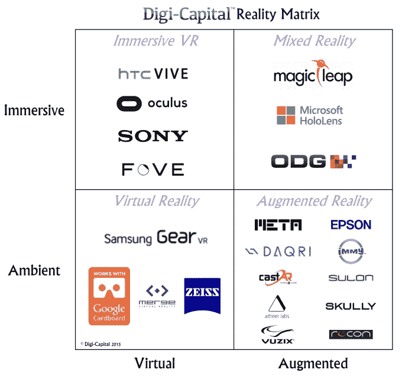

# 1500 亿美元 AR/VR 产业的 7 大驱动力

> 原文：<https://web.archive.org/web/https://techcrunch.com/2015/07/08/the-7-drivers-of-the-150-billion-arvr-industry/>

More posts by this contributor

增强现实和虚拟现实要到明年才能正常发展，但我们已经看到早期市场参与者之间的良性竞争。

虽然内部市场竞争不可避免，但真正重要的是 AR/VR 的安装基础和庞大的现有智能手机和平板电脑市场之间的斗争(PC 和游戏机支持 VR，而不是与之竞争)。

今天有超过 40 亿部智能手机和平板电脑，到 2020 年将达到 60 亿部。相比之下，AR 和 VR 希望在相同的时间框架内，从 2016 年的起步发展到数亿台。

因此，虽然到 2020 年 1，500 亿美元的 AR/VR 收入确实是一个很大的数字，但移动产生的数万亿美元可以让我们正确看待这个数字。AR 和 VR 公司做噩梦的应该是苹果、三星、华为、联想和小米，而不是彼此。

**现实很艰难**

为了达到真正的市场规模，AR 和 VR 需要通过实现 7 个关键驱动因素，从 2016 年的早期采用者快速过渡到 2020 年的大众消费者。

一些已经到位，另一些很难做到，一些在 12-18 个月内不可能实现，还有一些还没有在产品路线图上。这些驱动因素将决定 AR 和 VR 何时以及如何实现其潜力。我们的现实矩阵细分市场，定位早期市场领导者，并为理解驱动因素提供背景。值得注意的是，这是 2015 年 Q2 的快照。在接下来的 6 个月里，事情可能会发生很大的变化。

****

我们的矩阵使用几个基本定义:

*   **虚拟**:真实世界被屏蔽(即用户只能看到虚拟世界和虚拟物体)
*   **增强**:真实世界未被遮挡(即用户可以看到真实世界和虚拟物体)
*   身临其境:驱动程序(见下文)结合起来欺骗用户的大脑，使其做出反应，就好像这是一次真实的体验
*   **环境**:一个或多个驱动程序无法提供与沉浸式相同的体验水平(注意:这可能是可取的，特别是对于一些增强现实应用程序)

现实矩阵由四个部分组成，一些玩家跨越它们来满足不同的用户需求。

沉浸式 VR 使用户在一条虚拟鲸鱼在海底向他们游来时跳出去(例如 [HTC Vive](https://web.archive.org/web/20230327052840/https://techcrunch.com/2015/03/04/htc-and-valve-have-cracked-the-vr-code/#.aihuy9:gLvm) 、 [Oculus](https://web.archive.org/web/20230327052840/https://techcrunch.com/2015/06/11/oculus-rift-consumer/) )。与此同时，虚拟现实提供了非常好的虚拟现实体验，但由于位置跟踪等关键驱动因素(例如[三星 Gear VR](https://web.archive.org/web/20230327052840/https://techcrunch.com/2015/05/08/samsung-gear-vr-for-galaxy-s6-now-on-sale-for-200/) )，虚拟现实并不像身临其境。增强现实公司给用户提供了相当于钢铁侠的全息显示，在日光下的真实世界中有透明的虚拟物体(例如 [Meta](https://web.archive.org/web/20230327052840/https://techcrunch.com/2014/09/18/meta-1-augmented-reality-glasses-are-dragging-us-into-a-vr-future/) )。最后，混合现实为用户提供了在日光下真实世界中呈现固体的虚拟物体(例如[微软 HoloLens](https://web.archive.org/web/20230327052840/https://techcrunch.com/2015/04/30/hololens-is-real/#.aihuy9:jlHi) 、 [Magic Leap](https://web.archive.org/web/20230327052840/https://techcrunch.com/2015/03/19/watch-magic-leaps-video-of-seamless-augmented-reality-office-game-play/) )，或者在 ar 和 VR 之间轻松切换(例如 [ODG](https://web.archive.org/web/20230327052840/https://techcrunch.com/2015/01/15/odg-wants-to-put-android-on-your-face-for-less-than-1000-later-this-year/) )

**七个司机**

AR 和 VR 有一些共同的驱动，但是解决的问题不同。那么什么会塑造 AR 和 VR 的未来呢？

**移动性** : AR 可以在任何地方使用，因为它不会遮挡现实世界。这种自由是一个主要优势，但 AR 需要变得比移动更具移动性才能竞争。这意味着无线平台、全天电池续航时间以及语音和数据的移动服务质量。如果你不能整天在 Wi-Fi 范围外打电话或浏览网页，它不会取代你的智能手机。VR 屏蔽了真实世界，所以在用户不会摔倒的受控环境(家里、办公室、火车、飞机)中是最好的。移动性对 VR 来说并不是什么大问题，尽管它对三星的 Gear VR 等移动 VR 来说是一大利好。

**视觉** : AR 和 VR 都是关于视觉的。用户已经拥有带视网膜显示屏(即没有可见像素)的智能手机，并希望他们的眼睛和大脑一直保持快乐。如果 AR 最后看起来没有钢铁侠或者大英雄 6 好看，大众消费者是不会买的。看到单个像素或眼睛疲劳的 VR 用户也不会成为大众市场，这就是为什么一些解决方案已经解决了这些问题。技术细节太深入，无法在此提取，但关键要素是视野、焦深/景深、视力矫正、图像分辨率和亮度/可视性。

**沉浸感**:真正沉浸式的体验是不可思议的，可以振奋精神，促使用户想要更多。这对于沉浸式 VR 和混合现实来说至关重要，尽管对于一些用户需要明确区分真实和虚拟的 AR 应用(例如汽车中的平视显示器)来说并非如此。沉浸感的关键是位置跟踪(空间和旋转)、抖动、对象稳定性、音频质量和音频跟踪(立体声与 3D)。

**可用性**:AR 和 VR 的起点是至少与现有平台多年来所做的相匹配。这个驱动因素包括处理能力(AR 的电池寿命和 VR 的主机平台成本的权衡)、用户舒适度(VR 的晕动病和 AR 的重量)和用户输入控制(控制器、手/身体、眼睛、语音、用户位置、环境)。AR/VR 独特的处理需求可能是英特尔、高通、英伟达和 ARM 的下一个大市场。

**灵活性** : AR 是一种通用计算设备，将被用于今天智能手机和平板电脑一样多的不同应用。所以 AR 和 VR 的跨平台操作系统和 SDK 让开发者的日子轻松了很多。混合现实拥有更大的前景，它提供了在同一设备上轻松切换 AR 和 VR 的能力，或者为用户提供在明亮的日光下看起来实心的虚拟物体。

**耐磨性**:大众消费技术看起来很美，用起来感觉很棒，不打折扣。把东西放在脸上比从口袋里掏出手机更有个性，设计风格和舒适度排在首位。AR 面临比 VR 更大的挑战，因为它在街上的使用，尺寸，重量和功率之间的权衡取决于电池寿命和高效的 CPU 和 GPU。

可负担性:房间里的大象是价格。沉浸式虚拟现实必须遵循个人电脑和游戏机走过的道路，才能接触到大量观众。环境虚拟现实需要更便宜，T2 一加 T3 已经决定免费。T4 电信公司的威瑞森和 T-Mobile 仍然相信，补贴增强现实和智能手机这样的混合现实是一个好主意。这意味着购买这些平台将成为移动语音和数据收入的未来。AR 玩家现在应该和电信公司谈谈，因为有很多教育工作要做。

从硅谷到上海，一些最聪明的头脑和最好的投资者正在努力建设 AR 和 VR 的未来。这将是一段疯狂的旅程，可能会很颠簸，但下一个苹果可能会从中走出来(除非苹果先走一步)。