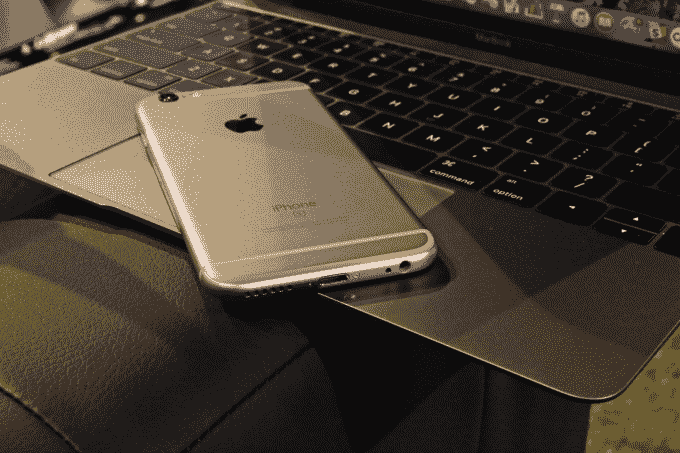

# iPhone 6s TechCrunch 的可访问性

> 原文：<https://web.archive.org/web/https://techcrunch.com/2015/11/26/the-accessibility-of-the-iphone-6s/>

每过一年，苹果都会发布新的 iPhone。每过一年，我都面临着升级的问题。

一方面，我想实际一点，省钱。我的手机仍然很好用，可以无限制地运行最新版本的 iOS，所以我没有必要升级。

另一方面，我这个书呆子*想要*新手机带来的所有新功能。(更不用说，作为一个近距离报道苹果的作家，我的生计就靠跟上最新最棒的。)诚然，这是第一世界的典型问题，但困境是真实存在的。

史蒂文·阿基诺撰稿人

史蒂文·阿基诺是一名自由科技作家和 iOS 无障碍专家。

More posts by this contributor

关于 2015 年是 iPhone 的又一个“s”年，已经有很多文章写了。总的来说，这些手机保留了以前型号的外观设计，但内部配备了更好、更快的内脏。以我的经验来看,“s”型号是我拥有的最好的 iPhones 之一，这在很大程度上归功于突破性新技术的出现。2011 年的 iPhone 4s 引入了 Siri 两年后的 2013 年，iPhone 5s 带来了触控 ID。这些功能不仅酷而且令人兴奋——事实上，我专门为它们进行了升级——而且，在可访问性方面，它们使使用我的手机比以往任何时候都更容易。

带有 3D Touch 的新款 iPhone 6s 延续了这一趋势。我把苹果的一个评测单元作为我的日常手机用了几个星期，在我测试它的时候，我发现它又是一个恒星的年度更新。

我写这篇文章的目的是从一个残疾人的角度来评论 iPhone 6s，重点关注我认为影响其可访问性的手机方面。

## 使用和携带 iPhone 6s

我过去曾说过，尽管传统观点认为易访问性主要指的是软件，但它同样适用于硬件。iPhone 的动觉价值——拿着和使用它的感觉——和它运行的软件的可访问性一样重要。作为一个既有视觉障碍又有身体运动障碍的人，我的手机作为一个物品，尽可能地拿在手中舒适也同样重要。

与我个人的 iPhone 6 相比，6s 在外观上是一样的，在我手中的感觉也一样好。然而，还是有区别的。其他评论者认为，由于增加了 Taptic 发动机传感器，从 6 到 6s 的重量增加几乎不明显。我不同意这个观点。我发现 6s 增加的重量非常明显。它对使用的负面影响并不明显，但它确实存在。换句话说，6s 本身并不重，但比 6s 更有分量。

> 我的 iPhone 是我生活的“遥控器”。

6s 和 6s 的另一个区别是它的制作材料。苹果公司表示，这款新手机是由 7000 系列铝制成的，并将其吹捧为“航空业使用的同一等级的铝”。和我的 6 一样，我更喜欢把 6 放在一个盒子里(一个午夜蓝色的硅胶盒子，也是借来的)，以保护和增加抓地力。(抓握是关键，因为脑瘫导致我的肌肉较弱，这使我容易掉东西。)

Sans case，但是，6s 肯定是“粘性”比它的前身；这种金属有不同的质地。尽管这种纹理有助于我更安全地握持手机，但我使用外壳感觉更好。俗话说得好，安全胜于后悔。

6s Plus 在这里也值得一提。在过去的几个月里，我已经看到许多同行在 Twitter 和播客上赞美 iPhone 6 Plus 的优点，他们说 iPhone 6 Plus 更高密度的屏幕和更长的电池寿命是如此的突出，以至于他们[从普通的 6 换成了 T3。这让我怀疑我想测试哪个 6s，因为我想到了](https://web.archive.org/web/20230212220515/http://www.512pixels.net/blog/2015/4/well-i-switched-to-the-iphone-6-plus)[再次尝试 Plus】。然后我想起了我在](https://web.archive.org/web/20230212220515/http://tidbits.com/article/15354)[花絮](https://web.archive.org/web/20230212220515/http://tidbits.com/article/15354)上写的:

> 当我测试 iPhone 6 Plus 并为这次评测做笔记时，脑海中不断浮现的一句话是“足够好了”。普通的 iPhone 6 比之前的任何 iPhone 都要大得多，但感觉上还是像 iPhone。从可访问性的角度来看，它的 4.7 英寸屏幕足够大和亮，但 iPhone 6 也更易于握持和携带。它有一些问题，但足够好了。

虽然我可能会在未来重新审视 Plus，但对我来说，它今天的主要问题是它所呈现的浮士德式的讨价还价。是的，Plus 为我提供了更大的屏幕和其他优势，但结果是我得到了一部笨重的手机。如果我的视力是我唯一需要适应的残疾，选择将会很简单。问题是，我也有身体运动的问题要考虑。加号是一头野兽，我的手很难驯服。这些因素加在一起，让我愿意接受哪些权衡的问题变得更加复杂——令人痛苦的是，因为我的眼睛喜欢 Plus 的屏幕。

目前，普通的 6s 是更好的选择。虽然我确实怀念 Plus 更大、分辨率更高的屏幕、更好的电池和光学图像稳定，但普通的 6s 仍然足够好。更容易单手使用，随身携带。最重要的是，它仍然感觉像 iPhone，而不是它的老大哥“iPad Nano”的感觉。

## 3D 触摸

3D Touch 是 iPhone 6s 的标志性特征，我是它的粉丝。苹果公司将 3D Touch 称为“下一代多点触控”，它在很大程度上工作得非常好。3D Touch 有两个部分:快速动作和 Peek & Pop。这两个功能都做得很好，但在我的使用中，快速动作被证明比 Peek & Pop 更有助于辅助功能。

快速行动和我假设的非常相似。它们真的是常用操作的快捷方式，这让我从多次点击的繁琐中解脱出来。更重要的是，这些快捷方式让我的眼睛和手指不用耗费太多精力去寻找和按下按钮，比如说，把一张照片发到 Instagram 上。这似乎是一件微不足道的事情，但对于那些有特殊需求、可能需要更长时间来浏览应用程序 UI 的人来说，这是一个巨大的差异。我和其他人一样欣赏 Quick Actions 提供的效率，但它也是一个真正的可访问性增益，是锦上添花。

到目前为止，我使用 Quick Actions 的主要是 iPhone 的一些内置应用程序:信息、邮件、相机和电话。(我最喜欢的是“信息”,因为它可以让你看到最近的三次对话。)

> 3D Touch 是 iPhone 6s 的标志性特征。

至于 App Store 应用程序，作为 Twitter 和脸书的重度用户，我喜欢分别使用快速操作来快速发布推文或更新我的状态。此外，我喜欢能够快速地将照片导入 VSCO 摄像头进行编辑，以及在 Fantastical 中添加新的日历事件。反过来，也有我希望很快添加 3D Touch 支持的应用。例如，如果我可以在空闲时跳转到我最喜欢的组，或者通过一个简单的快速操作请求在优步搭车，那就太好了。

独立开发者温斯顿·陈(Winston Chen)开发的第三方应用软件 [Voice Dream Writer](https://web.archive.org/web/20230212220515/http://www.voicedream.com/writer/) 很好地利用了 3D Touch。Voice Dream Writer 是一款面向 iOS(和 Android)的 Markdown 文本编辑器，用户可以使用语音和打字进行写作。该应用程序还会大声朗读文本，这有助于校对。

就可访问性而言，Voice Dream Writer 在两个方面值得注意:它不仅支持 3D Touch，而且使盲人和视力受损的作家更容易编写散文。它对非残疾人也很有用，他们可能喜欢使用语音转文本，或者厌倦了不停地敲击键盘。

最近，我有机会与陈通过电话讨论了 Voice Dream Writer 及其如何利用 3D Touch。他告诉我，他觉得 3D Touch 对 VoiceOver 用户最有利，因为他认为 VoiceOver 和 3D Touch 一起工作可以提供丰富的体验。陈还解释了用户如何使用 force-press 来调整快进，即用力按下快进按钮将使速度加倍。如果你减轻触摸，速度会恢复正常，这种行为类似于老式卡带播放器。这是 3D 触摸的一个非常聪明的实现。

3D Touch 与 iOS 的许多辅助功能深度集成，使其更加易于使用。具体来说，苹果已经设计了 3D Touch，可以与 VoiceOver、大型动态类型、开关控制和 AssistiveTouch 配合使用。(还要注意:使用缩放时，可以调出快速动作。)VoiceOver 用户可以使用标准的 VoiceOver 手势来循环浏览一系列快速操作，以及“浏览”内容，如地图和 URL。

对于大型动态类型，我通过将文本大小分别设置为最小和最大进行了测试，Quick Actions 界面会做出相应的响应。开关控制用户能够分配各种移动来调用 3D 触摸动作。最后，AssistiveTouch 用户能够在 AssistiveTouch 菜单中定义 3D 触摸按压。

除了单独的辅助功能，苹果还在新 iPhones 的辅助功能偏好设置(设置>通用>辅助功能> 3D Touch)中添加了全局 3D Touch 设置。用户能够以三种增量调节显示器的压力灵敏度:轻、中、硬。还有一张美丽的花的照片，用来测试印刷机的灵敏度。按一下，照片就弹出来了；放手，它就会消失。

摆弄过这些设置后，我选择了灯光作为我的首选级别。我不喜欢把手指塞进屏幕的想法，所以我喜欢一个微妙的触摸来达到目的。我可以看到轻度(甚至中度)受那些患有 RSI 或其他肌肉影响疾病的人的欢迎。

> 我是个书呆子，想要新手机带来的所有新功能。

至于 Peek & Pop，我的意见就没那么热情了。正如我之前所写的，我认为快速行动更符合可及性。Peek & Pop 给人的感觉更像是一个方便的功能，尽管我确实喜欢偷看 Apple Music 中的相册和 Instagram 中的照片。(同样不错的是:向上滑动手势可以显示可用的动作。例子包括在 Instagram 上喜欢一张照片，对一封电子邮件采取行动。)它让我想起了 OS X 上的 Quick Look，比如，我希望你可以放大邮件信息来阅读；然后，你*可以通过“弹出”全屏并使用缩放来进行缩放。不过，如果你可以双击放大预览，那就更好了。*

总的来说，我看好 3D Touch。就像 [Markdown](https://web.archive.org/web/20230212220515/http://tidbits.com/article/13865) 和 [Apple Pay](https://web.archive.org/web/20230212220515/http://www.imore.com/apple-watch-makes-apple-pay-even-better-accessibility) 一样，3D Touch 并不是专门为可访问性而设计的，而是设计得如此之好，以至于每个人都可以使用它，而不需要特殊的模式或设置。我希望它最终能进入 iPad，我也有兴趣在 Mac 上尝试 Force Touch。3D Touch 还处于早期阶段——我发现自己在每个图标上按键，看看是否有更多的第三方应用程序支持它。

我唯一的抱怨是，当我打算访问 3D Touch 时，无意中激活了“抖动模式”(移动/删除应用程序)，这让我感到沮丧。此外，我认为苹果错过了一个从 Apple Watch 借鉴强制按下清除通知手势的机会。这是 3D Touch 的天然选择，但遗憾的是，它并不存在。这是苹果公司一个奇怪的疏忽。

我希望它存在于 iPhone 上，因为从可访问性的角度来看，当前清除通知中心的方法是一项繁琐的工作。这是因为 X 和 Clear 按钮很小，很容易看到和点击，这导致了眼睛疲劳，并需要我所不具备的精细动作精度。(还有一个方便之处:清除手机上的通知需要两次点击，而你只需在手表上按一次。)

## iPhone4S 上的语音控制功能

我很高兴 Siri 在很大程度上改进了 T1，这是有原因的。Siri 更擅长快速准确地解析我的命令。考虑到我有语言障碍，这一进步更加令人印象深刻。作为一名口吃者，Siri 在理解我方面一直很糟糕，因此它的进步令人耳目一新。

在 iPhone 6s 上，Siri 在几个方面更好。首先，苹果增加了一个教程，让你训练 Siri 学习你的声音，使用诸如“嘿，Siri，今天天气怎么样？”这实现了两件事:它防止其他声音意外提示 Siri，更重要的是，它打开了免提通信的大门。从技术角度来看，苹果告诉我“嘿，Siri”是通过直接内置在 A9 芯片组上的 M9 运动协处理器实现的。(以前，协处理器是分立的芯片。)

第二，新 iPhones 上的 Siri 是免提的，而且一直存在，这有一个明显的易用性优势。对于身体运动延迟的用户来说，按住 Siri 的主屏幕按钮可能会有问题——这可能是由于灵活性降低或肌肉紧张度低。然而，iPhone 6s 缓解了这些问题。现在可以只通过语音与 Siri 进行交互，这使得它比以往任何时候都更容易访问和包容。

在宏观层面上，“嘿，Siri”的加入标志着 Siri 作为辅助工具的有用性向前迈进了一大步。它不仅在识别像我这样的非标准语音模式方面取得了技术上的进步，还通过允许有 6s 的人在不触摸 Home 键的情况下召唤 Siri，为那些有运动障碍的人消除了文字摩擦。我一直认为 Siri 作为一种辅助技术有很大的潜力，它最近的进步使它更接近于完全实现这种能力。

## 电池

iPhone 6s 的电池寿命似乎与 iPhone 6 不相上下，但应该会更好。在我看来，如果有一个原因让苹果提高 iPhone 的电池性能，那就是屏幕亮度。

作为一个弱视的人，我[绝对需要](https://web.archive.org/web/20230212220515/http://www.macworld.com/article/2038890/now-you-see-it-how-apples-retina-display-is-a-boon-to-accessibility.html#tk.rss_all)把我的 iPhone(和我的其他设备)屏幕调到最大亮度，因为这样我最容易看到屏幕。我得到每个新设备的第一件事就是调高屏幕亮度；对我来说，最大亮度是一个事实上的辅助功能。当然，代价是我的电池会因为必须整天保持屏幕明亮而受到影响。

降低亮度以保存果汁是一种站不住脚的妥协；为了有效地使用手机，我需要所有的光线。尽管如此，我承认有负罪感，因为我知道我的手机电池必须更努力地工作。因此，更大的电池会让我对屏幕如此明亮感觉更好。

我无法想象成为唯一一个需要最大屏幕亮度的人，而且我*知道*我不是唯一一个想要更好电池的人。看起来电池技术进步缓慢，但我认为苹果的电池团队应该解决这个问题。也许明年吧。

## 一些随机观察

正如其他人报道的那样，新款 iPhones 的速度非常快。触控 ID 尤其令人印象深刻；现在太快了，我不得不提醒自己在检查锁屏时使用睡眠/唤醒按钮。

用一个手指操作“触控板模式”比用两个手指操作 iPad 更容易。不过，我没有使用它，因为我发现光标太小，看起来不舒服。

我不喜欢使用 3D Touch 来访问多任务 UI。这很不舒服，所以我改为双击 Home 键。

说到 3D Touch，我喜欢当应用程序没有快速动作时你得到的反馈。这就好像系统在告诉你，“嗯，嗯”，类似于错误的密码“摇头。”两者都是 UI 设计中快乐和有趣的例子。

由 Taptic 发动机驱动的振动马达非常棒。它比旧的那种有一种更愉快的，几乎是抚慰人心的感觉。

相机再次表现非凡。

广告词“唯一改变的是一切”，太棒了。它很有趣，轻松，完美地抓住了 iPhone 的新特点。

https://www.youtube.com/watch?v=aBYWGjIzvyw&feature=youtu.be

## 结果

我在这篇文章的开头写了每年升级我的 iPhone 的“困境”。反对这样做的逻辑现在是，将来也永远是正确的，但事实是，像 iPhone 6s 这样的更新让我的决定变得显而易见。

我想[经常升级我的手机](https://web.archive.org/web/20230212220515/http://www.apple.com/us/shop/iphone/iphone-upgrade-program)的原因并不是因为我是个书呆子或者我的工作需要它。因为我的 iPhone 是我生活中的[【遥控器】](https://web.archive.org/web/20230212220515/https://twitter.com/recode/status/651874904602771456)。我的手机是不可或缺的工具，我想要最好的工具。

iPhone 6s 符合这个要求。这是迄今为止最好、最易操作的遥控器。