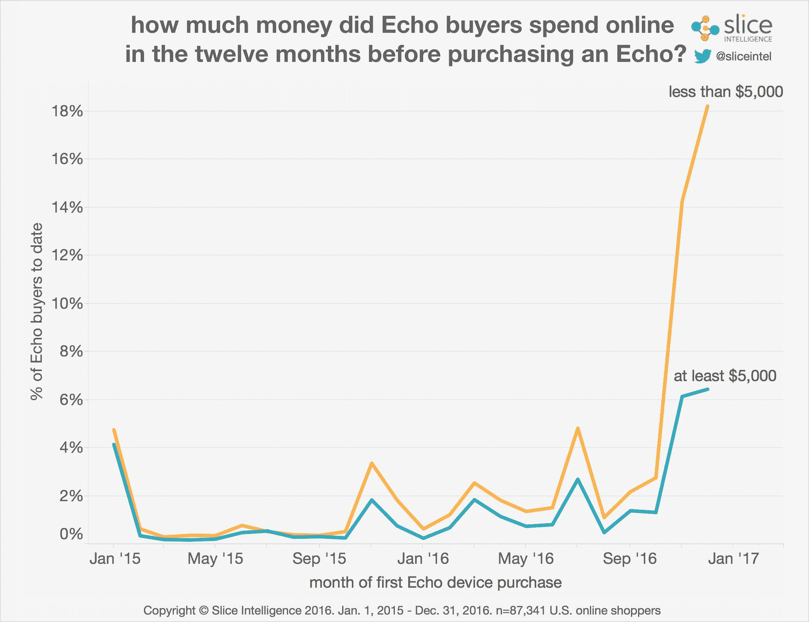

# 亚马逊回声迎来了它的主流时刻 

> 原文：<https://web.archive.org/web/https://techcrunch.com/2017/01/25/the-amazon-echo-is-having-its-mainstream-moment/>

根据分析公司 [Slice Intelligence](https://web.archive.org/web/20221025222741/https://intelligence.slice.com/amazon-echo-officially-mainstream/) 收集的数据，可以说话的小音箱亚马逊的 Echo 正进入其成功的突破阶段。回声来自一个非常成功的假日购物季，不仅销量很高，而且消费者人口统计数据的关键演变推动了更广泛的买家群体的销售。

Slice 发现，与 Echo 相关的收入有 50%来自女性，这一趋势与设备发布时的模式相比有很大变化，当时绝大多数男性倾向于购买 Echo。Slice 最初在推出第一款 Echo 时发现了这种趋势，现在又在最近的假期发布了新的 Echo Dot。

然而，这并不是 Echo 成为主流的唯一标志。Slice 指出，X 一代和婴儿潮一代的消费者也在推动大量的 Echo 购买，这是更广泛市场渗透的另一个关键指标，因为千禧一代往往更早采用科技和电子产品。

Slice 还发现，电子商务常客在早期 Echo 买家中占了很大比例，但现在首次购买 Echo 的买家不一定是重度网购者，这也符合更主流的消费习惯。

不出所料，Slice 还发现，非常实惠的 Echo Dot 是假日期间最受欢迎的选择，而 Echo 紧随其后，位居第二，根据其数据，Tap 仅占销售额的一小部分。《回声报》在 11 月至 12 月期间总体销量大幅飙升，网络周末的销量基本上是其他任何一天的两倍。由于消费者的强烈需求，亚马逊在 T4 的大部分假期都缺货。

Echo 的增长和主流势头对该公司和基于语音的界面来说都是一个巨大的消息，因为这意味着更多可能不习惯大声说话来完成任何计算的人现在将定期接触这种交互方法。