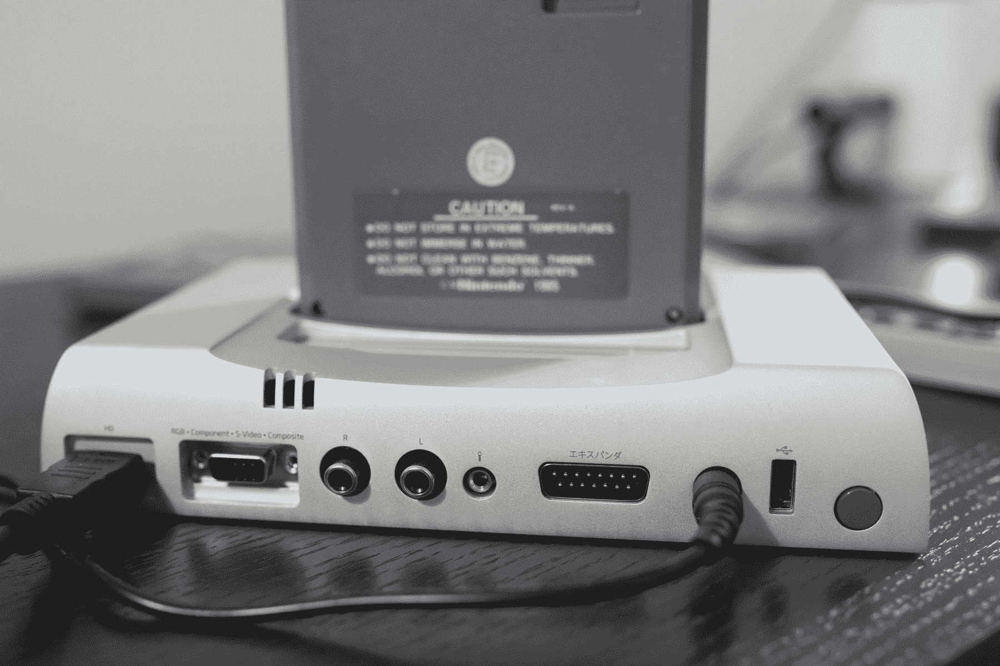
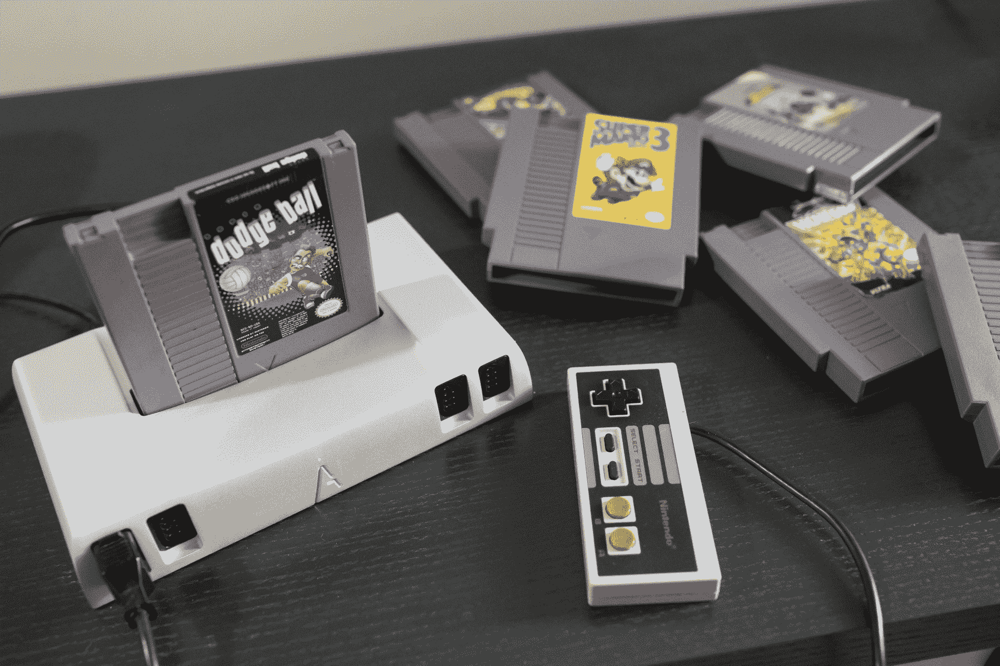

# 模拟版 Nt Mini 是视频游戏爱好者的完美 NES 游戏机 

> 原文：<https://web.archive.org/web/https://techcrunch.com/2017/02/09/the-analogue-nt-mini-is-the-perfect-nes-console-for-video-game-lovers/>

任天堂本身不可能像 Analogue 的 Nt Mini 一样为最初的任天堂娱乐系统精心制作出如此可爱和功能完美的贡品——事实上，多亏了 NES 经典，我们知道它没有。

[模拟版 Nt Mini](https://web.archive.org/web/20221210040142/http://www.analogue.co/pages/nt-mini) 是你想象中的 NES 游戏机，如果你今天还在梦想的话，不考虑成本，专注于最完美地再现任天堂体验，但支持现代电视硬件。

我很幸运地得到了一部 NES 经典，尽管普遍缺乏供应和持续的售罄，但在过去几周测试模拟 Nt Mini 的时候，我想不出有什么时候我想启动任天堂的微型游戏机。这两款设备很难占据相同的市场空间——任天堂的游戏机捆绑游戏售价 60 美元，而 Analogue 的产品对行家来说售价 450 美元，没有任何游戏，除非你有一些不错的老式塑料 NES 墨盒。

但两者都引发了 OG NES 粉丝的怀旧情绪，如果这真的是你所追求的，那就没有什么可比较的了:Analogue 的版本就是你要找的。这是因为，虽然 NES 经典提醒你过去玩旧游戏机有多有趣，但 Nt Mini 确实将你带到了那个顶部空间，这要归功于对原始 NES 体验的更忠实再现。

这是因为它使用的硬件实际上是“参考质量”，由来自实际 Famicom systems 和 Altera Cyclone V FPGA(你可以通过透明的系统基座偷看)的内部部件设计而成，它提供了与任何 Famicom，NES 或 Famicom 磁盘系统游戏的完全兼容性，以及它们的硬件附件(包括 Zapper，尽管你需要找到一个 CRT 才能正常工作)。Nt Mini 没有像 Retros 和其他公司的廉价现代游戏机那样，使用仿真来提供您的 NES 游戏体验——它完全按照预期的方式玩游戏，没有延迟诱导的软件欺骗，这种欺骗甚至出现在 NES 经典游戏中。

没有延迟听起来像是一件小事，但它实际上对 NES 的可玩性至关重要——许多你可能记得很喜欢的老游戏，部分是因为它们看起来非常困难，因为它们需要精确的时间，所以很有挑战性。你仍然可以用许多仿真软件 NES 播放器来掌握这个时间，但它仍然与你记忆中的不同，所以 Nt Mini 是唯一一个你的肌肉记忆会感觉完全“正确”的现代控制台

声音也很棒，无论是通过电视扬声器还是家庭影院环绕系统输出，就像我在测试中使用的一样，都会让你回到年轻时代。当然，味道是无法解释的，所以你必须已经享受到 8 位音频的吸引力，但是 Nt Mini 提供了比内存更好的准确性。你还可以在高级音频菜单中调整频道和一系列其他设置，系统软件内置的 NFS 播放器可以让你播放插入控制台的 SD 卡中的 NES 声音文件。

Nt Mini 有一个坚固的铝制外壳，令人难以置信的结实，与它更大的前身——最初的模拟 Nt——上使用的外壳相似。顾名思义，Mini 占用的空间少得多，但仍能提供同样出色的功能。还有四个控制器端口，可与实际的 NES 原装控制器配合使用，甚至可以复制 Four Score 的功能，即原装的 NES 四人适配器。在盒子里，有一个无线复古接收器和来自 8bitdo 的 NES 控制器，但我大部分时间都在玩原始的有线控制器，以获得真正的复古感觉。

我用 Mini 玩了各种各样的游戏，因为它们过去和现在都很棒，包括*超级马里奥兄弟 3* 、*忍者神龟 2:街机游戏*、*冒险岛*、*豺狼*、*超级躲避球*和*战斗蟾蜍*。每款游戏在游戏机上都完美运行，连接到我的 1080p 明基家庭影院投影仪上看起来棒极了。

然而更重要的是，我玩这些游戏比我想象的更开心，当然也比我玩任何最近的 AAA 级大片更开心。鉴于其高昂的价格，Nt Mini 显然不适合所有人，但你会惊讶地发现，考虑到对游戏机的工业设计及其硬件和软件工程的明显关注和重视，证明其成本是多么容易。

如果你有兴趣走这条路，还有一个针对 Nt Mini 的[“越狱”,使其与 ROMs](https://web.archive.org/web/20221210040142/http://atariage.com/forums/topic/242970-fpga-based-videogame-system/page-42#entry3687219) 兼容，而且它实际上有模拟本身的支持，所以如果你的兴趣超出了 NES，硬件也有可用的选项。但就其核心而言，Nt Mini 更适合真正的粉丝，他们希望将他们对 NES 的热爱带入更现代的家庭影院系统，它完美地贯穿了这一点。