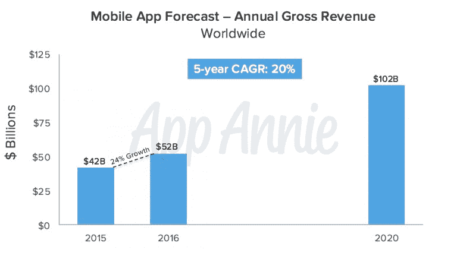

# 应用热潮还没有结束

> 原文：<https://web.archive.org/web/https://techcrunch.com/2016/06/25/the-app-boom-is-not-over/>

安舒·夏尔马是一位连续创业者，也是

[Storm Ventures](https://web.archive.org/web/20230316161016/http://www.stormventures.com/)

.

More posts by this contributor

新一波报道聚焦于后应用时代。Recode 公布“[appboom为 o ver](https://web.archive.org/web/20230316161016/http://www.recode.net/2016/6/8/11883518/app-boom-over-snapchat-uber) ”Quartz 指出大多数用户[从来不下载任何应用](https://web.archive.org/web/20230316161016/http://qz.com/253618/most-smartphone-users-download-zero-apps-per-month/) 。让我把话说清楚:a pp b oom 不是 n ot o ver 。

关于这个话题的报道让我想起了一句想象中的 Yogi Berra 的名言:“没人再下载应用了，太拥挤了。”

## 1000 亿美元，占 CAGR 市场的 20%

先说事实。真实的数字是惊人的——当谈到来自应用的收入时，我们正处于一个前所未有的增长时代。

收入很难操纵，因为它与谷歌和苹果的财务申报文件相关联，并且需要接受审计。

应用收入正在增长，预计到 2020 年将达到 1000 亿美元。[来源](https://web.archive.org/web/20230316161016/http://venturebeat.com/2016/02/10/the-app-economy-could-double-to-101b-by-2020-research-firm-says/) : App 安妮

以 app 下载新闻为例。它通过指出热门应用的数字，讲述了应用下载是如何停滞的。

事实上，较新的应用如优步、Airbnb 和 Snapchat 都在快速增长，而不出所料的是，大多数已经存在一段时间、用户已经饱和的顶级应用如脸书不再增长。

用这个数据来指向一个 app boom 的结束，多少有些误导。

## 对 pps 来说，这是最好的时机

这是成为一名应用开发者的最佳时机。数十亿用户可以获得廉价的新智能手机，数据套餐在全球范围内变得可用，苹果和谷歌等应用商店老板比以往任何时候都更加慷慨。

苹果支持降低订阅收入的费用——从第二年开始从 30%到 15%。

作为一个 SaaS 人，让我告诉你这是苹果公司一个非常有洞察力的决定——如果大多数开发者能够被推动去考虑订阅，反过来让消费者每月支付更多，你最终会有一个非常长期、有粘性的收入基础。更重要的是，这种收入更便宜，并导致虚拟锁定，因为拥有更多订阅的消费者不太可能改变生态系统。

向前发展，增加您的应用。