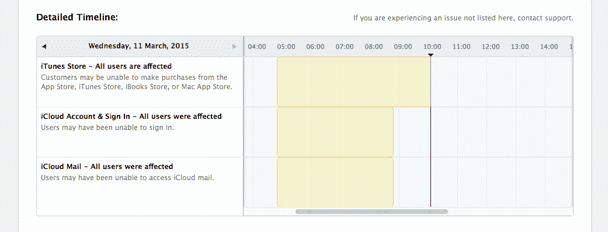
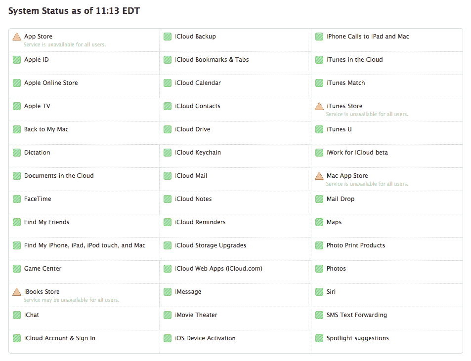
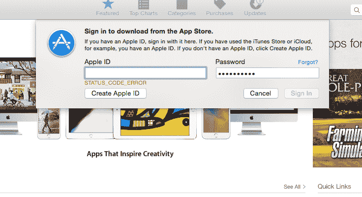

# App Store、iTunes Store 和 iTunes Connect 正在经历长时间的中断 

> 原文：<https://web.archive.org/web/https://techcrunch.com/2015/03/11/the-app-store-itunes-store-and-itunes-connect-are-experiencing-lengthy-outages/>

# App Store、iTunes Store 和 iTunes Connect 正在经历长时间的中断

**更新:**苹果的在线商店现在似乎已经恢复正常，在测试中可以在移动和桌面上登录和更新，苹果的[服务状态页面](https://web.archive.org/web/20221006125257/https://www.apple.com/ca/support/systemstatus/)报告一切正常。

苹果的数字内容商店，以及 iTunes Connect 开发者门户，目前在世界各地都遇到了问题，因为几个国家的客户已经[无法完成购买，运行更新或登录](https://web.archive.org/web/20221006125257/https://discussions.apple.com/thread/6868907?start=525&tstart=0)好几个小时了。苹果的[服务状态仪表盘](https://web.archive.org/web/20221006125257/https://www.apple.com/ca/support/systemstatus/)仍然全线显示绿色状态指示器。我们已经能够在多个国家的工作人员中复制该错误，并且已经联系了苹果公司，以找出问题所在以及我们何时可以期待解决方案。当我们知道更多的时候，我们会更新这篇文章。

**更新美国东部时间上午 10:05:**苹果更新了其服务状态仪表盘，表明 iTunes Store 从美国东部时间上午 5 点前一点开始出现购买故障。这一问题仍未解决，而 iCloud 登录失败的问题应该会得到解决。

**美国东部时间上午 11:15 更新:**停电持续到第六个小时，除了系统状态页面上的状态从黄色变为红色之外，苹果公司没有任何更新。全球用户仍然报告无法在所有平台上更新或购买应用程序、音乐、电影和书籍。

**美国东部时间下午 12:23 更新:**停电仍在继续，现在已经是第七个小时了。下面有一个截图，是那些试图在桌面上购物的人最常见的错误信息。苹果的服务状态页面还是没有变化，公司也没有官方消息。

**美国东部时间下午 1:28 更新:**苹果公司向美国消费者新闻与商业频道提供了以下[声明，解释称内部 DNS 错误是导致长时间中断的原因，目前已持续了八个小时。](https://web.archive.org/web/20221006125257/http://www.cnbc.com/id/102495735)

> 我们向今天早上遇到 iTunes 和其他服务问题的客户道歉。原因是苹果内部的 DNS 错误。我们正在努力尽快为客户提供所有服务，感谢大家的耐心。

**美国东部时间下午 3:02 更新:**这是 10 个小时的持续停电。苹果公司唯一的说法仍然是上面引用的道歉。

**美国东部时间下午 4:45 更新:**不到 12 个小时后，应用程序和 iTunes 商店似乎重新上线并正常工作。iTunes Connect 似乎也允许开发者再次登录。

正在开发…